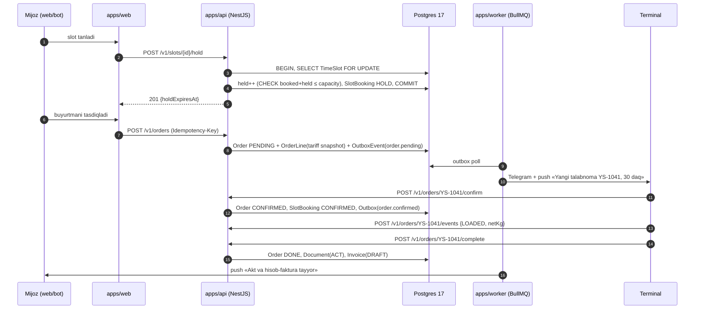
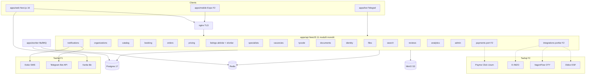
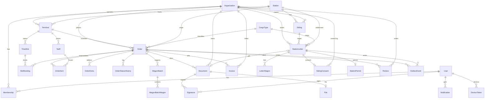

# YukSaroy — Yakuniy birlashtirilgan arxitektura va mahsulot hisoboti

Versiya 2.0 · 2026-09-03 (kechki tahrir) · Bosh Arxitektor + Bosh PM · Manba: 11 linza hisoboti + 4 skeptik tekshiruvi (yagni, reality, uxperf, complete) + Cowork sessiyasi konteksti + VagonFlow `schema.prisma`.

Hujjat maqsadi: bitta stack, bitta modul ro'yxati, bitta MVP chegarasi, bitta holat-mashinalari to'plami. v2.0 — foydalanuvchi qarorlari: mustaqil tizim, VagonFlow integratsiyasi F1 da yo'q, NestJS + Next.js, clean architecture, barcha rollar F1 dan, to'lov F2 (arxitektura tayyor).

---

## 0. Xulosa

> **v2.0 (03.09.2026, kechki tahrir).** Foydalanuvchi qarorlari asosida qayta yozildi: **YukSaroy — mustaqil tizim**, VagonFlow bilan F1 da integratsiya yo'q (faqat kelajak uchun port), stansiya xati oqimi yadro emas (F2 moduli), stack — **alohida NestJS backend + Next.js frontend**, clean architecture, **barcha rollar F1 dan**, to'lov F1 da amalga oshirilmaydi, lekin arxitektura to'lovga tayyor. 0, 3, 4, 5, 6, 16-bo'limlar to'liq yangi; 1, 2, 7, 17, 18 tuzatildi; 8–15-bo'limlardagi VagonFlow tilga olingan joylar faqat tajriba havolasi.

1. **YukSaroy — O'zbekiston temir yo'l yuk saroylari, terminallar, shahobcha yo'llar, aktivlar va logistika xizmatlari uchun mustaqil marketpleys.** O'z auth, o'z ma'lumotlar bazasi, o'z UI; hech qanday tashqi tizimga bog'liq emas.
2. **Arxitektura — API-first:** `apps/api` (NestJS 11, modulli monolit, clean architecture: domain → application → infrastructure → presentation) + `apps/web` (Next.js 16, App Router) + `apps/worker` (BullMQ) + `apps/bot` (Telegraf). Postgres 17 + Prisma, Redis, MinIO (S3). Bitta OpenAPI kontrakt — web, mobil va tashqi hamkorlar uchun.
3. **F1 MVP = 4 modul guruhi to'liq:** (a) katalog + xarita + narx kalkulyatori, (b) buyurtma + tayim-slot + terminal kabineti, (c) aktivlar bozori + e'lonlar, (d) mutaxassislar, vakansiyalar, TY kod arizasi, hujjat xizmati. Muddat 16 hafta; katalog butun respublika, faol pilot — Toshkent tuguni.
4. **Rollar F1 dan to'liq:** 10 rol — mijoz (yuk egasi/logist), ekspeditor, deklarant, avtotashuvchi/haydovchi, terminal operatori, shahobcha egasi, vagon egasi, lokomotiv xizmati, ish izlovchi, platforma admin/operator. Bitta akkaunt — bir nechta rol, tashkilot (STIR) darajasida a'zolik.
5. **To'lov F1 da yo'q, lekin tayyor:** `payments` moduli port/adapter sifatida (`PaymentProvider` interfeysi, `Invoice`, `Payment`, `LedgerEntry` jadvallari, holat-mashinasi) hozir yoziladi, Payme/Click/Uzum adapteri F2 da ulanadi. F1 da buyurtma summasi hisoblanadi, akt/hisob-faktura PDF chiqadi, to'lov «bank o'tkazmasi» belgisi bilan qo'lda tasdiqlanadi.
6. **Integratsiya portlari (F2+):** VagonFlow (vagon talabnomasi), E-IMZO (ERI), Payme/Click, Didox (ESF), O'TY ma'lumotlari — barchasi `integrations/*` adapterlari, domen kodi ularni bilmaydi. F1 da faqat SMS (Eskiz), Telegram, xarita tile'lari, S3.
7. **Stansiya xati oqimi — F2 moduli** (`letters`): konstruktor, PDF+QR, shahobcha egasi roziligi; stansiya kabineti kerakmi — F2 boshida hal qilinadi (Q2). F1 da demo konstruktori faqat PDF generatsiya sifatida qolishi mumkin (ixtiyoriy, yadro emas).
8. **Holat-mashinalari** `packages/domain` da: `OrderStatus` (9), `BookingStatus` (4), `ListingStatus` (5), `SpecialistOrderStatus` (6), `ApplicationStatus` (5), `TyCodeStatus` (5), `DocOrderStatus` (5), `InvoiceStatus` (5), `PaymentStatus` (6, F2). Bitta manba — Prisma enum'lari shundan generatsiya qilinadi.
9. **Dizayn tizimi** — `packages/ui/tokens.css` (navy/teal/amber + qum fon, Unbounded/Manrope/JetBrains Mono), logo A «Ravoq + rels», landing: 8 s video + bitta R3F sahna, fallback bilan (8–9-bo'limlar o'zgarmadi).
10. **Jamoa va byudjet:** F0 (6 hafta) + F1 (16 hafta) ≈ 7 FTE, ≈ 0,95 mlrd so'm; F2 (to'lov, ERI, xat, VagonFlow porti, mobil) ≈ 1,2 mlrd so'm. Raqamlar 16-bo'limda.

### «Bir sahifa»

| Savol | Javob |
|---|---|
| Nima quramiz | Mustaqil B2B marketpleys: terminal/shahobcha/aktiv katalogi → narx → slot → buyurtma → hujjat; mutaxassislar, vakansiyalar, TY kod, e'lonlar |
| Kim uchun | Talab: yuk egasi/logist, ekspeditor, deklarant, avtotashuvchi. Taklif: terminal, shahobcha egasi, vagon/teplovoz egasi, lokomotiv xizmati. Ish izlovchi. Platforma operatori |
| Stack | NestJS 11 + Prisma 6 + Postgres 17 + Redis/BullMQ + MinIO; Next.js 16 + React 19 + Tailwind v4 + shadcn; Telegraf; OpenAPI 3.1 → generatsiya qilingan TS client; docker-compose → k3s (F2) |
| Monorepo | `apps/api`, `apps/web`, `apps/worker`, `apps/bot`, (F2) `apps/mobile`; `packages/domain`, `packages/contracts`, `packages/ui`, `packages/i18n`, `packages/config` |
| MVP (F1) chegarasi | 2-bo'lim jadvalidagi «F1» qatorlari: 4 modul guruhi, 10 rol, ~58 model, ~110 endpoint, onlayn to'lovsiz |
| Muddat | F0 — 6 hafta (huquq, brend, kontraktlar, skeleton); F1 — 16 hafta (8 sprint); F2 — 16 hafta (to'lov, ERI, xat, mobil, VagonFlow porti); F3+ — AI, tender, portlar |
| Jamoa | Tech lead (1), backend NestJS (2), frontend Next.js (2), dizayner (0,5), QA (1), DevOps (0,5), domen-ekspert (siz) ≈ 7 FTE |
| Byudjet | F0–F1 ≈ 0,95 mlrd so'm (~$73k); F2 ≈ 1,2 mlrd; jami 12 oy ≈ 2,15 mlrd so'm (~$165k) |
| North-star | Oylik bajarilgan onlayn buyurtmalar + faol e'lonlar (F1 oxiri: 300 buyurtma, 500 e'lon) |
| Eng katta xavf | Taklif tomonini to'ldirish (terminal va aktiv egalari), ma'lumot huquqi (reestrlar), 16 haftada 4 modul guruhini sifatli yetkazish |

---

## 1. Manba va kontekst

### 1.1 Cowork sessiyasidan olindi

| Manba | Nima berdi | Hisobotda qayerda |
|---|---|---|
| Konsepsiya (29.08.2026) | 6 modul, 8 daromad oqimi, F0–F4 yo'l xaritasi, ekotizim (aktivlar bozori, portlar, ma'lumotnomalar), «mukammallik yo'li» (eskrou, AI, tender, akademiya) | 2-bo'lim inventari; monetizatsiya 14-bo'limda qayta hisoblandi |
| Ish standarti v1.0 | 8 jarayon «kim → nima → qancha vaqtda», SLA jadvali (30 daq tasdiq, 2–4 soat slot, 3 ish kuni TY kod) | 3-bo'lim oqimlari; SLA jadvali 12.1 da tuzatilgan holda qayta berildi (TY kod SLA olib tashlandi, demurraj sababi qo'shildi, har norma `PlatformConfig` kalitiga bog'landi) |
| Interaktiv demo | IA (`NAVS.ship/term/adm`), 7 mobil rol, `ST` statuslar, `CARGO/EXTRA/SLOTS/DOCTYPES/ADS/ASSETS`, `spurMap` SVG, xat konstruktori `letter()` | 5-bo'lim route xaritasi, 7-bo'lim seed, 8-bo'lim ekranlar |
| Oxirgi talab (02–03.09) | Shahobcha yo'l topildi → kelishildi → stansiya boshlig'iga xat (vagonlar, egasi, davr, «qarshi emasman») → avtomatik yuklab olinadi va stansiyaga topshiriladi | 3.3 oqim (stateDiagram + sequenceDiagram) — hujjatning markaziy qismi |
| VagonFlow tajribasi | Faqat naqsh sifatida: OTP auth, Telegram bot, shahobcha reestri maydonlari ro'yxati | Kod va DB ulashilmaydi; F1 da integratsiya yo'q, F2 da `RailwayProvider` porti |
| Desktop fayllari | `Шахобча йўллар.xlsx` (1 393 qator), `ЕСР с новыми станциями.xlsx` (22 419, DOR=73 → ~300), ETSNG (407), «Yagona darcha» 18 428 mijoz (18 338 STIR, telefon 0), railmap JSON (214 stansiya) | 7.5 import pipeline; huquqiy shartlar 12-bo'lim |

### 1.2 Nima yetishmadi (F0 da to'ldiriladi)

| Bo'shliq | Nega muhim | Kim / qachon |
|---|---|---|
| Pilot terminallarning huquqiy statusi (O'TY yuk saroyi / O'ztemiryo'lkonteyner / xususiy LC) | «Terminal shartnomasi» kim bilan tuzilishini belgilaydi | Foydalanuvchi, F0 hafta 1 |
| DS Sergeli/Chuqursoy bilan intervyu: elektron/QR xatni qabul qiladimi | H4 — xat oqimining huquqiy shakli | Foydalanuvchi, F0 hafta 2 |
| O'TY/DAS UTY yozma roziligi (reestr, shahobcha reestri) | 18 428 bazadan foydalanish qonuniyligi | CEO, F0 |
| yuksaroy.uz egaligi (03.09.2026 SUVAN NET orqali ro'yxatdan o'tgan) | Barcha hostname/deep-link rejasi | Bugun |
| E-IMZO shartnomasi (e-imzo-server VPN kaliti, SiteID) | F2 ERI muddati | CTO, F0 boshlanadi, 4–6 hafta |
| Terminal pasport anketasi (5 ta) va tarif jadvali | Katalog seed | Domen-ekspert, F0 |
| Bank hamkori (eskrou hisobi, faktoring/rassrochka) | F2/F3 moliya | CEO, F1 davomida |
| IMA tovar belgisi tekshiruvi «YukSaroy/ЮкСарой» | Brend himoyasi | F0 |

---

## 2. Mahsulot

### 2.1 Personalar va JTBD

| # | Persona | JTBD | F1 da bormi |
|---|---|---|---|
| P1 | Yuk jo'natuvchi / logist (Dilshod, «Xorazm Agro Eksport», Urganch) | Vagon berilganda terminal/slotni 5 daqiqada topib, narxni oldindan bilib band qilish | Ha — asosiy |
| P2 | Terminal operatori (Sherzod, Sergeli smena boshlig'i) | Ertangi oynalarni oldindan to'ldirish, kran/brigadani rejalashtirish | Ha — asosiy |
| P3 | Ekspeditor («Sogdiana Trans») | Butun zanjirni bitta kabinetdan boshqarish | Ha — mijoz sifatida (`orgKind=FORWARDER`), mutaxassis bozori F2 |
| P4 | Shahobcha yo'l egasi («Biokimyo» AJ) | Bo'sh sig'imni berish, «qarshi emasman»ni bir tugmada berish | Ha — `ASSET_OWNER`, rozilik SMS-OTP |
| P5 | Stansiya boshlig'i (DS) / DSP | Raqamlangan, tekshiriladigan so'rov; naryad avtomatik | F2 — `letters` moduli; kabinet yoki PDF/QR (Q2) |
| P6 | Platforma operatori/admin | KYC, SLA buzilishi, «stol uslug» navbati | Ha — `PLATFORM` |
| P7 | Xususiy LC / SVX egasi (Angren LC) | Bo'sh maydonni sotish | Ha — `TERMINAL` (kind=LC/SVX) |
| P8 | Deklarant | SVX ga kelayotgan vagonni oldindan ko'rish | F2 |
| P9 | Avtotashuvchi / haydovchi | Aniq soatda yuk olish, GPS | F2 (mobil) |
| P10 | Vagon egasi / teplovoz xizmati | Ijara/manevr e'loni, kalendar | F2 |
| P11 | O'TY boshqaruv | Haftalik yuklama/bandlik dashboardi | F3 |

Nima uchun 11 (demoda 7): P5 va P6 oxirgi talab va «institutsional qarshilik» xatarini yopadi. Alternativa — 4 rol — RBAC darajasida shunday qilinadi (`OrgKind × OrgRole`, 6-bo'lim).

### 2.2 To'liq funksiya inventari

Belgilar: M/S/C/W = MoSCoW; faza F0–F4; S/M/L/XL murakkablik. **Qalin** — F1 MVP.

| ID | Funksiya | Rol | MoSCoW | Faza | Mur. |
|---|---|---|---|---|---|
| **K1** | Telefon + SMS-OTP kirish (o'z `identity` moduli: OTP + JWT/refresh) | barcha | M | F1 | S |
| **K2** | Organization + Membership (`OrgKind × OrgRole`), ko'p-rolli akkaunt | barcha | M | F1 | M |
| **K3** | STIR bo'yicha reestrdan profil topish; **ulash faqat operator KYC dan keyin** (F2: E-IMZO sertifikat TIN == STIR) | mijoz | M | F1 | M |
| **K4** | Elektron oferta aksepti (SMS-OTP), 3 oferta matni | barcha | M | F1 | S |
| **K5** | Bildirishnoma: Telegram bot + Web Push (VAPID) + SMS fallback; FCM F2 | barcha | M | F1 | M |
| **K6** | AuditLog (kim/qachon/nima), append-only | admin | M | F1 | S |
| **K7** | i18n uz/oz/ru (`packages/i18n`, next-intl; manba uz-Latn) | barcha | **M** | F1 | S |
| **K8** | Admin panel: KYC navbati, SLA monitor, PlatformConfig, moderatsiya | admin | M | F1 | M |
| K9 | PWA manifest (o'rnatiladigan); service worker/offline navbat | barcha | S / C | F1 / F2 | S / M |
| K10 | Native mobil (Expo SDK 55) | barcha | S | F2 | XL |
| K11 | Telegram Mini App (`/tma` route apps/web ichida) | mijoz, egasi | S | F2 | S |
| K12 | KYC: E-IMZO challenge-auth / OneID | barcha | M | F2 | M |
| K13 | Legal-0: e-tijorat uvedomleniesi, PD reestri (3 baza), ofertalar | platforma | M | F0 | S |
| **M1.1** | Terminal pasporti (yo'llar, kran, ombor, SVX, ish vaqti, foto) | terminal, admin | M | F1 | M |
| **M1.2** | Katalog: stansiya/hudud/xizmat filtri, reyting/narx saralash, `use cache` | mijoz | M | F1 | M |
| **M1.3** | Stansiya ro'yxati + `SidingMap` SVG sxemasi (demo `spurMap` porti), koordinata railmap API dan | mijoz | M | F1 | S |
| M1.4 | MapLibre + OSM raster xarita (20+ terminal bo'lganda) | mijoz | S | F2 | M |
| M1.5 | «Kelish stansiyasidan terminal tanlash» (vagon № → stansiya) | mijoz | S | F2 | M |
| M1.6 | Real vaqt bandlik indikatori (`loadPct`) | mijoz | S | F2 | S |
| M1.7 | SVX katalogi (`SvxWarehouse`: litsenziya №, muddati) | mijoz | S | F2 | M |
| M1.8 | Ma'lumotnomalar: tarozilar, yo'l servislari | haydovchi | C | F3 | S |
| M1.9 | Xalqaro portlar | ekspeditor | C | F4 | L |
| M1.10 | Premium joylashuv (top-3) | terminal | S | F2 | S |
| **M2.1** | Buyurtma vizardi 3 ekran (yuk+yo'nalish+vazn → terminal+slot+qo'shimchalar → xulosa) | mijoz | M | F1 | L |
| **M2.2** | Slot dvigateli: `TimeSlot(terminalId, localDate, window)` capacity/booked/held, `FOR UPDATE`, hold 10 daq (`PlatformConfig`) | mijoz, terminal | M | F1 | L |
| **M2.3** | Terminal kabineti: qabul/rad (sabab), 30 daq SLA taymer | terminal | M | F1 | M |
| **M2.4** | Auto-expire: 30 daq → EXPIRED, slot bo'shaydi, reyting −0,05, 2 alternativa | tizim | M | F1 | S |
| **M2.5** | Qo'shimcha xizmatlar (tarozi, saqlash, SVX, oxirgi milya — ro'yxat) | mijoz | M | F1 | S |
| M2.6 | Terminal resurs rejasi (kran/yo'l/darvoza → slot, `resourceId` nullable) | terminal | S | F2 | L |
| M2.7 | Avto gate-slot (2 soatlik oyna faqat darvoza uchun) | haydovchi | S | F2 | L |
| M2.8 | Slot fiksatsiya to'lovi + no-show jarimasi | mijoz | S | F2 | M |
| M2.9 | Takroriy buyurtma / shablon | mijoz | C | F2 | S |
| M2.10 | Yuk tenderi | yirik mijoz | C | F3 | L |
| **M3.1** | Narx: `calcQuote()` serverda — tarif × vazn + xizmatlar; komissiya `PlatformConfig` (F1 0 %, payer TERMINAL) | mijoz | M | F1 | M |
| **M3.2** | Terminal tarif matritsasi (append-only versiya, `validFrom`) | terminal | M | F1 | M |
| **M3.3** | Landing hero'da login'siz «tez hisob» (stansiya + yuk + vazn → 3 terminal) | mehmon | M | F1 | S |
| M3.4 | Median/kvartil «bozor narxi» (SQL), keyin ML | mijoz | C | F3 | L |
| **M4.1** | Buyurtma holat mashinasi + push (8 status, sub-hodisalar timeline) | barcha | M | F1 | M |
| M4.2 | Vagon talabnomasi porti (`RailwayProvider`; birinchi adapter VagonFlow) | mijoz | S | F2 | L |
| M4.3 | Demurraj taymeri (`placedAt` GU-45 dan, `delayReason` majburiy) | terminal, mijoz | S | F2 | M |
| M4.4 | Vagon dislokatsiyasi ASOUP | mijoz | W | O'TY API ochilguncha | XL |
| M4.5 | Fura GPS + haydovchi ilovasi | haydovchi | S | F2 | L |
| M4.6 | 24 soat oldin «tushirish slotini band qiling» (mijoz kiritgan kelish sanasi) | mijoz | S | F2 | M |
| **M5.1** | Akt + hisob-faktura PDF (`@react-pdf/renderer`), Invoice + bank o'tkazma; «to'landi» operator | tizim | M | F1 | M |
| M5.2 | Onlayn to'lov: bitta provayder (Payme yoki Click) — hujjat/e'lon/slot to'lovi | mijoz | M | F2 | M |
| M5.3 | Didox ESF/akt (EDO) | tizim | M | F2 | M |
| M5.4 | Bank eskrou hisobi + `Order.escrowState` + release signali | mijoz | S | F2 | M |
| M5.5 | ERI (E-IMZO deeplink/brauzer) hujjatlarga | barcha | M | F2 | M |
| **M5.6** | «Stol uslug»: GU-27 yuk xati, SMGS, qayta jo'natish, VU/GU-45 akt to'plami — 4 soat SLA, PDF | mijoz, admin | S | F1 | M |
| **M5.7** | TY kod: cheklist + shablonlar + e-nakl deep-link + holat kuzatuvi (SLA va'da yo'q) | mijoz | S | F1 | S |
| M5.8 | To'lov agenti (ELS) — bank agentlik shartnomasi bilan | mijoz | C | F3 | L |
| M5.9 | Rassrochka/faktoring — bank/MFO hamkor, YukSaroy agent | mijoz | C | F3 | L |
| M5.10 | 1C/xlsx eksport | mijoz | C | F3 | S |
| M5.11 | Yuk sug'urtasi (agentlik) | mijoz | C | F3 | M |
| **M6.1** | Reyting 1–5 + SLA jarimasi | mijoz | M | F1 | S |
| M6.2 | Terminal analitikasi (recharts 3 ekran) | terminal | S | F2 | M |
| M6.3 | Boshqaruv dashboardi | O'TY, admin | S | F2 | M |
| M6.4 | Mijoz oylik hisoboti | mijoz | C | F3 | M |
| M6.5 | Anti-frod (qoidalar, moderator navbati) | admin | S | F2 | M |
| **E1.1** | Shahobcha katalogi (milliy reestr importi; egasi «claim» qilmaguncha nomi yashirin) | mijoz | M | F1 | M |
| E1.2 | Stansiya xati konstruktori (yuk egasi blankasi, vagonlar, davr, shartnoma №, PDF + DOCX + QR) | mijoz | S | F2 | L |
| E1.3 | Shahobcha egasining roziligi (Telegram/SMS-OTP, F2 ERI) | egasi | S | F2 | M |
| E1.4 | Xatni stansiyaga topshirish: PDF+QR, gibrid qog'oz; stansiya kabineti — Q2 | mijoz | S | F2 | M |
| E1.5 | Ruxsat → vagon qo'yish naryadi (`RailwayProvider` orqali) | tizim | C | F3 | M |
| E1.6 | `SidingServiceContract` entity (F1 da xatda `contractNo` + fayl) | egasi, mijoz | S | F2 | M |
| E2.1 | Aktivlar bozori e'lonlari (vagon/teplovoz/shahobcha; `permitNo`, `PRIVATE_SIDING_ONLY`) | egalar | S | F2 | M |
| E2.2 | `AssetDeal` bitim (so'rov → kelishuv → akt) | egalar | S | F2 | L |
| E2.3 | `ManeuverRequest` + teplovoz kalendari (o'z `LocoShift` jadvali) | teplovoz | S | F2 | M |
| E2.4 | E'lonlar (kran, fura) + VIP; terminal `elonlar` route | xizmatchilar | S | F2 | S |
| E3.1 | Mutaxassislar bozori (ekspeditor/deklarant, 2 soat SLA) | mijoz | S | F2 | L |
| E3.2 | Vakansiyalar | terminal | C | F2 | S |
| E3.3 | Arbitraj/nizo (3 ish kuni) | barcha | S | F2 | M |
| E3.4 | Buyurtma ichidagi chat (F1: Telegram deep-link) | barcha | C | F3 | M |
| **E4.1** | Avtotashuvchilar bazasi (ro'yxat) | mijoz | S | F1 | S |
| E4.2 | Avto-yuk birjasi | haydovchi | C | F3 | L |
| **E5.1** | Telegram bot: holat, tasdiq/rad, rozilik | mijoz, terminal, egasi | M | F1 | M |
| E5.2 | Referal/sodiqlik | mijoz | C | F3 | M |
| E5.3 | Akademiya | mutaxassis | W | F4 | L |
| **A1** | Event jadvali (`Event`, 10 nom) — KPI hisobi | admin | M | F1 | S |
| **A2** | AI: ETSNG tanlash `pg_trgm`, SMS shablon `{name}` — LLM'siz | tizim | M | F1 | S |
| A3 | AI: OCR nakladnoy/tarozi cheki, e'lon matni yaxshilash (Haiku/Sonnet) | mijoz | C | F2 | M |

Jami 81 qator; v2: barcha rol profillari F1, xat oqimi (E1.2–E1.5) F2 (K9 PWA manifest qismi ham F1, lekin qator F1/F2 ga bo'lingani uchun qalin emas).

### 2.3 MVP F1 chegarasi — nima kirmaydi va nima uchun

| Kirmaydi | Sabab | F1 alternativasi |
|---|---|---|
| Onlayn to'lov, eskrou, split, ledger | Pilotda komissiya 0 % — pul oqimi yo'q; platforma hisobida tranzit pul huquqan xavfli | Invoice PDF + bank o'tkazma, «to'landi» belgisi operator |
| ERI (E-IMZO) | Shartnoma 4–6 hafta, SiteID ro'yxati; F0 da boshlanadi | SMS-OTP rozilik + gibrid qog'oz xat |
| Stansiya kabineti | DS/DSP ro'yxatdan o'tishi F1 da kutilmaydi | F2 `letters` moduli: PDF+QR yoki kabinet — Q2 |
| Native mobil, offline navbat | Haydovchi roli F1 da yo'q; PWA offline «yo'qolgan buyurtma» logi ko'rinmaguncha | Responsive web + Telegram bot |
| Aktivlar bitimi, teplovoz kalendari, mutaxassislar | KYC/eskrousiz — nizo xavfi | Shahobcha katalogi read-only + «Stansiyaga xat» |
| MapLibre + PMTiles | 5–8 terminal uchun 300 MB tile hosting ortiqcha | `SidingMap` SVG + stansiya ro'yxati |
| Mikroservislar, Kafka, k8s, ClickHouse, RLS | F1 hajmi uchun ortiqcha; modulli monolit + BullMQ + Postgres yetadi | NestJS modulli monolit, Redis/BullMQ, Grafana/Prometheus |
| LLM bilan xat matni | Rasmiy xat — standart shablon; O'TY reestr maydonlari AQSh serveriga ketmasin | `docx`/react-pdf shablon, 6 o'zgaruvchan maydon |
| O'TY API (ASOUP), TY kod avto | API yo'q, EBRD dasturi 2027+ | Mijoz kiritadi; cheklist + deep-link |

### 2.4 KPI daraxti

North-star: **CBO** (Completed Booked Orders/oy) — onlayn band qilingan, akt bilan yopilgan buyurtmalar. GMV emas: komissiya 0 %, tarif manipulyatsiyaga ochiq.

| Daraja | KPI | F1 maqsad |
|---|---|---|
| Taklif | Jonli obyektlar (terminal/LC/SVX) | 5–8, pasport to'liqligi ≥ 90 % |
| Taklif | E'lon qilingan slot / ish soati | ≥ 80 % |
| Talab | Ro'yxatdan o'tgan tashkilotlar (opt-in) | 150 |
| Konversiya | DRAFT → PENDING | ≥ 60 % |
| Konversiya | PENDING → CONFIRMED ≤ 30 daq | ≥ 85 % maqsad; H2 minimal chegara ≥ 80 % (undan past bo'lsa 60 daq + auto-accept) — 14.5 va S8 da shu ikki raqam |
| Konversiya | CONFIRMED → DONE | ≥ 92 % |
| Sifat | O'rtacha reyting / SLA buzilishi | ≥ 4,5 / ≤ 5 per 100 |
| Landing | Hero «tez hisob» → ro'yxat | ≥ 15 % |
| UX | Vizard median vaqti (5 sinovchi) | ≤ 3 daq |

---

## 3. Asosiy oqimlar (7 ta)

Yozuv: ekran (route) · aktor · hodisa · holat. Barcha statuslar `packages/domain/enums.ts` dan. Har oqim faqat YukSaroy ichida yopiladi — F1 da tashqi tizim chaqiruvi yo'q.

### 3.1 Oqim 1 — Yuklash/tushirish buyurtmasi + tayim-slot

| # | Ekran | Aktor | Hodisa | Holat |
|---|---|---|---|---|
| 1 | `/kabinet/buyurtma/yangi` (1-ekran: yo'nalish, operatsiya, yuk turi ETSNG, vazn, vagon/fura soni) | Mijoz | draft localStorage | Order: — |
| 2 | 2-ekran: terminal kartasi ichida slot grid + qo'shimcha xizmatlar | Mijoz | `POST /v1/slots/{id}/hold` → `SlotBooking(HOLD, 10 daq)` | Booking: HOLD |
| 3 | 3-ekran: xulosa (ochiq formula) | Mijoz | `POST /v1/orders` (Idempotency-Key) → `PricingService.quote()` | Order: PENDING, `confirmUntil = +30 daq` |
| 4 | — | Tizim | `order.pending` → outbox → Telegram/push terminalga | — |
| 5 | `/terminal/talabnomalar/{no}` | Terminal | `POST /v1/orders/{no}/confirm` yoki `/reject {reason}` | CONFIRMED (Booking CONFIRMED) / REJECTED (Booking RELEASED) |
| 5a | fon (BullMQ delayed job) | Tizim | `confirmUntil` o'tdi → EXPIRED, reyting −0,05, mijozga 2 alternativa | EXPIRED |
| 6 | `/terminal/talabnomalar/{no}` | Terminal | `POST /v1/orders/{no}/events {ARRIVED, WEIGHED, LOADED, netKg}` | IN_PROGRESS (hodisalar `OrderEvent` da) |
| 7 | — | Tizim | `POST /v1/orders/{no}/complete` → `Document(ACT)`, `Invoice(DRAFT)` | DONE |
| 8 | `/kabinet/buyurtmalar/{no}` | Mijoz | baho 1–5 → `Review` | DONE (rated) |
| 9 | `/kabinet/hisob-fakturalar/{no}` | Mijoz / Admin | F1: «bank o'tkazmasi» belgisi admin tasdiqlaydi → `Invoice.PAID_OFFLINE`; F2: `PaymentProvider.charge()` | Invoice: PAID |



### 3.2 Oqim 2 — Tushirish buyurtmasi (vagon/fura kelishi)

Mijoz vagon raqamini va taxminiy kelish sanasini o'zi kiritadi (F1 da tashqi dislokatsiya manbai yo'q). Qadamlar 3.1 bilan bir xil; farqlar: `operation = UNLOAD`, qo'shimcha xizmatlar (omborda saqlash, «oxirgi milya», deklarant) buyurtmaga `OrderLine` sifatida qo'shiladi; `ARRIVED` hodisasini terminal kiritadi; demurraj taymeri `placedAt` dan `OrderEvent` orqali hisoblanadi (F1 — faqat ko'rsatish, F2 — avtomatik hisob).

### 3.3 Oqim 3 — Aktiv e'loni (vagon / teplovoz / shahobcha yo'l) va kelishuv

| # | Ekran | Aktor | Hodisa | Holat |
|---|---|---|---|---|
| 1 | `/kabinet/aktivlar/yangi` | Egasi (vagon/teplovoz/shahobcha) | `POST /v1/listings` (kategoriya, rejim ijara/sotuv/xizmat, narx, hujjat-foto) | Listing: DRAFT |
| 2 | — | Tizim | KYC: tashkilot verifikatsiyalangan bo'lsa avto, aks holda operator navbati | PENDING_REVIEW |
| 3 | `/admin/elonlar` | Operator | `approve` / `reject {reason}` | ACTIVE / REJECTED |
| 4 | `/aktivlar`, `/aktivlar/{slug}` (xarita: shahobcha yo'llar) | Mijoz | ko'rish, filtr, «So'rov yuborish» → `POST /v1/listings/{id}/inquiries` | Inquiry: OPEN |
| 5 | `/kabinet/aktivlar/{id}/sorovlar` | Egasi | javob (thread), «Kelishildi» → `Deal(AGREED)` | Inquiry: AGREED |
| 6 | — | Tizim | e'lon haqi (premium joylashuv) va kelishuv komissiyasi — F2, `payments` porti orqali | Listing: ACTIVE / ARCHIVED |

### 3.4 Oqim 4 — TY kod (yuk jo'natuvchi kodi) arizasi

| # | Ekran | Aktor | Hodisa | Holat |
|---|---|---|---|---|
| 1 | `/kabinet/ty-kod/ariza` | Mijoz | STIR, rekvizitlar, stansiya, hajm; cheklist hujjatlari yuklanadi | TyCode: DRAFT → SUBMITTED |
| 2 | `/admin/ty-kod` | Operator | to'liqlik tekshiruvi, to'ldirilgan shakl PDF paketi | IN_REVIEW |
| 3 | tashqarida | Mijoz | paketni O'TY ga o'zi topshiradi (F1 da API yo'q), natijani kabinetda belgilaydi | ISSUED / DECLINED |
| 4 | `/kabinet/ty-kod` | Mijoz | kod va ELS raqami profilga yoziladi | ISSUED |

### 3.5 Oqim 5 — Hujjat xizmati («stol uslug»)

| # | Ekran | Aktor | Hodisa | Holat |
|---|---|---|---|---|
| 1 | `/kabinet/hujjatlar/buyurtma` | Mijoz | tur (GU-27 yuk xati, SMGS, qayta jo'natish, VU to'plami), buyurtma/yuk ma'lumoti, narx darhol | DocOrder: NEW |
| 2 | `/admin/hujjatlar` | Platforma mutaxassisi | qabul, tayyorlash (shablon + ma'lumot), tekshiruv | IN_PROGRESS |
| 3 | — | Tizim | PDF/DOCX → `Document`, SLA 4 ish soati, kechiksa eskalatsiya | READY |
| 4 | `/kabinet/hujjatlar/{no}` | Mijoz | yuklab olish; F2 — ERI bilan imzolash | DELIVERED |

### 3.6 Oqim 6 — Mutaxassis buyurtmasi (ekspeditor / deklarant / logist)

| # | Ekran | Aktor | Hodisa | Holat |
|---|---|---|---|---|
| 1 | `/mutaxassislar` | Mijoz | filtr (ixtisos, hudud, reyting), profil, «Buyurtma berish» | SpecialistOrder: NEW |
| 2 | `/kabinet/xizmatlar` | Mutaxassis | qabul / rad (SLA 2 soat) | ACCEPTED / DECLINED |
| 3 | `/kabinet/xizmatlar/{no}` | Ikkalasi | bosqich belgilash, fayl almashish, thread | IN_PROGRESS |
| 4 | — | Mijoz | «Bajarildi» tasdiq, baho | DONE |
| 5 | — | Tizim | F2: to'lov `PaymentProvider` orqali; F3: eskrou | — |

### 3.7 Oqim 7 — Vakansiya va ariza

Terminal/kompaniya `POST /v1/vacancies` → operator moderatsiya → `/vakansiyalar` ro'yxati → ish izlovchi `POST /v1/vacancies/{id}/applications` (rezyume PDF, telefon) → terminal kabinetida ko'radi, `INVITED / REJECTED / HIRED` belgilaydi → ish izlovchiga push.

### 3.8 F2 ga qoldirilgan oqimlar

Stansiya boshlig'iga xat (konstruktor → shahobcha egasi roziligi → PDF+QR → stansiya), vagon talabnomasi (`RailwayProvider` porti, birinchi adapter VagonFlow), onlayn to'lov, ERI imzo, avtotashuvchi GPS-treking. Har biri alohida modul, F1 modullariga bog'lanmagan.

---

## 4. Umumiy arxitektura

### 4.1 Tamoyillar

| Tamoyil | Nima degani | Nega |
|---|---|---|
| Mustaqil tizim | O'z auth, DB, UI; tashqi tizimlar faqat port/adapter orqali | VagonFlow yoki O'TY tizimlari o'zgarsa YukSaroy ishlashda davom etadi |
| API-first | `apps/api` OpenAPI 3.1 kontrakt; web, bot, mobil, hamkorlar bitta API dan foydalanadi | Frontend va backend alohida rivojlanadi, mobil F2 da qo'shimcha backend ishisiz |
| Clean architecture (har modulda) | `domain` (entity, value object, domain event, port interfeyslari) → `application` (use case / command / query handler, policy) → `infrastructure` (Prisma repo, adapterlar) → `presentation` (controller, DTO, guard) | Bog'liqlik faqat ichkariga; to'lov/ERI/VagonFlow adapterlari domenni o'zgartirmasdan ulanadi |
| Modulli monolit | Bitta NestJS jarayoni, modullar `@Module` chegarasi bilan; modul boshqa modulga faqat `application` API orqali kiradi, DB jadvallariga to'g'ridan-to'g'ri emas | F1 hajmi uchun mikroservis ortiqcha; keyin bo'lish oson |
| Transactional outbox + BullMQ | Domen hodisalari `OutboxEvent` jadvaliga tranzaksiya ichida, worker Redis navbatiga uzatadi | Xabar yo'qolmaydi, ikki marta ketmaydi |
| To'lovga tayyor, to'lovsiz | `payments` moduli portlari va jadvallari F1 da, provayder adapteri F2 da | Keyin sxema migratsiyasiz ulanadi |

### 4.2 Diagramma



### 4.3 Qatlamlar (har modul ichida)

| Qatlam | Nima bor | Nimaga bog'liq | Test |
|---|---|---|---|
| `domain/` | `Order`, `TimeSlot`, `Listing` entity'lari; `Money`, `Stir`, `WagonNo` value object'lari; `OrderStatus` mashinasi; `OrderRepository`, `PaymentProvider` interfeyslari; domen hodisalari | hech narsaga (toza TS) | unit, 90 %+ |
| `application/` | use case'lar: `HoldSlot`, `CreateOrder`, `ConfirmOrder`, `PublishListing`…; policy (`can(user, action, resource)`); DTO mapping | faqat `domain` | unit + in-memory repo |
| `infrastructure/` | `PrismaOrderRepository`, `EskizSmsAdapter`, `TelegramAdapter`, `S3FileStore`, `BullMqEventBus`, (F2) `PaymeAdapter` | Prisma, Redis, HTTP | integratsiya (testcontainers) |
| `presentation/` | NestJS controller, `class-validator` DTO, guard (`JwtGuard`, `RolesGuard`, `OrgScopeGuard`), OpenAPI dekoratorlari | `application` | e2e (supertest) |

Modul o'rtasidagi aloqa: sinxron — boshqa modulning `application` servisi (`OrdersFacade`), asinxron — domen hodisasi (`order.confirmed`) → outbox → handler. Bitta modul boshqa modulning jadvaliga so'rov yubormaydi (lint qoidasi `eslint-plugin-boundaries`).

### 4.4 Modullar (bounded context) va mas'uliyat

| Modul | Mas'uliyat | Asosiy entity | Portlar | Faza |
|---|---|---|---|---|
| identity | telefon+OTP, JWT/refresh, sessiya, qurilma, admin TOTP | User, Session, OtpCode, DeviceToken | SmsSender | F1 |
| organizations | tashkilot (STIR), a'zolik, rollar, KYC holati, verifikatsiya | Organization, Membership, KycCheck | — | F1 |
| catalog | terminal pasporti, xizmatlar, ish vaqti, stansiyalar, shahobcha reestri, tariflar (versiyali) | Terminal, TerminalService, Station, Siding, Tariff | — | F1 |
| pricing | narx kalkulyatori (tarif × vazn + xizmatlar + platforma haqi), snapshot | Quote, PlatformFee | — | F1 |
| booking | tayim-slot sig'imi, hold/confirm/release, no-show | TimeSlot, SlotBooking | — | F1 |
| orders | buyurtma hayot sikli, hodisalar, SLA taymerlar, akt | Order, OrderLine, OrderEvent | DocumentGenerator | F1 |
| listings | aktivlar bozori (vagon/teplovoz/shahobcha) + xizmat e'lonlari, moderatsiya, so'rov/kelishuv | Listing, ListingMedia, Inquiry, Deal | — | F1 |
| specialists | mutaxassis profili, buyurtma, SLA, baho | SpecialistProfile, SpecialistOrder | — | F1 |
| vacancies | vakansiya, ariza, moderatsiya | Vacancy, Application | — | F1 |
| tycode | TY kod arizasi, cheklist, PDF paket | TyCodeApplication | DocumentGenerator | F1 |
| documents | shablonlar, PDF/DOCX generatsiya, QR tekshiruv, hujjat buyurtmasi | DocumentTemplate, Document, DocOrder | (F2) SignatureProvider | F1 |
| files | yuklash, MIME/virus tekshiruv, S3 kalitlar, muddat | File | FileStore | F1 |
| notifications | shablonlar, kanallar (Telegram, SMS, web push, email), foydalanuvchi sozlamalari | Notification, NotificationPref | SmsSender, TelegramSender, PushSender | F1 |
| search | Postgres FTS + pg_trgm, filtr indekslari, xarita bbox so'rovlari | (index) | — | F1 |
| reviews | reyting, sharh, hisoblash | Review, RatingAggregate | — | F1 |
| reference | portlar, tarozilar, yo'l servislari, ETSNG, ma'lumotnoma | Port, Scale, RoadService, CargoType | — | F1 |
| analytics | boshqaruv paneli, terminal reytingi, hisobotlar (materialized view) | (read model) | — | F1 |
| admin | moderatsiya navbatlari, operator vazifalari, sozlamalar, audit | AuditLog, PlatformConfig | — | F1 |
| payments | hisob-faktura, to'lov, ledger, holat-mashinasi; provayder porti | Invoice, Payment, LedgerEntry | PaymentProvider (F2 adapter) | sxema F1, ishlash F2 |
| letters | stansiya xati konstruktori, rozilik, PDF+QR, (kabinet — Q2) | StationLetter, LetterWagon, SidingConsent | SignatureProvider | F2 |
| integrations | RailwayProvider (VagonFlow → O'TY), SignatureProvider (E-IMZO), EInvoiceProvider (Didox) | (adapterlar) | — | F2 |

### 4.5 Integratsiya xaritasi

| Tashqi tizim | Yo'nalish | Port | Faza | F1 da o'rnini bosadigan |
|---|---|---|---|---|
| Eskiz SMS | YS → | `SmsSender` | F1 | — |
| Telegram Bot API | ikki tomonlama | `TelegramSender` + webhook | F1 | — |
| Xarita tile (MapTiler yoki self-host PMTiles) | ← | — | F1 | shahobcha xaritasi SVG (F1 boshida) |
| MinIO / S3 | YS → | `FileStore` | F1 | — |
| Payme / Click / Uzum | ikki tomonlama (webhook) | `PaymentProvider` | F2 | «bank o'tkazmasi» qo'lda tasdiq |
| E-IMZO | brauzer/mobil | `SignatureProvider` | F2 | SMS-OTP darajali tasdiq |
| VagonFlow (keyin O'TY) | ikki tomonlama | `RailwayProvider` | F2 | mijoz vagon raqami va sanani qo'lda kiritadi |
| Didox / faktura.uz | YS → | `EInvoiceProvider` | F2 | PDF hisob-faktura |

### 4.6 Nega aynan shunday

| Qaror | Nega | Alternativa va rad sababi |
|---|---|---|
| NestJS alohida backend | Modul chegaralari, DI, guard/interceptor, OpenAPI avto; mobil va hamkor API uchun bitta kontrakt | Next.js Route Handlers — kichik loyihaga yetadi, lekin 19 modul va 3 mijoz (web/bot/mobil) uchun tuzilma zaif |
| Next.js frontend | SEO kerak bo'lgan ochiq katalog (RSC), kabinetlar (client), bitta React kod bazasi | Vite SPA — SEO va landing performance yomonroq |
| Prisma 6 + Postgres 17 | Tez, tanish, migratsiya; CHECK/EXCLUDE — qo'lda SQL | Drizzle — yengilroq, lekin jamoa tajribasi kam; TypeORM — eskirgan |
| Redis + BullMQ | Kechiktirilgan ishlar (hold expiry, SLA), navbatlar, rate-limit | node-cron — 19 modul uchun kuchsiz |
| Modulli monolit | Bitta deploy, bitta tranzaksiya chegarasi; modul bo'linishi keyin | Mikroservislar — F1 jamoasi uchun operatsion yuk |

---

## 5. Frontend

### 5.1 Stack

| Qatlam | Tanlov | Izoh |
|---|---|---|
| Framework | Next.js 16 (App Router, RSC, Turbopack) + React 19 + TypeScript 5.9 | Ochiq sahifalar — server render (SEO), kabinetlar — client |
| Stil | Tailwind v4 + `packages/ui/tokens.css` + shadcn/ui (Radix) | Tokenlar bitta manba, komponentlar loyihada (vendored), o'zgartirish erkin |
| Ma'lumot | OpenAPI → `orval` generatsiya (`packages/contracts/client`), TanStack Query v5 | Backend kontrakt o'zgarsa tip xatosi kompilyatsiyada |
| Forma | react-hook-form + zod (sxemalar `packages/contracts/schemas`) | Bitta validatsiya web va API da |
| Jadval/ro'yxat | TanStack Table, virtualizatsiya (`@tanstack/react-virtual`) | Katalog, buyurtmalar, e'lonlar |
| Xarita | MapLibre GL + PMTiles (self-host, O'zbekiston kesimi ~120 MB) | F1 boshida shahobcha xaritasi SVG, MapLibre S4 dan |
| Diagrammalar | Recharts | Boshqaruv paneli |
| Real-time | SSE (`/v1/events/stream`) — buyurtma holati, slot bandligi | WebSocket F2 (chat) |
| Sana/vaqt | `date-fns` + `Asia/Tashkent`, `Intl` | — |
| 3D/video | React Three Fiber + drei (faqat landing, dynamic import) | 8.4-bo'lim |
| Test | Vitest + Testing Library, Playwright e2e, Storybook (packages/ui) | CI da |

### 5.2 Monorepo daraxti (pnpm + Turborepo)

```
yuksaroy/
├─ apps/
│  ├─ api/                      # NestJS 11 (6-bo'lim)
│  ├─ web/                      # Next.js 16
│  │  ├─ app/
│  │  │  ├─ (public)/           # ochiq sahifalar, RSC
│  │  │  │  ├─ page.tsx                     # landing (video + R3F)
│  │  │  │  ├─ terminallar/page.tsx
│  │  │  │  ├─ terminallar/[slug]/page.tsx
│  │  │  │  ├─ aktivlar/page.tsx
│  │  │  │  ├─ aktivlar/[slug]/page.tsx
│  │  │  │  ├─ elonlar/page.tsx
│  │  │  │  ├─ mutaxassislar/page.tsx
│  │  │  │  ├─ vakansiyalar/page.tsx
│  │  │  │  ├─ portlar/page.tsx
│  │  │  │  ├─ malumotnoma/page.tsx         # tarozilar, yo'l servislari, ETSNG
│  │  │  │  └─ hisob/page.tsx               # narx kalkulyatori (tez hisob)
│  │  │  ├─ (auth)/kirish/page.tsx, royxat/page.tsx, tasdiq/page.tsx
│  │  │  ├─ (kabinet)/kabinet/              # mijoz / ekspeditor / deklarant / avtotashuvchi
│  │  │  │  ├─ layout.tsx                   # rol-shell, sidebar rolga qarab
│  │  │  │  ├─ page.tsx                     # dashboard
│  │  │  │  ├─ buyurtma/yangi/page.tsx      # 3 ekranli vizard
│  │  │  │  ├─ buyurtmalar/, buyurtmalar/[no]/
│  │  │  │  ├─ aktivlar/, aktivlar/yangi/, aktivlar/[id]/sorovlar/
│  │  │  │  ├─ elonlar/, elonlar/yangi/
│  │  │  │  ├─ xizmatlar/, xizmatlar/[no]/  # mutaxassis buyurtmalari (ikkala tomon)
│  │  │  │  ├─ hujjatlar/, hujjatlar/buyurtma/, hujjatlar/[no]/
│  │  │  │  ├─ ty-kod/, ty-kod/ariza/
│  │  │  │  ├─ hisob-fakturalar/, hisob-fakturalar/[no]/
│  │  │  │  ├─ arizalarim/                  # ish izlovchi
│  │  │  │  ├─ tashkilot/                   # STIR, a'zolar, rollar, KYC
│  │  │  │  └─ sozlamalar/                  # profil, bildirishnoma, til
│  │  │  ├─ (terminal)/terminal/
│  │  │  │  ├─ layout.tsx
│  │  │  │  ├─ page.tsx                     # bugungi slotlar, SLA taymerlar
│  │  │  │  ├─ talabnomalar/, talabnomalar/[no]/
│  │  │  │  ├─ slotlar/                     # sig'im kalendari
│  │  │  │  ├─ tariflar/                    # versiyali tarif
│  │  │  │  ├─ pasport/                     # terminal pasporti, xizmatlar, foto
│  │  │  │  ├─ vakansiyalar/, vakansiyalar/[id]/arizalar/
│  │  │  │  └─ hisobotlar/
│  │  │  ├─ (admin)/admin/
│  │  │  │  ├─ layout.tsx
│  │  │  │  ├─ page.tsx                     # navbatlar: moderatsiya, KYC, hujjat, TY kod
│  │  │  │  ├─ tashkilotlar/, foydalanuvchilar/
│  │  │  │  ├─ terminallar/, stansiyalar/, shahobchalar/
│  │  │  │  ├─ elonlar/, mutaxassislar/, vakansiyalar/
│  │  │  │  ├─ hujjatlar/, ty-kod/
│  │  │  │  ├─ hisob-fakturalar/            # F1: bank o'tkazmasi tasdiq
│  │  │  │  ├─ analitika/, reyting/
│  │  │  │  └─ sozlamalar/, audit/
│  │  │  ├─ api/                            # faqat BFF: SSE proxy, og-image, revalidate
│  │  │  ├─ layout.tsx, globals.css, not-found.tsx, error.tsx
│  │  ├─ components/            # sahifa-komponentlar (ui emas)
│  │  │  ├─ landing/ (Hero, HeroVideo, RailScene.lazy, QuickQuote, Sections)
│  │  │  ├─ catalog/ (TerminalCard, FilterBar, TerminalMap, ServiceChips)
│  │  │  ├─ order/ (Wizard, StepCargo, StepSlot, SlotGrid, StepSummary, PriceBreakdown)
│  │  │  ├─ listings/ (ListingCard, ListingForm, SidingMapSvg, InquiryThread)
│  │  │  ├─ specialists/, vacancies/, documents/, tycode/
│  │  │  ├─ terminal/ (RequestQueue, SlaTimer, CapacityCalendar, TariffEditor)
│  │  │  └─ shell/ (Sidebar, Topbar, RoleSwitcher, OrgSwitcher, NotificationBell)
│  │  ├─ lib/ (api.ts, auth.ts, sse.ts, i18n.ts, format.ts, rbac.ts)
│  │  ├─ middleware.ts          # locale + auth cookie + rol guard
│  │  ├─ messages/{uz,oz,ru}.json
│  │  └─ next.config.ts, tailwind.css, playwright.config.ts
│  ├─ worker/                   # BullMQ processors (6.7)
│  ├─ bot/                      # Telegraf: holat, tasdiq/rad, e'lon so'rovi, login-link
│  └─ mobile/                   # Expo (F2)
├─ packages/
│  ├─ domain/                   # enum'lar, holat-mashinalari, value object'lar (framework'siz)
│  ├─ contracts/                # openapi.yaml (apps/api dan generatsiya), zod sxemalar, TS client
│  ├─ ui/                       # tokens.css, shadcn komponentlar, ikonlar, Storybook
│  ├─ i18n/                     # lug'atlar, transliteratsiya (Latn↔Cyrl), formatlar
│  └─ config/                   # eslint, tsconfig, prettier, tailwind preset
├─ infra/                       # docker-compose.*.yml, nginx, k3s manifest (F2), scripts
├─ docs/                        # ADR, tahlil, API qo'llanma
├─ turbo.json, pnpm-workspace.yaml, package.json, .github/workflows/
```

### 5.3 Route xaritasi va rollar

| Route guruhi | Kim kiradi | Guard | Shell |
|---|---|---|---|
| `(public)` | hamma | — | Header + footer, RSC, ISR 5 daq |
| `(auth)` | anonim | `redirectIfAuthed` | minimal |
| `(kabinet)` | CLIENT, FORWARDER, DECLARANT, CARRIER, DRIVER, ASSET_OWNER, LOCO_SERVICE, JOB_SEEKER | `requireRole(any of)`; sidebar bandlari rolga qarab (`rbac.ts`) | Sidebar 7 band max |
| `(terminal)` | TERMINAL_OPERATOR, TERMINAL_ADMIN | `requireOrgKind(TERMINAL)` | Sidebar + SLA panel |
| `(admin)` | PLATFORM_ADMIN, PLATFORM_OPERATOR, DOC_SPECIALIST | `requireRole` + TOTP | Navbatlar paneli |

Bitta foydalanuvchi bir nechta rolga ega bo'lsa — `RoleSwitcher` (topbar), URL guruhi o'zgaradi. Tashkilot almashtirish — `OrgSwitcher`. Middleware faqat cookie mavjudligini tekshiradi; haqiqiy ruxsat API da (`OrgScopeGuard`).

### 5.4 Dizayn tizimi

- `packages/ui/tokens.css`: rang (`--page`, `--surface`, `--ink`, `--muted`, `--line`, `--teal`, `--teal-ink`, `--amber`, `--navy`, `--sand`), radius (6/10/14), soya (2 daraja), shrift (Unbounded 700 — faqat H1/H2 va hero raqamlar; Manrope 400–800; JetBrains Mono 400–600), harakat (`--ease-out-quart`, 120/200/320 ms). Light/dark uch holat (`:root`, `prefers-color-scheme`, `[data-theme]`).
- Komponentlar (shadcn asosida, vendored): Button, Input, Select, Combobox, DatePicker, Dialog, Sheet, Tabs, Table, Badge/StatusPill, Toast (sonner), Tooltip, Skeleton, EmptyState, Stepper, SlotGrid, CapacityCalendar, PriceBreakdown, RatingStars, FileDropzone, PhoneInput (+998), StirInput, MapCard, SlaTimer (`role=timer`, aria-live off), KpiTile, Sparkline.
- Kirill/lotin: Unbounded va Manrope subset'lari `pyftsubset` bilan (Latn + Cyrl + Қ Ғ Ҳ Ў), `font-display: swap`, `adjustFontFallback`.

### 5.5 Ma'lumot qatlami

| Holat | Yechim |
|---|---|
| Ochiq katalog, terminal sahifasi | RSC `fetch` (API dan), `revalidateTag('terminal:{id}')` admin tahriridan keyin |
| Kabinet ro'yxatlari | TanStack Query (`staleTime` 30 s), kursor pagination, optimistik yangilanish (tasdiq/rad) |
| Slot grid | Query + SSE `slot.changed` → `queryClient.setQueryData` |
| Buyurtma holati | SSE `order.{no}` kanali; ulanish uzilsa polling 15 s |
| Forma | zod sxema `packages/contracts` dan; server xatolari `problem+json` → maydonga bog'lanadi |
| Auth | httpOnly `access` (15 daq) + `refresh` (30 kun, rotation) cookie; `fetch` interceptor 401 → refresh → retry |
| Idempotency | `POST /v1/orders`, `/listings`, `/doc-orders` — `Idempotency-Key` header (uuid v7) |

### 5.6 i18n

`next-intl`, locale prefiks `/uz`, `/oz`, `/ru` (default `uz` — lotin). Manba lug'ati uz-Latn; uz-Cyrl `packages/i18n/translit` bilan build vaqtida hosil qilinadi + qo'lda istisnolar (`overrides.oz.json`); ru — tarjima. Sana `dd.MM.yyyy`, so'm `1 250 000 so'm`, tonna/kg. `en` — F2 (portlar bo'limi uchun).

### 5.7 PWA va offline

F1: `manifest.webmanifest`, ikonlar, «bosh ekranga qo'shish», push (web push, VAPID). F2: service worker (Serwist) — kabinet ro'yxatlari keshi, buyurtma holatini offline ko'rish; yozish offline emas.

### 5.8 Performance byudjeti va sifat darvozalari

| Ko'rsatkich | Landing | Kabinet |
|---|---|---|
| LCP (4G, o'rta Android) | ≤ 2,5 s (video poster) | ≤ 2,0 s |
| INP | ≤ 200 ms | ≤ 200 ms |
| JS (initial, gzip) | ≤ 150 KB (R3F alohida chunk, faqat desktop+GPU) | ≤ 250 KB |
| CLS | ≤ 0,05 | ≤ 0,05 |

CI: `lint`, `typecheck`, `vitest`, `playwright` (5 asosiy oqim), Lighthouse CI (landing, katalog), bundle-size cheklovi. Storybook — `packages/ui` komponentlari, a11y addon.

### 5.9 Landing va 3D

Hero video, R3F sahna, scroll xoreografiya, fallback — 8.3–8.5-bo'limlarda; u yerda VagonFlow'ga bog'liq hech narsa yo'q.

---

## 6. Backend

### 6.1 Stack

NestJS 11 (Fastify adapter), TypeScript 5.9, Prisma 6 (Postgres 17), Redis 7 + BullMQ, MinIO (S3 API), `@nestjs/swagger` → OpenAPI 3.1, `class-validator`/`zod` (DTO), `pino` (log), OpenTelemetry (trace), Vitest + testcontainers, `@react-pdf/renderer` + `docx` (hujjatlar), `sharp` (rasm), `otplib` (admin TOTP). Node 22 LTS.

### 6.2 Papka daraxti (clean architecture)

```
apps/api/
├─ src/
│  ├─ main.ts                          # bootstrap, Fastify, helmet, CORS, Swagger
│  ├─ app.module.ts
│  ├─ common/
│  │  ├─ domain/      (Entity, AggregateRoot, ValueObject, DomainEvent, Result)
│  │  ├─ application/ (UseCase, Command/Query, Policy, Clock, IdGen)
│  │  ├─ infra/       (prisma.service, redis, s3, outbox.publisher, unit-of-work)
│  │  └─ http/        (guards, interceptors: idempotency, problem-json filter, pagination)
│  ├─ modules/
│  │  ├─ identity/
│  │  │  ├─ domain/       (user.entity, session.entity, otp.vo, phone.vo, ports/sms-sender.port, ports/user.repo)
│  │  │  ├─ application/  (request-otp.usecase, verify-otp.usecase, refresh.usecase, logout.usecase, totp.usecase)
│  │  │  ├─ infrastructure/ (prisma-user.repo, eskiz-sms.adapter, redis-otp.store, jwt.service)
│  │  │  └─ presentation/ (auth.controller, dto/, jwt.guard, roles.guard)
│  │  ├─ organizations/   (organization, membership, kyc)  — bir xil 4 qatlam
│  │  ├─ catalog/         (terminal, terminal-service, station, siding, tariff)
│  │  ├─ pricing/         (quote.usecase, tariff-snapshot, platform-fee policy)
│  │  ├─ booking/         (time-slot aggregate, hold/confirm/release, capacity policy)
│  │  ├─ orders/          (order aggregate, status machine, events, sla policies)
│  │  ├─ listings/        (listing aggregate, moderation, inquiry, deal)
│  │  ├─ specialists/     (profile, specialist-order)
│  │  ├─ vacancies/       (vacancy, application)
│  │  ├─ tycode/          (application, checklist, pdf pack)
│  │  ├─ documents/       (template, generator, doc-order, qr-verify)
│  │  ├─ files/           (upload policy, s3 adapter, scan)
│  │  ├─ notifications/   (template, channel ports: sms/telegram/push/email, prefs)
│  │  ├─ search/          (fts index, bbox query, suggest)
│  │  ├─ reviews/, reference/, analytics/, admin/
│  │  ├─ payments/        (invoice, payment, ledger, PaymentProvider port; adapters/ bo'sh F1)
│  │  ├─ letters/         (F2)
│  │  └─ integrations/    (ports: railway.provider, signature.provider, einvoice.provider — F2)
│  └─ shared-kernel/      (Money, Stir, WagonNo, Locale, Timezone)
├─ prisma/ (schema.prisma, migrations/, seed/)
├─ test/ (e2e/, fixtures/)
└─ openapi/ (generated openapi.yaml → packages/contracts)
```

Qoidalar: `domain` hech qanday `@nestjs/*` yoki `@prisma/*` import qilmaydi; `application` faqat `domain` va portlar; `infrastructure` portlarni amalga oshiradi; modul chegarasi `eslint-plugin-boundaries` bilan CI da tekshiriladi. Har use case — bitta tranzaksiya (`UnitOfWork`), domen hodisalari tranzaksiya oxirida `OutboxEvent` ga yoziladi.

### 6.3 Auth va ruxsat

| Mavzu | Qaror |
|---|---|
| Kirish | telefon + SMS-OTP (6 raqam, 3 urinish, 10 daq); admin/operator — parol + TOTP |
| Token | JWT access 15 daq (RS256, JWKS), refresh 30 kun (Redis, rotation, reuse-detect); web — httpOnly cookie, mobil — Bearer |
| Identitet modeli | `User` (telefon) ⟶ `Membership` (Organization × Role[]) ; rolsiz shaxsiy rollar: DRIVER, JOB_SEEKER |
| Rollar | CLIENT, FORWARDER, DECLARANT, CARRIER, DRIVER, TERMINAL_OPERATOR, TERMINAL_ADMIN, ASSET_OWNER, LOCO_SERVICE, JOB_SEEKER, PLATFORM_OPERATOR, DOC_SPECIALIST, PLATFORM_ADMIN |
| Ruxsat | RBAC (rol → ruxsat ro'yxati) + ABAC (`orgId`, `terminalId` scope) `application/policy` da; `OrgScopeGuard` so'rovdagi `orgId` ni a'zolik bilan solishtiradi |
| KYC | tashkilot STIR + hujjat → operator tasdiqlaydi (`KycCheck`); verifikatsiyasiz: ko'rish, e'lon DRAFT, buyurtma yo'q |
| Xavfsizlik | rate-limit (Redis, telefon/IP), OTP brute-force qulfi, audit (`AuditLog`: kim, nima, qachon, oldingi/keyingi), PII maydonlari shifrlangan (pgcrypto), sirlar env/SOPS |

### 6.4 API ro'yxati (v1, ~110 endpoint)

| Modul | Endpointlar |
|---|---|
| auth | `POST /auth/otp/request`, `POST /auth/otp/verify`, `POST /auth/refresh`, `POST /auth/logout`, `POST /auth/totp/setup`, `POST /auth/totp/verify`, `GET /me`, `PATCH /me`, `GET /me/roles`, `POST /me/devices` |
| organizations | `POST /orgs`, `GET /orgs/{id}`, `PATCH /orgs/{id}`, `GET /orgs/{id}/members`, `POST /orgs/{id}/members/invite`, `PATCH /orgs/{id}/members/{uid}`, `DELETE …`, `POST /orgs/{id}/kyc`, `GET /orgs/lookup?stir=` |
| catalog | `GET /terminals` (filtr, bbox, sort), `GET /terminals/{slug}`, `POST /terminals`, `PATCH /terminals/{id}`, `GET/PUT /terminals/{id}/services`, `GET/PUT /terminals/{id}/hours`, `GET /terminals/{id}/tariffs`, `POST /terminals/{id}/tariffs` (yangi versiya), `GET /stations`, `GET /stations/{code}`, `GET /sidings`, `GET /sidings/{id}`, `POST /sidings/{id}/claim`, `GET /cargo-types` |
| pricing | `POST /quote` (terminal, operatsiya, yuk, vazn, xizmatlar → breakdown) |
| booking | `GET /terminals/{id}/slots?date=`, `POST /slots/{id}/hold`, `DELETE /holds/{id}`, `POST /holds/{id}/extend`, `PUT /terminals/{id}/capacity` (kun × oyna × sig'im), `GET /terminals/{id}/capacity?month=` |
| orders | `POST /orders`, `GET /orders` (rol bo'yicha scope), `GET /orders/{no}`, `POST /orders/{no}/confirm`, `POST /orders/{no}/reject`, `POST /orders/{no}/cancel`, `POST /orders/{no}/events`, `POST /orders/{no}/complete`, `GET /orders/{no}/timeline`, `GET /orders/{no}/documents` |
| listings | `GET /listings` (kategoriya, rejim, hudud, bbox), `GET /listings/{slug}`, `POST /listings`, `PATCH /listings/{id}`, `POST /listings/{id}/publish`, `POST /listings/{id}/archive`, `POST /listings/{id}/media`, `POST /listings/{id}/inquiries`, `GET /inquiries`, `POST /inquiries/{id}/messages`, `POST /inquiries/{id}/agree`, `GET /ads`, `POST /ads`, `PATCH /ads/{id}` |
| specialists | `GET /specialists`, `GET /specialists/{id}`, `PUT /me/specialist-profile`, `POST /specialist-orders`, `GET /specialist-orders`, `POST /specialist-orders/{no}/accept`, `/decline`, `/progress`, `/complete`, `POST /specialist-orders/{no}/messages` |
| vacancies | `GET /vacancies`, `GET /vacancies/{id}`, `POST /vacancies`, `PATCH /vacancies/{id}`, `POST /vacancies/{id}/applications`, `GET /vacancies/{id}/applications`, `PATCH /applications/{id}` (INVITED/REJECTED/HIRED), `GET /me/applications` |
| tycode | `POST /tycode/applications`, `GET /tycode/applications/{id}`, `PATCH …`, `POST …/submit`, `POST …/documents`, `POST …/review` (operator), `POST …/result` |
| documents | `GET /document-templates`, `POST /doc-orders`, `GET /doc-orders`, `GET /doc-orders/{no}`, `POST /doc-orders/{no}/assign`, `POST /doc-orders/{no}/ready`, `GET /documents/{id}`, `GET /documents/{id}/download`, `GET /verify/{qrToken}` (ochiq) |
| files | `POST /files/presign`, `POST /files/{id}/complete`, `GET /files/{id}`, `DELETE /files/{id}` |
| notifications | `GET /notifications`, `POST /notifications/{id}/read`, `GET/PUT /me/notification-prefs`, `POST /push/subscribe`, `GET /events/stream` (SSE) |
| reviews | `POST /orders/{no}/review`, `POST /specialist-orders/{no}/review`, `GET /terminals/{id}/reviews` |
| reference | `GET /ports`, `GET /scales`, `GET /road-services`, `GET /reference/etsng?q=` |
| search | `GET /search?q=` (terminal, e'lon, mutaxassis), `GET /suggest?q=` |
| analytics | `GET /admin/analytics/overview`, `GET /admin/analytics/terminals`, `GET /terminals/{id}/stats`, `GET /admin/rating` |
| admin | `GET /admin/queues`, `POST /admin/listings/{id}/moderate`, `POST /admin/kyc/{id}/decide`, `GET/PUT /admin/config`, `GET /admin/audit`, `GET/PATCH /admin/users`, `GET/PATCH /admin/orgs`, `POST /admin/invoices/{no}/mark-paid` (F1 bank o'tkazma) |
| payments (sxema F1, ishlash F2) | `GET /invoices`, `GET /invoices/{no}`, `GET /invoices/{no}/pdf`; F2: `POST /invoices/{no}/pay` (provayder tanlov), `POST /webhooks/payments/{provider}`, `GET /payments/{id}` |
| health | `GET /health`, `GET /ready`, `GET /metrics` (ichki) |

Umumiy: `Accept-Language`, `problem+json` xatolar (`type`, `title`, `status`, `detail`, `errors[]`), kursor pagination (`?cursor=&limit=`), `ETag`/`If-Match` tahrirlarda, `Idempotency-Key` yaratishlarda, versiya `/v1` URL da.

### 6.5 Holat-mashinalari

| Aggregate | Holatlar | O'tishlar (kim) |
|---|---|---|
| Order | PENDING → CONFIRMED → IN_PROGRESS → DONE; PENDING → REJECTED / EXPIRED / CANCELLED; CONFIRMED → CANCELLED (mijoz, slotdan 12 soat oldin) / NO_SHOW (terminal); DONE → DISPUTED (F2) | confirm/reject — terminal; cancel — mijoz; events/complete — terminal; expire — worker |
| SlotBooking | HOLD → CONFIRMED / RELEASED; HOLD → EXPIRED (worker 10 daq); CONFIRMED → RELEASED (cancel) | hold — mijoz; confirm — order.confirmed hodisasi |
| Listing | DRAFT → PENDING_REVIEW → ACTIVE → ARCHIVED; PENDING_REVIEW → REJECTED; ACTIVE → EXPIRED (90 kun, worker) | publish — egasi; moderate — operator |
| Inquiry | OPEN → AGREED / CLOSED | egasi / mijoz |
| SpecialistOrder | NEW → ACCEPTED → IN_PROGRESS → DONE; NEW → DECLINED / EXPIRED (2 soat); ACCEPTED → CANCELLED | mutaxassis / mijoz / worker |
| Application (vakansiya) | NEW → VIEWED → INVITED / REJECTED → HIRED | terminal |
| TyCodeApplication | DRAFT → SUBMITTED → IN_REVIEW → READY_TO_FILE → ISSUED / DECLINED | mijoz / operator |
| DocOrder | NEW → IN_PROGRESS → READY → DELIVERED; NEW → CANCELLED | operator / mijoz |
| Invoice | DRAFT → ISSUED → PAID / PAID_OFFLINE / VOID; ISSUED → OVERDUE (worker) | tizim / admin / (F2) provayder webhook |
| Payment (F2) | INITIATED → PENDING → SUCCEEDED / FAILED / CANCELLED → REFUNDED | provayder webhook (idempotent, `providerRef @unique`) |

Barcha o'tishlar `packages/domain/machines/*.ts` da jadval sifatida; `application` qatlam `assertTransition(from, to, actor)` chaqiradi; Prisma enum'lari shu fayldan `pnpm gen:enums` bilan hosil qilinadi.

### 6.6 Fon ishlari (apps/worker, BullMQ)

| Navbat | Ish | Trigger |
|---|---|---|
| `outbox` | `OutboxEvent` → hodisa handler'lari (`SKIP LOCKED`, 1 s) | doimiy |
| `booking` | hold expiry (10 daq), kun oxiri release | delayed job |
| `orders` | confirm SLA (30 daq → EXPIRED + 2 alternativa), slot eslatma (−24 soat, −2 soat), no-show belgisi | delayed |
| `notifications` | Telegram/SMS/push yuborish, retry (3×, backoff), o'chirilgan kanallar | hodisa |
| `documents` | PDF/DOCX generatsiya, SLA 4 soat eskalatsiya | doc-order.created |
| `listings` | 90 kunlik muddat, moderatsiya eslatmasi, `Siding` claim eslatma | cron |
| `search` | FTS indeks yangilash (terminal, e'lon, mutaxassis) | hodisa |
| `analytics` | materialized view refresh (soatlik), terminal reytingi (kunlik) | cron |
| `payments` (F2) | to'lov holati polling, webhook qayta ishlash, OVERDUE belgilash | cron/hodisa |

### 6.7 To'lovga tayyor dizayn (F1 sxema, F2 ishlash)

- Port: `PaymentProvider { createCheckout(invoice): CheckoutSession; parseWebhook(req): PaymentEvent; refund(payment, amount) }` — `payments/domain/ports`. F1 da bitta `OfflineBankTransferProvider` (admin `mark-paid`).
- Jadvallar: `Invoice` (orgId, orderId?/specialistOrderId?/docOrderId?/listingId?, lines[], totalTiyin, dueAt, status), `Payment` (invoiceId, provider, providerRef @unique, amountTiyin, status, raw Json), `LedgerEntry` (ikki tomonlama yozuv: debit/credit hisob, `sourceType/sourceId`, immutable) — komissiya, terminal ulushi, qaytarish shu yerda.
- Idempotency: webhook `providerRef` + `eventId` unique; qayta kelgan hodisa 200 bilan e'tiborsiz.
- Pul: `BigInt` tiyin, hech qachon float; valyuta `UZS` (F4 — USD portlar uchun).
- Komissiya siyosati `PlatformFeePolicy` (pricing modulida): F1 0 %, `commissionPayer` konfiguratsiyada; F2 da provayder ulanganda hech qanday sxema o'zgarmaydi.

### 6.8 Integratsiya portlari (F2)

| Port | Metodlar | Birinchi adapter |
|---|---|---|
| `RailwayProvider` | `createWagonRequest(order)`, `getWagonStatus(ref)`, webhook `wagon.status_changed` | VagonFlow (keyin O'TY) |
| `SignatureProvider` | `sign(documentHash, user)`, `verify(signature)` | E-IMZO |
| `EInvoiceProvider` | `issue(invoice)`, `status(ref)` | Didox |
| `SmsSender`, `TelegramSender`, `PushSender` | `send(...)` | Eskiz, Telegram, web-push (F1 da mavjud) |

Domen kodi portlarni `application` orqali chaqiradi; adapter mavjud bo'lmasa `NullAdapter` (feature flag `INTEGRATIONS_RAILWAY=off`) — tizim ishlayveradi.

### 6.9 Kuzatuv, sifat, xavfsizlik

- Log: `pino` JSON (`requestId`, `userId`, `orgId`), PII maskalanadi; trace: OpenTelemetry → Tempo (yoki Sentry performance); metrikalar: Prometheus (`/metrics`), Grafana dashboard (RPS, p95, navbat uzunligi, SLA buzilishlari).
- Test piramidasi: domain unit (90 %+), application unit (in-memory repo), infra integratsiya (testcontainers Postgres/Redis), e2e (supertest, 7 asosiy oqim), kontrakt testi (OpenAPI snapshot).
- OWASP ASVS L2: helmet, CORS ro'yxati, input validatsiya, SSRF himoyasi (file URL yo'q), yuklangan fayl MIME + ClamAV (F2), rate-limit, sirlar aylanishi, backup shifrlangan.
- Ma'lumot lokalizatsiyasi: barcha PII O'zbekiston DC da (13-bo'lim); tashqi AI/API ga faqat anonimlashtirilgan ma'lumot (11.3).

---

## 7. Ma'lumotlar modeli

Konvensiya: `id String @id @default(cuid())` (tashqi kalitlar `@unique`), `createdAt/updatedAt @db.Timestamptz(3)`, pul `BigInt` tiyin (`*Tiyin`), tenant jadvallarda `orgId` indeksli, soft-delete faqat katalog obyektlarida, moliya/audit jadvallari append-only. Postgres 17, Prisma 5.22 (Prisma 7 ga o'tish — alohida ADR, VagonFlow bilan bir vaqtda). `uuidv7()` kerak emas.

### 7.1 Entity jadvali (v2: xat modellari F2 ga ko'chdi; `Invoice/Payment/LedgerEntry` sxemasi F1 da, ishlashi F2 da; jami 64 model)

Hisob: F1 qatorlari 1–39, ulardan 20 (`WagonBatch` + `WagonBatchWagon`) va 38 (`ImportBatch` + `ImportRow`) ikkitadan model — 39 + 2 = **41 F1 model**. F2: 40–51 qatorlar = 16 model (42, 48 ikkitadan, 50 uchta); F3: 52-qator = 7 model. Jami 41 + 16 + 7 = 64. Backend/data linzalaridagi 60+ F1 modeldan 41 qoldi; qolganlari 7.1 oxirida «O'chirilgan» ro'yxatida.

| # | Entity | Asosiy maydonlar | Faza | Izoh |
|---|---|---|---|---|
| 1 | Organization | kind OrgKind, name, stir @unique (9 raqam), address, director, tyCode?, homeStationId?, kycStatus, vfClientId? @unique, deletedAt? | F1 | STIR checksum yo'q — 9 raqam + reestr mavjudligi |
| 2 | User | phoneEnc, phoneHash @unique, name, locale, telegramId?, sv Int, lastLoginAt? | F1 | |
| 3 | Membership | userId, orgId, role OrgRole, terminalId?, isOwner, acceptedAt? @@unique([userId, orgId]) | F1 | |
| 4 | OtpCode | phoneHash, codeHash, purpose, attempts, expiresAt, usedAt? | F1 | rate-limit shu yerda |
| 5 | KycCheck | orgId, source KycSource, request Json, result, checkedById?, checkedAt | F1 | MANUAL F1 |
| 6 | PlatformConfig | key @id, value Json, updatedById | F1 | SLA/komissiya/TTL |
| 7 | Station | esrCode @unique (String, 6), nameUz/Oz/Ru/En, dor, regionCode?, lat?, lng?, vfStationId?, railmapId? | F1 | ESR import |
| 8 | CargoType | etsngCode @unique, groupCode, name, nameUz?, isBulk, tariffClass? | F1 | pg_trgm indeks |
| 9 | WagonType | code, name, axles, capacityT | F1 | |
| 10 | Siding | stationId, name, ownerOrgId?, ownerNameRaw? (yashirin, claim gacha), lengthM, capacityWagons, occupiedWagons, usageType, locoType, loadNorm?, unloadNorm?, contractEnd?, listingMode?, registryRef?, railmapId? | F1 | VF master |
| 11 | Terminal | orgId, stationId, kind TerminalKind (YARD/CONTAINER/LC/SVX), slug, passport Json, hours Json, lat/lng, status, ratingAvg, ratingCount, loadPct, claimedAt? | F1 | |
| 12 | TerminalService | terminalId, serviceCode, isEnabled, leadTimeMin @@unique | F1 | ServiceCatalog = enum/config |
| 13 | Tariff | terminalId, serviceCode, version, validFrom, validTo?, priceTiyin, unit, tiers Json?, cargoGroupCode? | F1 | append-only, EXCLUDE gist |
| 14 | TimeSlot | terminalId, localDate @db.Date, window Int (1..n), startsAt, endsAt, capacity, booked, held, status @@unique([terminalId, localDate, window]) | F1 | CHECK booked+held<=capacity; `resourceId?` F2 |
| 15 | SlotBooking | slotId, orderId, status BookingStatus, holdExpiresAt?, extendedOnce, confirmedAt?, releasedAt? | F1 | |
| 16 | Order | no @unique, shipperOrgId, createdById, terminalId, stationId, direction, operation, cargoTypeId, weightKg, wagonCount, subtotalTiyin, extrasTiyin, commissionTiyin, commissionPayer, totalTiyin, status, slaConfirmUntil?, vfRequestId?, note? | F1 | kind faqat TERMINAL |
| 17 | OrderItem | orderId, serviceCode, tariffId (muzlatilgan), qty, unitPriceTiyin, amountTiyin | F1 | |
| 18 | OrderExtra | orderId, extraCode, priceTiyin, status, payload Json? | F1 | |
| 19 | OrderStatusHistory | orderId, fromStatus?, toStatus, code?, actorId?, actorRole?, reason?, payload Json?, at | F1 | append-only; ARRIVED/WEIGHED… shu yerda |
| 20 | WagonBatch / WagonBatchWagon | orderId, kind, vfRequestId?; wagonNo, seq, netKg?, sealNo?, placedAt? (GU-45), readyNoticeAt?, removedAt?, delayReason? | F1 | demurraj F2 shu maydonlardan |
| 21 | Document | templateCode, orgId, orderId?, letterId?, kind DocKind, payload Json, fileId?, sha256, qrToken @unique, status, preparedById?, slaDueAt? | F1 | |
| 22 | Signature | documentId, signerUserId, onBehalfOrgId, method SignMethod (SMS_OTP / EIMZO), certSerial?, pkcs7Ref?, signedAt, ip | F1 | EIMZO F2 |
| 23 | Invoice | no @unique, orgId, orderId?, amountTiyin, vatTiyin, status, dueAt, fileId?, paidAt?, paidMarkedById?, didoxId? | F1 | bank o'tkazma |
| 24 | File | bucket, key @unique, mime, sizeBytes, sha256, ownerOrgId?, uploadedById, isPublic | F1 | S3 |
| 25 | StationLetter | no @unique, shipperOrgId, sidingId, stationId, cargoTypeId, operation, periodFrom, periodTo, wagonCountPlanned, contractNo?, contractFileId?, signatureLevel, status LetterStatus, documentId?, sentAt?, decidedAt?, returnReason?, vfLetterId? | F2 | |
| 26 | LetterWagon | letterId, wagonNo, expectedAt?, vfWagonMemoId?, placedAt?, removedAt? @@id([letterId, wagonNo]) | F2 | |
| 27 | SidingConsent | letterId @unique, ownerOrgId, decidedByUserId, decision (AGREE / AGREE_WITH_CONDITIONS / DECLINE), conditions?, method, signatureId?, decidedAt | F2 | |
| 28 | StationPermit | letterId @unique, permitNo (DS matni), issuedByName?, issuedVia (CABINET / OPERATOR), validFrom, validTo, conditions?, scanFileId?, revokedAt? | F2 | |
| 29 | Review | orderId, fromOrgId, targetType, targetId, stars, text?, reply? | F1 | |
| 30 | Notification | userId, channel, template, payload, status, sentAt?, readAt?, providerRef? | F1 | |
| 31 | DeviceToken | userId, platform (web/android/ios), token @unique, lastSeenAt | F1 | |
| 32 | AuditLog | actorUserId?, actorOrgId?, action, entity, entityId, before?, after?, ip, prevHash, hash, at | F1 | append-only, 5 yil |
| 33 | OutboxEvent | aggregate, aggregateId, type, payload, status, attempts, nextAt? | F1 | |
| 34 | InboundEvent | source, eventId @unique, payload, processedAt? | F1 | webhook dedupe |
| 35 | IdempotencyKey | key @unique, userId, responseHash, status, expiresAt | F1 | |
| 36 | Event | userId?, orgId?, name, props Json, sessionId, at | F1 | KPI (PostHog o'rniga) |
| 37 | VfSyncLog | entity, vfId, ysId, payloadHash, syncedAt, error? | F1 | |
| 38 | ImportBatch / ImportRow | source, fileId, totals; rowNo, rowHash @unique, raw, targetId?, error? | F1 | idempotent seed |
| 39 | TyCodeApplication | orgId, stationId, monthlyVolumeT, checklist Json, status, notes | F1 | |
| 40 | Payment | orgId, invoiceId, provider, providerTxnId? @unique, amountTiyin, status, idempotencyKey, raw | F2 | bitta provayder |
| 41 | EscrowRef | orderId @unique, bankRef, status (HELD/RELEASED/REFUNDED), releaseSignalAt? | F2 | bank eskrou, platforma pul ushlamaydi |
| 42 | Asset / AssetListing | ownerOrgId, kind (WAGON/LOCOMOTIVE), specs, permitNo?, permitUntil?, scope; mode, priceTiyin, status, premiumUntil | F2 | Siding uchun alohida Asset yo'q — `Siding.listingMode` |
| 43 | AssetDeal | listingId, requesterOrgId, qty, periodFrom/To, priceTiyin, status | F2 | |
| 44 | ManeuverRequest | locoAssetId, sidingId, wagonCount, windowFrom/To, status, priceTiyin, vfManeuverOrderId? | F2 | |
| 45 | SidingServiceContract | sidingId, ownerOrgId, contragentOrgId, no, validFrom/To, feeTiyin?, fileId, signatureIds[] | F2 | letter.contractId FK |
| 46 | SvxWarehouse | orgId, stationId, licenseNo, licenseUntil, capacityM2, tariffs Json | F2 | |
| 47 | Ad | orgId, category, title, body, stationId?, priceNote, phoneEnc, status, premiumUntil | F2 | |
| 48 | Specialist / SpecialistOrder | userId, kind[], regions[], verified, rating; orderId, feeTiyin, status, respondBy | F2 | |
| 49 | Dispute | orderId, openedByOrgId, reason, status, slaDueAt, resolution, refundTiyin? | F2 | |
| 50 | Vehicle / AutoTrip / DriverLocation | plate, kind, capacityT; orderExtraId, driverUserId, status, gateSlotId?; vehicleId, at, lat, lng | F2 | mobil bilan |
| 51 | TerminalResource | terminalId, kind (CRANE/TRACK/GATE), capacityUnits; `TimeSlot.resourceId?` | F2 | |
| 52 | BnplApplication / Referral / Vacancy / Application / Port / Scale / RoadService | — | F3 | hamkor API / ma'lumotnoma |

v2 izoh: `Invoice`, `Payment`, `LedgerEntry` — 6.7-bo'limdagi to'lov-tayyor sxema (F1 da yaratiladi, F2 da provayder ulanadi). O'chirilgan (backend/data linzalaridan): LedgerAccount, EscrowHold, Installment, InstallmentSchedule, RailTransfer, Payout, DspTask, Session, SlotTemplate (F2), Hold (SlotBooking ichida), materialized view ×6, partitsiya, replica, pg_cron.

### 7.2 ER diagramma (yadro — soddalashtirilgan; StationLetter guruhi F2)

Ko'rsatilmagan F1 modellar (munosabati trivial yoki tenant/texnik): OtpCode, KycCheck, PlatformConfig, WagonType, TerminalService, AuditLog, InboundEvent, IdempotencyKey, Event, ImportBatch/ImportRow, TyCodeApplication. `Document.orderId` va `Document.letterId` ikkalasi ixtiyoriy (XOR — akt/faktura buyurtmaga, xat PDF `StationLetter` ga bog'lanadi; «stol uslug» hujjati ikkalasisiz ham bo'lishi mumkin) — diagrammada `|o--o{` bilan berilgan.



### 7.3 Enumlar (`packages/domain/enums.ts`, Prisma bilan bir xil)

```
OrgKind      SHIPPER LOGISTICS FORWARDER TERMINAL ASSET_OWNER PLATFORM        (F2: DECLARANT CARRIER)
OrgRole      OWNER MANAGER OPERATOR ACCOUNTANT VIEWER                          (F2: DRIVER)
KycStatus    NONE PENDING VERIFIED REJECTED        KycSource  MANUAL EIMZO ONEID
TerminalKind YARD CONTAINER LC SVX                 Operation  LOAD UNLOAD EMPTY_DISPATCH STORAGE
Direction    LOCAL IMPORT EXPORT                   Ownership  CARGO MPS SPS  
OrderStatus  DRAFT PENDING CONFIRMED REJECTED EXPIRED IN_PROGRESS DONE CANCELLED DISPUTED
BookingStatus HOLD CONFIRMED RELEASED NO_SHOW      SlotStatus OPEN FULL CLOSED
LetterStatus DRAFT AWAITING_OWNER OWNER_CONSENTED OWNER_DECLINED SUBMITTED PERMITTED RETURNED IN_EFFECT EXPIRED REVOKED
ConsentDecision AGREE AGREE_WITH_CONDITIONS DECLINE   SignMethod SMS_OTP EIMZO   SignatureLevel OTP ERI PAPER
DocKind      STATION_LETTER ACT INVOICE GU27_NAKLADNOY SMGS RESHIP VU_ACT_SET CLIENT_REPORT
DocStatus    DRAFT ORDERED IN_WORK READY REVISION SIGNED CANCELLED
DelayReason  TERMINAL CLIENT RAILWAY               CommissionPayer CLIENT TERMINAL
InvoiceStatus ISSUED PAID OVERDUE CANCELLED        PaymentStatus (F2) CREATED PENDING PAID FAILED REFUNDED
OutboxStatus PENDING SENT FAILED PAUSED            NotifChannel TELEGRAM PUSH SMS INAPP
```

### 7.4 Muhim qarorlar

| # | Qaror | Nega | Alternativa (rad) |
|---|---|---|---|
| 1 | Pul `BigInt` tiyin, foiz `Int` (300 = 3,00 %) | 3,2 mlrd so'mlik teplovoz Int32 ga sig'maydi; float bank uchun yaroqsiz | Decimal — serializatsiya yuki |
| 2 | Hamma vaqt `Timestamptz`, `TimeSlot.localDate` alohida `date` | Server TZ o'zgarsa slot 5 soat siljimasin; «bugungi slotlar» indeksdan | local vaqt saqlash |
| 3 | Slot = terminal × kun × oyna (`window`), sig'im bitta raqam; oynalar terminal sozlaydi (default 6×2 soat, yoki 2 smena) | eModal modeli; resurs (kran/yo'l) F2 da `resourceId?` bilan qo'shiladi; temir yo'l uchun smena oynasi ham shu modelga sig'adi | resurs × oyna F1 (mijoz qaysi resursni band qilayotganini bilmaydi) |
| 4 | Tarif append-only + `EXCLUDE USING gist (terminal_id, service_code, tstzrange)`; `OrderItem.tariffId` muzlatiladi | Nizoda «qaysi tarif bilan» javobli; DB kafolatlaydi | TariffHistory + trigger |
| 5 | Tenant = `orgId`/`terminalId` ustuni + `forTenant()` extension; RLS yo'q | Pilot; RLS Prisma pool bilan har so'rovni tranzaksiyaga o'raydi | RLS |
| 6 | Append-only: AuditLog, OrderStatusHistory, Tariff (app-rol `REVOKE UPDATE, DELETE`) | «Kim, qachon, nima qildi» | pgaudit |
| 7 | PII: `phoneEnc` + `phoneHash`; STIR ochiq; pasport faqat S3 | Dump chiqsa o'qilmaydi; qidiruv kerak | pgcrypto (kalit DB da) |
| 8 | Saqlash muddati: AuditLog/Document/Invoice/Signature — **5 yil** (2024 dan buxgalteriya 5 yil); Notification 180 kun; OtpCode 10 daq; DriverLocation (F2) 90 kun | qonun + hajm | «hech narsani o'chirmaymiz» |
| 9 | Transactional Outbox (`OutboxEvent`, worker poll 1 s, `SKIP LOCKED`) | Telegram/SMS yotsa buyurtma yo'qolmasin, ikki marta ketmasin | handler ichida `fetch()` |
| 10 | Hisobot — indeksli SQL (`analytics.sql`), MV/partitsiya/replica yo'q | 3 000 buyurtma/oy × 5 yil = 180 k qator | 6 MV + pg_cron + replica |
| 11 | `Siding` — manba: milliy reestr importi + egasi «claim» qiladi; `ownerNameRaw` claim gacha ommaviy ko'rsatilmaydi | O'TY ichki reestri (179-telegramma) | qo'lda kiritish |
| 12 | `Order.kind` yo'q (faqat terminal); «stol uslug» = `Document(status)`; mutaxassis/rail-payment — F2 alohida | takror modellar | OrderKind 4 xil |

### 7.5 Import pipeline (`packages/db/seed/`, idempotent, `ImportBatch/ImportRow`, `rowHash`)

```
00-config.ts        PlatformConfig (commissionPct=0, commissionPayer=TERMINAL, slotHoldTtlMin=10, terminalConfirmMin=30, docSlaHours=4)
01-esr-stations.ts  ЕСР.xlsx V_STAN, DOR='73' → ~300 Station (KOD String, leading zero); lat/lng ← railmap API (214)
02-etsng.ts         yuklar.xlsx 407 qator → CargoType (6 raqam rasmiy .doc dan; nazorat raqami tekshiruvi yo'q — faqat mavjudlik)
03-wagon-types.ts   wagon-types.json (qo'lda tuzilgan ro'yxat) → WagonType
04-sidings.ts       Шахобча йўллар.xlsx 1 393 → Siding (registryRef = esrCode:№); Лист1 94 qator ИНН → Organization.stir (ownerOrgId)  [CONSENT_REF env bo'lmasa o'tkazib yuboriladi]
05-clients.ts       «Yagona darcha» 18 428 → Organization (stir upsert, homeStationId; telefon ustuni umuman o'qilmaydi; User yaratilmaydi)  [CONSENT_REF majburiy]
07-terminals.ts     pilot 5–8 obyekt pasporti (anketa xlsx) → Terminal, TerminalService, Tariff v1, TimeSlot 30 kun (oynalar terminal sozlamasi bo'yicha)
```

Migratsiya: `prisma migrate`, har migratsiya `-- rollback:` izohi; EXCLUDE/CHECK — qo'lda SQL. Seed 04/05 — O'TY yozma roziligi (`CONSENT_REF`) bo'lmasa skript o'zini o'tkazib yuboradi va CI da ogohlantiradi.

---

## 8. UI/UX

### 8.1 Dizayn tili — «Raqamli karvonsaroy»

Metafora: Ipak yo'li karvonsaroyi (ravoq, hovli, tartib) × zamonaviy terminal. Motivlar dekor emas, funksiya:

| Motiv | Qayerda | Qanday | Taqiq |
|---|---|---|---|
| Ravoq | Hero video maskasi (desktop o'ng 5/12), terminal kartasi rasmi | `border-radius: var(--radius-arch)` | 1 ekran = 1 ravoq |
| Girih (8 qirrali yulduz) | Seksiya foni, xat blankasi vodyanoy belgisi, 404 | SVG `<pattern>` 128 px, `--color-rail`, opacity .06/.08 | rangli/gradient girih |
| Gumbaz | Loader/progress ring, slot sig'imi indikatori | 180° arc | illyustratsiya sifatida |
| Karvon yo'li | Marshrut chizig'i (timeline, sxema) | `stroke-dasharray 2 6` + offset animatsiya | |
| Qum | Sahifa foni `#F6F1E7` | iliq neytral, Uzum/ATI sovuq oqidan ajratadi | |

Anti-generic 12 qoida (uxui linzasi): teal solid tugma (gradient yo'q); glassmorphism yo'q (navbar solid `rgb(13 28 47 / .92)`, blur faqat ≥1024 px + `prefers-reduced-transparency: no-preference`); feature-kartada real mikro-demo; ikonka doirasiz 20 px; stok illyustratsiya yo'q; raqamlar faqat o'zimizniki; fade-up faqat 3 seksiyada; radius 6/12/20; emoji sarlavha yo'q; har sarlavha fe'l + raqam; hero chapga tekis 7/5; hero 100 svh, CTA fold ustida (1366×768).

### 8.2 Landing strukturasi (6 seksiya, 10 emas)

| # | Seksiya | Sarlavha (oz manba, uz ko'rsatilgan) | Vizual | Animatsiya |
|---|---|---|---|---|
| 1 | **Hero + tez hisob** | «Yuk saroyini 3 daqiqada toping, band qiling, kuzating» · chap 7/12: `Stansiya (ESR autocomplete)` + `Yuk turi` + `Vazn` → «Narxni ko'rish» (`POST /api/quote`, login'siz, 3 terminal kartasi inline) · o'ng 5/12: ravoq ichida video | 3 ishonch belgisi: `N terminal (pasport bilan)` · `N shahobcha xaritada` · `30 daq — terminal javob SLA` (jonli, API dan) | Sarlavha so'zma-so'z 240 ms/stagger 40; video loop; pauza tugmasi 32 px (`aria-pressed`, localStorage) |
| 2 | Muammo → Yechim | «Hozir: 6 qo'ng'iroq, 2 kun. YukSaroy'da: 1 buyurtma, 3 daqiqa» | Split: chap xira qog'oz/telefon, o'ng ilova kartasi | IntersectionObserver + `@starting-style` |
| 3 | Qanday ishlaydi + tarmoq 3D | «Buyurtma → Slot → Yuklash» — 3 ustunli grid (gorizontal pin yo'q) + ostida `RailNetwork3D` (desktop) / WebP parallax (mobil) | Har karta jonli mini-UI (vizard, slot grid, timeline) | Kamera scroll progress bilan (10 qatorli listener, GSAP yo'q) |
| 4 | Rollar | 5 tab: logist, terminal, shahobcha egasi, ekspeditor, (F2) haydovchi | Ekran mockup ravoq maskada | Tab crossfade 160 ms |
| 5 | Ishonch + stansiya xati preview | «Stansiya xati — 3 daqiqada, QR bilan tekshiriladi» + chip: `Audit izi · QR · ERI (F2)` | A4 preview real | statik |
| 6 | CTA + footer | «Pilotga 0 % komissiya bilan qo'shiling» — telefon + SMS | Girih .06 | magnetic ≤ 8 px |

Raqamlar «18 428 mijoz» va «6 daromad oqimi» landing'da **yo'q** (O'TY reestri, investor xabari).

### 8.3 Video-banner

**Storyboard (8 s, 24 fps, seamless loop, matn videoda emas):**

| Vaqt | Kadr | Kamera | Rang |
|---|---|---|---|
| 0–2 s | Tong, tuman, relslar ustidan past uchish | Dron 3 m, oldinga 2 m/s | Soyalar navy→teal, yorug'lik amber |
| 2–4 s | Terminal: richstaker 40 ft konteynerni ko'taradi, orqada gantri kran | Crane-up 3→12 m | Quyosh gorizontda, flare yo'q |
| 4–6 s | Yarim vagonlar qatori yonidan o'tish, bitta vagon raqami fokusda | Lateral dolly 1,5 m/s | HTML overlay: JetBrains Mono «Vagon 62 t · Slot 10:00–12:00» |
| 6–7,5 s | Vagonlar yuqoridan, rels chiziqlari tarmoq sxemasiga aylanadi | Tilt-down 40 m | Teal ga siljiydi — 3D ga ko'prik |
| 7,5–8 s | Tumanga dissolve → 0 kadr | Statik | Tuman navy 80 % |

**Spetsifikatsiya (bitta ADR):**

| Parametr | Desktop | Mobil |
|---|---|---|
| O'lcham / fps / uzunlik | 1280×720 / 24 / 8 s (hero 5/12 ravoq ichida — 1080 kerak emas) | 720×1280 / 24 / 6 s (Higgsfield `reframe` yoki ffmpeg crop) |
| Formatlar | `h264 High ≤1,8 MB` (majburiy, hamma brauzer) + `av1 ≤1,2 MB` (ixtiyoriy, ffmpeg 1 qator) | h264 ≤0,9 MB |
| Poster | `<picture>`: AVIF ≤50 KB + WebP ≤80 KB, `media=(max-width:767px)` 720×1280; `fetchpriority=high` — **LCP shu**; video ostida absolute qatlam, yuklangach opacity crossfade | |
| Atributlar | `muted playsinline loop preload="none" disablepictureinpicture`, `src` JS orqali IntersectionObserver + rIC dan keyin | |
| Fallback | `prefers-reduced-motion` → poster + «Videoni yoqish»; `video.play().catch(() => poster)` (iOS Low Power, Firefox autoplay blok — tizim controls yo'q); ko'rinmasa `pause()`; `saveData ?? false` fail-closed emas — poster faqat aniq `true` bo'lganda | |
| A11y | Doimiy Pauza/Play tugma (WCAG 2.2.2), `aria-hidden` video, matn HTML da | |

ffmpeg: `ffmpeg -i hero.mov -an -vf "scale=1280:720,fps=24" -c:v libx264 -profile:v high -crf 23 -movflags +faststart hero-720.h264.mp4` (+ `-c:v libsvtav1 -crf 38` av1).

**Generatsiya:** F1 — AI (Higgsfield: Kling 3.0 multi-shot / Veo 3.1), avval `generate_image` bilan 3 key-art (O'TY vagonlari «generic» bo'lmasin), image-to-video; F2 — real dron (Sergeli/Toshkent-tovar, O'TY ruxsati).

3 prompt:
1. **Veo 3.1 (kadr 1–2):** `Cinematic aerial drone shot at dawn over a Central Asian railway freight terminal, low altitude gliding forward along steel rails with thin morning fog, then craning up to reveal a reach stacker lifting a 40-foot container beside a gantry crane; teal-blue shadows and warm amber sunrise highlights, dry steppe landscape, Soviet-era brick warehouse in background, photoreal, 24fps, smooth stabilized camera, no text, no logos, no people.`
2. **Kling 3.0 (multi-shot loop):** `Multi-shot sequence, 8 seconds, seamless loop: Shot 1 — foggy dawn, camera glides 3 m above railway tracks toward a freight yard. Shot 2 — crane-up past open-top gondola wagons loaded with grain, a reach stacker moving a container. Shot 3 — lateral dolly along a row of gondola wagons, one wagon number plate in sharp focus. Shot 4 — tilt down from 40 m, rail lines form a network pattern, dissolve into the same fog as shot 1. Color grade: deep navy shadows, teal midtones, amber highlights. Photoreal, no text, no logos, no people.`
3. **Higgsfield mobil 9:16 (Crane Up preset, 6 s):** `Vertical 9:16, Uzbekistan railway freight terminal at golden hour, gantry crane silhouette, gondola wagons in a row, reach stacker with container, subtle dust in the air, teal and amber color grade, slow crane-up camera, photoreal, no text.`

### 8.4 3D effektlar — `RailNetwork3D` (bitta sahna)

Ma'lumot: ESR + railmap → `scripts/build-railmap.ts` → `public/data/railmap.min.json` (`{stations:[{esr,name,x,y,terminal}], edges}`, d3-geo geoMercator, ≤80 KB gz).

```
<Canvas dpr={[1,1.5]} frameloop="demand" gl={{antialias:false, powerPreference:'high-performance'}}>
  <ScrollCamera path={curve5pts} progress={scrollProgress}/>  // Toshkent → Qo'qon → Buxoro-2 → Urganch → Nukus
  <CountryOutline/>   // GeoJSON → ExtrudeGeometry, navy, 1 draw call
  <RailLines/>        // drei Line2, barcha edges bitta geometriya, teal, 1 draw call
  <Stations/>         // InstancedMesh, 1 draw call
  <Terminals/>        // sprite + oddiy pulse (sin(uTime)), additive, 1 draw call
</Canvas>
```

Yo'q (F2 «polish»): EffectComposer/Bloom, CargoFlow 5 000 Points, custom shaderlar, vagon GLTF, Lenis, GSAP. Byudjet: ≤8 draw call, ≤40 k uchburchak, chunk ≤200 KB gz, 60 fps desktop. **Yuklash sharti (fail-closed):** `matchMedia('(min-width:1024px) and (pointer:fine)')` + `detect-gpu` `tier >= 2` + `!prefers-reduced-motion` + WebGL2; aks holda `<picture>` WebP 1600 px render + CSS `animation-timeline: scroll()` parallax. `deviceMemory`/`effectiveType` (Chromium-only) ishlatilmaydi. Hover → DOM karta (`<Html>` emas). `role="img" aria-label` + yashirin stansiya ro'yxati.

### 8.5 Scroll xoreografiyasi

Faqat 1 pin — hero (≤150 vh), faqat desktop `pointer:fine`; 0–40 % video opacity 1→0 + ravoq maskasi kengayadi (`clip-path`), 40–100 % kamera progress. Qolgan seksiyalar: `IntersectionObserver` + `@starting-style` / CSS `animation-timeline: scroll()` (Chrome 115+, Safari 26; bo'lmasa oddiy). Gorizontal scroll, snap, Lenis — yo'q. `prefers-reduced-motion` → hamma 0 ms, pin oddiy oqimga aylanadi. Custom cursor yo'q. Lighthouse «non-composited animations» 0, scroll TBT < 50 ms.

### 8.6 Ilova ekranlari (matnli wireframe)

**Shipper dashboard** (12 ustun, 24 px gap):
```
[ 8: Bugun — faol buyurtmalar (YS-1041 tasdiqlandi 10:00–12:00 · YS-1038 kutilmoqda ⏱ 18 daq) ] [ 4: TY kod holati + «Yangi buyurtma» CTA ]
[ 8: Kelayotgan vagonlar (mijoz kiritgan) — vagon № · stansiya · «Tushirish slotini band qilish» ] [ 4: Yaqin terminallar sig'imi (3 mini-gumbaz arc) ]
[ 12: So'nggi hujjatlar — chip: Tayyor / Rozilik kutilmoqda / Ruxsat № ]
```

**Katalog** — 40/60: chapda kartalar (rasm ravoq 96×72, nom, `24/7` chip, `load %` bar, reyting, tarif `18 500 so'm/t`), chip-filtrlar (hudud, xizmat); o'ngda F1 `SidingMap`/stansiya ro'yxati (F2 MapLibre). Mobil: ro'yxat default, «Xaritada ko'rish» tugma.

**Buyurtma vizardi — 3 ekran** (stepper yuqorida, sticky xulosa o'ngda; har qadamda oldingi qadam chip sifatida):
1. Yuk: yo'nalish, operatsiya, ETSNG qidiruv (pg_trgm), vazn, vagon soni / № (tushirishda).
2. Terminal + slot: 3 tavsiya (yaqin stansiya) → karta ichida slot grid (kun × oyna, katak = segmentli bar: teal bo'sh / amber 1 qoldi / faint to'la; rang + raqam), qo'shimchalar checkbox; hold countdown, 2 daq qolganda amber + «Uzaytirish».
3. Xulosa: `62 t × 18 500 = 1 147 000 + Tarozi 120 000 = 1 267 000 so'm` (komissiya qatori faqat `payer=CLIENT`), oferta havolasi, «Buyurtma berish» → 30 daq SLA taymeri.

**Terminal inbox** — deadline bo'yicha tartib, har qatorda countdown `18:42` + matn chip «18 daq qoldi», «Qabul» / «Rad (sabab majburiy)»; `SlaTimer` `aria-live=off`, alohida polite region: «Talabnoma YS-1038: 5 daqiqa qoldi». Slot boshqaruvi: kun × oyna sig'im, «+/−» tugma (2.5.7).

**Buyurtma timeline** — vertikal, 8 qadam, aktor chipi, vaqt, SLA halqasi; sub-hodisalar (ARRIVED/WEIGHED/LOADED) shu yerda; F2 demurraj taymeri + sabab chipi.

**Stansiya xati konstruktori** — desktop 2 panel (forma | jonli A4 preview: yuk egasi blankasi, sand-soft qog'oz, girih vodyanoy, DS nomiga murojaat, vagon jadvali mono, rozilik bloki, QR, footer «Tayyorlangan: YukSaroy»); mobil — 4 qadamli stepper, preview alohida tab (HTML, 100 % kenglik). Vagonlar: paste (8 raqamli chip, nazorat raqami shake), VF `providedWagons` checkbox, (F2) kamera OCR. Stepper: Egasiga yuborildi → Rozilik → Stansiyaga topshirildi → Ruxsat № → (F2) Vagon qo'yildi. Sinov: 10 vagonli xat telefonda ≤ 4 daq.

**Egasi roziligi** (bot/web) — bitta ekran: shahobcha, mijoz, yuk, davr, vagon soni; «Qarshi emasman» (SMS kod) / «Shart bilan» (matn) / «Rad».

### 8.7 Motion tizimi

`--dur-1..5` = 80/160/240/400/700 ms; ilovada `--dur-5` taqiq. Tugma `scale(.98)` 80 ms; slot katak chegara 160 ms + segment stagger 30 ms; SLA halqa oxirgi 5 daq amber, 1 daq bad + 2 puls (reduced-motion — faqat rang + matn); buyurtma yuborildi — View Transitions 400 ms; toast (sonner) 240 ms; vagon № chip 160 ms, xato shake 2×4 px; karta hover `translateY(-2px)` + `--shadow-2`; drawer 240 ms `--ease-emph`; summa `tabular-nums` bilan 240 ms sanaladi; preview maydoni 400 ms `--teal-soft` yonadi; skeleton faqat > 300 ms javobda.

### 8.8 A11y (WCAG 2.2 AA)

Kontrast 4.5:1 matn / 3:1 UI (teal-ink/amber-ink); fokus `outline 2px teal` + `scroll-padding-top 96px` (2.4.11); target ≥24 px, mobil 44, slot 48 (2.5.8); sudrash o'rniga «+/−» (2.5.7); STIR qayta so'ralmaydi (3.3.7); OTP paste ruxsat, CAPTCHA faqat 3-urinishdan (3.3.8); video pauza tugmasi (2.2.2); 3D `role=img` + ro'yxat; reduced-motion hamma 0; `<html lang="uz-Latn" | "uz-Cyrl" | "ru">`; ʻ (U+02BB) bir xil, qidiruv normalizatsiyasi backend'da; matn uzunligi +25 % — `padding`, wrap.

### 8.9 «Lol qolish» checklist (20)

1. Poster 1 s ichida, LCP < 2,0 s (3G < 3,5 s). 2. Video 3 s ichida silliq, loop tikish sezilmaydi. 3. 1366×768 da sarlavha + tez hisob + CTA fold ustida. 4. Tez hisob login'siz 3 terminal narxini beradi. 5. Video → 3D o'tish uzilishsiz (trace, long task 0). 6. 3D da o'z stansiyangizni topasiz, terminallar pulsatsiyada. 7. Mobil (Redmi Note 11, iPhone 12) — WebP parallax, 30 fps dan tushmaydi. 8. Reduced-motion da hamma o'qiladi. 9. Har seksiyada real ekran, stok yo'q. 10. Raqamlar faqat o'zimizniki, jonli. 11. Teal matn faqat teal-ink (lint o'tdi). 12. Unbounded ≤2 display, sarlavha ≤2 qator. 13. Ravoq 1 ekranda 1 ta, girih ≤.08. 14. Tab/PageDown bilan fokus yashirin emas. 15. Pauza tugmasi ishlaydi, holat saqlanadi. 16. JS ≤150 KB gz (3D lazy). 17. Ilovada animatsiya > 400 ms yo'q. 18. Vizard 3 ekran, 5 sinovchida median ≤ 3 daq. 19. Slot sig'imi rang + raqam bilan o'qiladi. 20. Xat preview A4 print → PDF blanka, QR, rozilik bloki bilan to'g'ri; kirill ↔ lotin layout diff < 2 %.

---

## 9. Brend va logo

### 9.1 Nom

**YukSaroy** qoladi (kirill **ЮкСарой**, URL `yuksaroy`). «Yuk» — turkiy o'zak (MDH/Turkiya uchun tayyor eksport qiymati), «Saroy» — karvonsaroy (Ipak yo'li logistika tuguni); «yuk saroyi» — грузовой двор ning rasmiy o'zbekcha atamasi — insayder darhol tushunadi. Xavflar: ingliz «yuck» → talaffuz qoidasi /yook-sa-ROY/ + deskriptor «Rail Terminal Marketplace»; rus «сарай» → «ЮкСарой» (о bilan), ravoq belgisi ma'no beradi; tavsifiy nom → kombinatsiyalangan belgi (grafik + so'z) sifatida IMA ro'yxati (F0). Alternativa faqat IMA salbiy bo'lsa — «Rabot».

**Domen (bugun):** `yuksaroy.uz` 03.09.2026 SUVAN NET orqali Farg'onadan ro'yxatdan o'tgan («Aktivatsiyani kutish») — egaligini tasdiqlash (registrator/ahost hisobi); siz emas bo'lsa — `yuksaroy.com` (bo'sh) + `yuk-saroy.uz`/`yuksaroy.co.uz` zaxira. Barcha hostname faqat `APP_HOST` env orqali. `@yuksaroy_bot`, `@yuksaroy` — bugun band qilinsin.

**Tagline:** asosiy — «Yukingiz uchun raqamli karvonsaroy» (Юкингиз учун рақамли карвонсарой / Цифровой караван-сарай для вашего груза / The digital caravanserai for your cargo); funksional (CTA ustida) — «Terminal top. Slot band qil. Yukla.»; ishonch — «Har vagon, har slot — ochiq va vaqtida».

### 9.2 Logo — 3 yo'nalish (UI tokenlariga qayta bo'yalgan)

Qoidalar: 512 viewBox, `path/rect/line/circle`, ≤10 element, 32 px da o'qiladi. Ranglar: navy `#0D1C2F`, qum `#F6F1E7`, teal `#0E9384`, teal-ink `#0B7568`, amber `#C77E1E`, amber-hi `#E0A24A`.

**A) «Ravoq» — karvonsaroy peshtoqi + rels (TAVSIYA).** Darvozadan kirasiz, yo'l ochiladi: ravoq = saroy, rels = yuk, uchidagi nuqta = manzil/slot. Fon kvadrati bilan tayyor app-ikona.

```svg
<svg xmlns="http://www.w3.org/2000/svg" viewBox="0 0 512 512" role="img" aria-label="YukSaroy">
  <rect x="48" y="48" width="416" height="416" rx="56" fill="#0D1C2F"/>
  <path d="M144 424 V264 C144 204 204 170 256 146 C308 170 368 204 368 264 V424 Z" fill="#F6F1E7"/>
  <line x1="166" y1="400" x2="346" y2="400" stroke="#0E9384" stroke-width="12" stroke-linecap="round"/>
  <line x1="184" y1="348" x2="328" y2="348" stroke="#0E9384" stroke-width="11" stroke-linecap="round"/>
  <line x1="202" y1="300" x2="310" y2="300" stroke="#0E9384" stroke-width="10" stroke-linecap="round"/>
  <line x1="218" y1="258" x2="294" y2="258" stroke="#0E9384" stroke-width="9" stroke-linecap="round"/>
  <line x1="176" y1="424" x2="240" y2="226" stroke="#C77E1E" stroke-width="16" stroke-linecap="round"/>
  <line x1="336" y1="424" x2="272" y2="226" stroke="#C77E1E" stroke-width="16" stroke-linecap="round"/>
  <circle cx="256" cy="204" r="14" fill="#E0A24A"/>
</svg>
```

**A-16 — favicon/16 px varianti** (shpal va relssiz; brend linzasida faqat matn bilan tasvirlangan, fayl yo'q edi):

```svg
<svg xmlns="http://www.w3.org/2000/svg" viewBox="0 0 512 512">
  <rect width="512" height="512" rx="96" fill="#0D1C2F"/>
  <path d="M128 448 V256 C128 176 200 132 256 104 C312 132 384 176 384 256 V448 Z" fill="#F6F1E7"/>
  <circle cx="256" cy="220" r="28" fill="#E0A24A"/>
</svg>
```

**A-32 — favicon/32 px varianti** (shpalsiz: ravoq + 2 rels + nuqta; 16 px da A-16 ga tushadi):

```svg
<svg xmlns="http://www.w3.org/2000/svg" viewBox="0 0 512 512">
  <rect width="512" height="512" rx="96" fill="#0D1C2F"/>
  <path d="M128 448 V256 C128 176 200 132 256 104 C312 132 384 176 384 256 V448 Z" fill="#F6F1E7"/>
  <line x1="168" y1="448" x2="240" y2="228" stroke="#C77E1E" stroke-width="22" stroke-linecap="round"/>
  <line x1="344" y1="448" x2="272" y2="228" stroke="#C77E1E" stroke-width="22" stroke-linecap="round"/>
  <circle cx="256" cy="204" r="22" fill="#E0A24A"/>
</svg>
```

**A-mono — 1 rang** (muhr, DOCX blanka, chop, `<svg class="text-navy">` ichida rang tashqaridan): fon yo'q, ravoq konturi + 2 rels `stroke="currentColor"`, nuqta `fill="currentColor"`.

```svg
<svg xmlns="http://www.w3.org/2000/svg" viewBox="0 0 512 512" fill="none" stroke="currentColor" stroke-linecap="round" stroke-linejoin="round" role="img" aria-label="YukSaroy">
  <path d="M112 448 V264 C112 184 192 140 256 108 C320 140 400 184 400 264 V448" stroke-width="28"/>
  <line x1="176" y1="448" x2="240" y2="236" stroke-width="22"/>
  <line x1="336" y1="448" x2="272" y2="236" stroke-width="22"/>
  <circle cx="256" cy="200" r="16" fill="currentColor" stroke="none"/>
</svg>
```

**B) «YS» monogram — Y (strelka/spreader) + konteyner + S (yuk oqimi).** Tech/marketpleys tomonga og'ish kerak bo'lsa (investor, xalqaro). 16 px da S yo'qoladi — favicon faqat Y + konteyner.

```svg
<svg xmlns="http://www.w3.org/2000/svg" viewBox="0 0 512 512" role="img" aria-label="YS">
  <path d="M104 72 L256 236 L408 72" fill="none" stroke="#0B7568" stroke-width="44" stroke-linecap="round" stroke-linejoin="round"/>
  <line x1="256" y1="236" x2="256" y2="300" stroke="#0B7568" stroke-width="44" stroke-linecap="round"/>
  <rect x="144" y="292" width="224" height="176" rx="28" fill="none" stroke="#0D1C2F" stroke-width="18"/>
  <rect x="144" y="292" width="34" height="34" rx="6" fill="#0D1C2F"/>
  <rect x="334" y="292" width="34" height="34" rx="6" fill="#0D1C2F"/>
  <rect x="144" y="434" width="34" height="34" rx="6" fill="#0D1C2F"/>
  <rect x="334" y="434" width="34" height="34" rx="6" fill="#0D1C2F"/>
  <path d="M310 344 C310 318 202 318 202 352 C202 386 310 374 310 408 C310 442 202 442 202 416" fill="none" stroke="#C77E1E" stroke-width="30" stroke-linecap="round"/>
</svg>
```

**C) «Gumbaz» — rad** (ikkala linzada ham: turizm/madaniyat brendlari bilan chalkashadi, temir yo'l belgisi yo'q). Figma da A/B ikkitasi A/B-testga chiqadi.

**Girih pattern** (`brand/girih-pattern.svg`, 128 px kafel, `--color-rail`, opacity .06 — to'liq fayl; har yulduz = tekis kvadrat + 45° kvadrat → 8 qirrali yulduz; markazda bitta, to'rt burchakda chorak-yulduzlar qo'shni kafel bilan birlashadi):

```svg
<svg xmlns="http://www.w3.org/2000/svg" width="100%" height="100%" viewBox="0 0 512 512" preserveAspectRatio="xMidYMid slice">
  <defs>
    <pattern id="girih" width="128" height="128" patternUnits="userSpaceOnUse">
      <g fill="none" stroke="#8DA0B3" stroke-width="1.5">
        <rect x="24" y="24" width="80" height="80"/>
        <rect x="24" y="24" width="80" height="80" transform="rotate(45 64 64)"/>
        <rect x="-40" y="-40" width="80" height="80"/>
        <rect x="-40" y="-40" width="80" height="80" transform="rotate(45 0 0)"/>
        <rect x="88" y="-40" width="80" height="80"/>
        <rect x="88" y="-40" width="80" height="80" transform="rotate(45 128 0)"/>
        <rect x="-40" y="88" width="80" height="80"/>
        <rect x="-40" y="88" width="80" height="80" transform="rotate(45 0 128)"/>
        <rect x="88" y="88" width="80" height="80"/>
        <rect x="88" y="88" width="80" height="80" transform="rotate(45 128 128)"/>
      </g>
    </pattern>
  </defs>
  <rect width="100%" height="100%" fill="url(#girih)" opacity=".06"/>
</svg>
```

CSS da: `background: url(/brand/girih-pattern.svg)`; xat blankasida (react-pdf) `opacity .08`, rang `--color-rail` o'rniga `--color-sand` qorong'i fonda.

**Wordmark/lockup:** `YukSaroy` Unbounded 700, tracking −0.02em; «Yuk» navy, «Saroy» teal-ink (qorong'i fonda qum / amber-hi). Gorizontal: belgi chapda, balandligi = cap-height × 1,6; himoya maydoni = belgi balandligining 1/4; minimal lockup 120 px, belgi 24 px. Deskriptor «Rail Terminal Marketplace» Manrope 500, tracking .08em.

### 9.3 Palitra va tipografika (5.4 tokenlari bilan bir xil — bitta manba)

| Token | Hex | Rol | Kontrast |
|---|---|---|---|
| navy | #0D1C2F | hero fon, nav, wordmark | qum matn 15+:1 |
| teal-ink | #0B7568 | **primary action**, link, success matn | oq matn 5,6:1 |
| teal | #0E9384 | chiziqlar, ikonka, ≥24 px, dark rejim tugma | oqda 3,8:1 (matnga emas) |
| amber | #C77E1E | accent (rels, urg'u), pending | matnga emas |
| amber-ink | #8F5A12 | amber matn (badge, narx) | 5+:1 |
| amber-hi | #E0A24A | navy fonda highlight, logo nuqtasi | 9+:1 navy da |
| qum (page) | #F6F1E7 | sahifa foni | |
| sand / sand-soft | #E9DCC3 / #F6F0E3 | landing seksiya / xat qog'ozi | |
| ink / muted / rail | #141821 / #5B6473 / #8DA0B3 | matn / ikkilamchi / sxema chiziqlari | |

Shriftlar: Unbounded 700 (display), Manrope variable (UI), JetBrains Mono 500 (raqamlar). ʻ (U+02BB) glif testi Figma da («Oʻzbekiston»); bo'lmasa sarlavhalarda ‘ (U+2018) qoidasi. Ikonografiya: lucide + 12 maxsus (yarim vagon, yopiq vagon, sisterna, konteyner, teplovoz, shahobcha strelkasi, kran, richstaker, tarozi, SVX, slot, ruxsat xati).

Foto/video uslubi: haqiqiy O'zbekiston terminallari, oltin/ko'k soat, teal-orange grade, stok yo'q. 3D — mat navy, mis metall, teal emissiv; mobil fallback WebP (PNG sekvensiya yo'q).

### 9.4 Asset ishlab chiqarish rejasi

| Qadam | Vosita | Natija | Muddat |
|---|---|---|---|
| 1 | Figma MCP `create_new_file` → `/figma-use` → `use_figma`: `01 Logo` (A/B, mono, 16/32/64 test), `02 Color` (Variables light/dark = tokens.css), `03 Type`, `04 Pattern`, `05 Icons`; `get_variable_defs` bilan tekshiruv | Vektor manba, Code Connect Button/Card/SlotCell | 1 kun |
| 2 | Canva MCP `list-brand-kits` → kit (palitra, shriftlar, logo A) → `create-brand-template-draft` (Telegram post 1280×720, OG 1200×630, Instagram) → `publish-brand-template` | Marketing shablonlari | 0,5 kun |
| 3 | Higgsfield `generate_image` (5 prompt quyida), `upscale_image`; `generate_video` (8.3 promptlar), `reframe` 9:16, `upscale_video`; `generate_3d` faqat konsept | Key-art, hero video, OG | 2 kun |
| 4 | Gamma `generate` — brandbook 12 sahifa + pitch deck | Brandbook PDF | 0,5 kun |

AI promptlar (rasm): (1) *Logo render:* «Minimal 3D render of a logo mark: pointed Islamic archway in deep navy #0D1C2F rounded square, two copper #C77E1E railway rails converging inside the arch toward a small saffron #E0A24A dot, teal #0E9384 sleepers; matte ceramic, soft studio light, isometric 3/4 view, sand #F6F1E7 background, no text.» (2) *Hero key-art:* «Cinematic wide shot, dusk: modern Uzbek railway freight terminal seen through a monumental caravanserai arch; container cranes, gondola wagons, subtle glowing 8-point-star grid on the ground marking booking slots; teal-orange grade, navy shadows, drone perspective, photoreal, 21:9, no text.» (3) *3D ikon to'plami:* «Set of 6 low-poly 3D icons on sand background, consistent isometric angle: gondola wagon, tank wagon, 40ft container, shunting locomotive TEM2, gantry crane, railway weighbridge; matte navy body, copper accents, teal emissive lines, no text.» (4) *OG/poster:* «Poster: bold wordmark space left, right side ogee-arch cutout revealing golden-hour container yard photo; navy background, faint teal girih bottom-right, copper accent line, premium editorial.» (5) *Telegram avatar:* «Flat icon 640×640 circle, navy background, cream pointed arch centered, small saffron dot at apex, no text, high contrast.»

Assetlar: iOS 1024, Android adaptive (fg ravoq+rels, bg navy+girih 8 %), favicon 32 (A-32, shpalsiz) / 16 (A-16), muhr/DOCX (A-mono), PWA maskable 512, bot avatar 640, OG 1200×630, hujjat blankasi — **yuk egasining rekvizitlari sarlavhada**, YukSaroy lockup faqat footer'da (12-bo'lim).

---

## 10. Mobil ilova

### 10.1 Qaror

**Expo SDK 55 + expo-router v7, `apps/mobile`, F2 (S9 dan, hafta 19; S8 — F1 pilot stabilizatsiyasi), alohida binary `uz.yuksaroy.app`** (VagonFlow `com.uzty.vagonflow` — xodimlar, YukSaroy — bozor). SDK 56 emas: Hermes V1 + reanimated xotira regressiyasi, SDK 57 stable bo'lgach `expo install --fix`. Flutter — ikkinchi til, VagonFlow 53 ekranlik Expo tajribasi va PLAY-STORE/iOS-RELEASE kitlari yo'qoladi. **F1 da mobil kanal = responsive web (PWA manifest) + Telegram bot.** Native majburiy bo'lgan yagona rol — haydovchi (background GPS) — F2.

**Nega F2:** 7 rol × 2 platforma = XL; Store 2–4 hafta; F1 gipotezalari (H2 terminal 30 daq, H3 mijoz onlayn buyurtma, H4 stansiya xat) web + bot bilan tekshiriladi. Alternativa — mobil 1-haftadan (mobile linzasi 12 hafta, 2 RN dev) — jamoa 5 FTE ga sig'maydi, backend API hali barqaror emas.

Mobil faqat YukSaroy `/api/*` (bitta sessiya; F2 da refresh token + `Session` jadvali qo'shiladi).

### 10.2 Rol ekranlari (F2 MVP: logist, terminal, haydovchi to'liq; qolganlari «lite»)

| Rol (route group) | Tab | Ekranlar |
|---|---|---|
| `(logist)` | Bosh · Terminallar · Buyurtma · Kuzatuv · Profil | Bosh (faol buyurtmalar, «vagoningiz ertaga keladi»); katalog + pasport; vizard 3 ekran (web bilan bitta `packages/domain` FSM); slot grid (kun → vertikal ro'yxat); buyurtma timeline + SLA; hujjatlar PDF (GU-27/SMGS/akt) + QR; TY kod; **shahobcha xati 4 qadam** (vagonlar: VF `providedWagons` checkbox / paste / F2 OCR; preview alohida tab; imzo qadamlari asinxron — «Egasiga yuborildi») |
| `(terminal)` | Bugun · Talabnomalar · Slotlar · Darvoza · Ko'proq | Bugun (bandlik, SLA ogohlantirish); inbox qabul/rad 30 daq (push dan ochiladi); slot kalendar; darvoza QR skaner (F2 gate); tariflar; hisobot; sharhlar; e'lon |
| `(driver)` | Reyslar · Xarita · Darvoza · Profil | Reys kartasi (terminal, slot, ETA); «Reysni boshlash» → GPS; jonli lokatsiya + batareya rejimi; gate QR (TOTP-uslub 60 s); foto-dalil (watermark serverda); yo'l servislari (F3); KYC |
| `(owner)` — shahobcha/vagon egasi | Roziliklar · Shahobchalarim · E'lonlar · Daromad | Rozilik so'rovi (bir ekran, OTP), park/ijara e'loni, so'rovlar inbox |
| `(forwarder)`, `(declarant)`, `(loco)` | lite | inbox + detal + e'lon + profil (4 ekran) |
| `(common)` | — | OTP kirish, rol tanlash, bildirishnomalar, profil/KYC, sozlamalar (til, PIN, batareya-wizard), `verify/[token]` |

Jami F2 ≈ 45 ekran (60 emas).

### 10.3 Offline / GPS / push / QR / ERI

- **Offline:** TanStack Query `persistQueryClient` (MMKV) — katalog, buyurtmalar, slotlar 24 soat; yozish `expo-sqlite` + Drizzle `outbox(id, method, path, body, idempotencyKey, tries)`, `track_points`, `photos_pending`; NetInfo online → ketma-ket, server `Idempotency-Key` bilan takrorni yutadi; 409 → «Slot band». Slot hold offline'da taqiq. WatermelonDB yo'q.
- **GPS (haydovchi):** `TaskManager.defineTask('YS_TRACK')`, `startLocationUpdatesAsync` Balanced 30 s/100 m, foreground service; batareya: < 3 km/soat 5 daq → 300 s; terminalga 2 km → High 10 s; `POST /api/mobile/track/batch` (10 nuqta yoki 60 s). Ruxsat ketma-ketligi: prominent-disclosure → When-In-Use → Always; Play deklaratsiyasi + 30 s video. OEM (Xiaomi/Huawei/Oppo) batareya-wizard; server watchdog 10 daq nuqta yo'q → push. expo-location OEM da yiqilsa 2 hafta ichida → `react-native-background-geolocation` (pullik). Geofence `Terminal.gate {lat,lng,radiusM:300}` faqat ETA/ogohlantirish; haqiqat manbai — darvoza QR check-in.
- **Push:** o'z push servisi (web-push / FCM); kanallar `orders` (MAX), `slots` (HIGH), `trip`, `marketing` (LOW); `DeviceToken(platform)`; `data.route` deep-link.
- **Deep link:** `yuksaroy://`, universal `https://{APP_HOST}/o/YS-1041`, `/t/{slug}`, `/l/{letterId}`, `/v/{token}`; `assetlinks.json` / AASA — domen tasdiqlangach.
- **QR:** `expo-camera` `CameraView` (`barcodeTypes:['qr']`); hujjat QR = qisqa imzolangan token `/v/{jti}` — server `Document.sha256`, imzolovchi, holat; gate QR — 60 s TOTP.
- **ERI:** ikki daraja — OTP (`expo-local-authentication`) slot/tasdiq/rozilik; E-IMZO (ID-karta ilovasi) — **deeplink oqimi** (SiteID, DocumentID, hash, CRC32 → PKCS7 qaytadi), QR emas; SiteID ro'yxati F0 da boshlanadi. PFX ilovada saqlanmaydi.

### 10.4 Telegram Mini App (TMA)

`apps/web/src/app/tma/*` — alohida Vite ilovasi yo'q; `POST /api/tma/auth` (initData HMAC tekshiruvi ~30 qator) → oddiy sessiya; origin-himoya (20.07.2026) sababli faqat `APP_HOST` dan xizmat qiladi; bot `web_app` tugmasi shu URL ni ochadi. Funksiyalar: holat/timeline, slot band qilish (OTP), terminal qabul/rad, egasi roziligi, e'lonlar; ERI/GPS/kamera — faqat native. Bot `@yuksaroy_bot` alohida (VF botidan ajratilgan), Telegraf naqshi bir xil.

### 10.5 Chiqarish

Play: `uz.yuksaroy.app`, EAS `production` AAB, Internal → Closed (stansiya/terminal xodimlari — Play Closed track, APK sideload emas: 2026-09-30 dan developer verification) → Production; background location deklaratsiyasi, Data safety. App Store: iOS-RELEASE.md, TestFlight pilot. EAS Update: `runtimeVersion: {policy:'fingerprint'}`, kanallar `preview/production`, foizli rollout, JS-OTA haftada, native oyda. CI: `eas build --profile preview` PR da, `eas update` main da. Jamoa F2: 1 RN dev (VagonFlow mobil muallifi) + web-jamoa backend.

---

## 11. AI qatlami

### 11.1 Qaror

**F1 da LLM yo'q — AI byudjeti $0.** Rasmiy stansiya xati — qonun bo'yicha standart matn, foydalanuvchining `.docx` shabloni bor: determinik shablon + 6 o'zgaruvchan maydon (siding, org, STIR, vagonlar, davr, shartnoma) — LLM faqat xato manbai, latency va **ma'lumot chet elga chiqishi** (Anthropic `inference_geo` faqat us/global; `Siding.ownerName/contractNo/junctionSwitch`, mijoz bazasi — O'TY ichki/tijorat siri; memorandumdagi «ma'lumotlar Respublikada» bandi). ETSNG tanlash — `pg_trgm` 407 qator ustida; tarjima — VagonFlow translit + operator; SMS — shablon `{name}`.

**Nega modul, mikroservis emas (F2 dan):** `apps/web/src/lib/ai/` — client singleton, `prompts/` (PROMPT_VERSION), `schemas/` (zod → `zodOutputFormat`), `pii.ts`, `usage.ts` (`AiCall` jadvali: feature, model, tokenlar, cache_read, costUsd, latency — prompt matni yozilmaydi). Vercel AI SDK/LangChain yo'q.

### 11.2 Use-case reestri

| # | Use-case | Ma'lumot | Yechim | Model | ≈ $/so'rov | Xavf / nazorat | Faza |
|---|---|---|---|---|---|---|---|
| 1 | Stansiya xati matni | Siding, org, vagonlar, davr | **Shablon (docx + react-pdf), 0 LLM** | — | 0 | — | F1 |
| 2 | ETSNG kodi tanlash («g'alla» → 011005) | ETSNG 407 | `pg_trgm` + sinonim lug'ati | — | 0 | top-3, foydalanuvchi tanlaydi | F1 |
| 3 | SMS/push personalizatsiya | segment | shablon `{name}, {station}` | — | 0 | — | F1 |
| 4 | Xat matnini «yaxshilash» (ixtiyoriy tugma) | faqat matn, reestr maydonlarisiz | Sonnet 5, structured output, `warnings[]` | Sonnet 5 | 0,01 | vagon to'plami/davr tengligi kodda; 8 xonali begona raqam → rad | F2 (ixtiyoriy) |
| 5 | OCR: GU-27/SMGS skan → maydonlar | foto/PDF | Sonnet 5 vision, `confidence` | Sonnet 5 / Haiku 4.5 | 0,012 / 0,006 | past confidence → foydalanuvchi tasdiqlaydi | F2 |
| 6 | OCR: tarozi cheki (vazn, vagon №) | foto | Haiku 4.5 vision | Haiku 4.5 | 0,004 | vagon № nazorat raqami | F2 |
| 7 | Terminal pasportini anketa skanidan to'ldirish | anketa | Sonnet 5 vision + schema | Sonnet 5 | 0,02 | egasi tasdiqlaydi | F2 (onboarding) |
| 8 | E'lon matni sifat (sarlavha/tavsif, yetishmagan maydon) | e'lon | Haiku 4.5 | Haiku 4.5 | 0,002 | faqat kiritilgan faktlar | F2 |
| 9 | Anti-frod klassifikator (soxta e'lon, reyting shishirish) | matn, graf | qoidalar SQL + Haiku | Haiku 4.5 | 0,001 | avto-blok yo'q, moderator navbati | F2 |
| 10 | Tarjima uz/oz/ru (terminal pasporti, e'lon) | matn | translit + Haiku Batch (ru) | Haiku 4.5 | 0,0015 | glossariy system'da | F2 |
| 11 | Mijoz-yordamchi RAG (ЮҚТ, SMGS, FAQ) | normativ PDF → pgvector | Sonnet 5 + `citations`, tool `search_docs`, `get_order_status` | Sonnet 5 | 0,016 | manba moddasi + «yuridik maslahat emas» | F2 |
| 12 | Narx bashorati («adolatli narx») | ≥ 6 oy, ≥ 2 000 bitim | LightGBM → `Prediction` jadvali; F1–F2 median/kvartil SQL | ML; izoh Haiku | 0 | MAPE < 15 % bo'lsa UI da | F3 |
| 13 | ETA / navbat bashorati | slot tarixi, buyurtma hodisalari | regressiya (ML) | — | 0 | «taxminiy» belgisi | F3 |
| 14 | Porojnyak tavsiyasi | e'lonlar, GPS | SQL matching + scoring | Haiku (matn) | 0,001 | kuniga ≤ 3 push | F3 |
| 15 | Text-to-SQL boshqaruv | read-only rol | Opus 5, tool `run_sql` (SELECT, 5 s timeout) | Opus 5 | 0,016 | SQL ko'rsatiladi | F3 |
| 16 | Nizo xulosasi loyihasi | AuditLog, foto | Sonnet 5, tool `get_audit_log` | Sonnet 5 | 0,03 | arbitr imzolaydi | F3 |
| 17 | Ovozli buyurtma (o'zbek STT) | audio | Aisha AI STT / Whisper zaxira + Haiku ekstraksiya | Haiku 4.5 | 0,001 + STT | WER yuqori — tasdiq ekrani | F3 |
| 18 | Mijoz oylik hisobot narrativi | agregat SQL | Sonnet 5 (raqamlar tayyor beriladi) | Sonnet 5 | 0,02 | LLM hisoblamaydi | F3 |

Model qoidasi: klassifikatsiya/qisqa matn → Haiku 4.5; hujjat/vision → Sonnet 5 (`thinking: adaptive`, `effort: medium`); huquqiy RAG/text-to-SQL → Opus 5. Prompt caching: `system[0]` barqaror + `cache_control ephemeral`, o'zgaruvchan JSON `messages[0]`; `PROMPT_VERSION` o'zgarsa eval majburiy (golden set: 50 xat, 100 ETSNG juftlik, 30 nakladnoy sahifa; `hallucinated_numbers = 0`).

### 11.3 Ma'lumot lokalizatsiyasi (uch qatlam)

1. Yuridik shaxs ochiq ma'lumoti (nom, STIR, manzil) — API ga ketishi mumkin.
2. Jismoniy shaxs (direktor F.I.Sh., telefon, haydovchi) — `pii.ts` `{{PERSON_1}}`, `{{PHONE_1}}` almashtiradi.
3. **O'TY reestr maydonlari** (`Siding.ownerName`, `contractNo`, `junctionSwitch`, mijoz bazasi), pasport/guvohnoma skanlari — **API ga umuman ketmaydi** (ESLint qoidasi: `lib/ai` ichida `Siding`/`Organization` importi taqiq); KYC OCR F3 da on-prem (vLLM, Toshkent DC) yoki Tesseract `uzb_cyrl`.

### 11.4 Xat generatsiyasi — F2 «matnni yaxshilash» prompt + schema (F1 shablon determinik)

Kirish (`LetterInput`) — faqat matn qismi, reestr maydonlarisiz:
```ts
type LetterInput = { lang: "uz-Cyrl"|"uz-Latn"|"ru"; stationName: string; applicantName: string;
  sidingName: string; cargoName: string; operation: "yuklash"|"tushirish"; wagonCount: number;
  period: { from: string; to: string }; draftBody?: string[] };   // vagon raqamlari, STIR, shartnoma № — LLM ga berilmaydi, shablon qo'yadi
```
System (keshlanadi): «Sen O'zbekiston temir yo'l yuk tashish sohasida rasmiy xatlar tuzuvchi mutaxassissan. Faqat berilgan JSON dagi faktlardan foydalan; raqam, sana, ism qo'shma/o'zgartirma. Uslub: rasmiy-ish, "Hurmatli ... stansiyasi boshlig'i!", 2–4 abzats, yakunda: "...davrida kelgan vagonlarni ... shahobcha yo'liga qo'yib berishingizni so'rayman." Nomuvofiqlikni matnga emas, `warnings` ga yoz. Til: `lang`. Chiqish — faqat schema.»
```ts
export const LetterText = z.object({ subject: z.string().max(160), salutation: z.string(),
  body: z.array(z.string()).min(2).max(4), requestSentence: z.string(), closing: z.string(), warnings: z.array(z.string()) });
```
Kodli tekshiruv: chiqishda 8 xonali raqam yo'q (`/\b\d{8}\b/` → rad), `period` matnda kirishdagi bilan teng, uzunlik ≤ 1 200 belgi; `parsed_output === null` → 1 retry → qo'lda tahrir. Vagon jadvali, STIR, shartnoma №, QR — shablon qo'yadi, LLM ko'rmaydi.

### 11.5 Ma'lumot platformasi

F1: `Event` jadvali (10 nom: `catalog_view, catalog_filter, quote_hero, order_step, order_submit, slot_pick, terminal_decide, letter_generate, letter_send, consent_decide`) + admin 3 recharts ekrani (voronka, SLA, terminal yuklamasi) — SQL `analytics.sql`. F2: PostHog hobby (session replay «UI lol qoldirdimi») — hajm 100 k event/oy dan oshsa. F3: ClickHouse + PeerDB (> 50 mln qator). ML pipeline (`ml/train_price.py`, LightGBM, tunda, `Prediction` jadvali) — ≥ 2 000 bitim va ≥ 6 oy dan keyin.

---

## 12. Domen va huquq

### 12.1 Jarayonlar va hujjatlar (tuzatilgan)

| Forma | Nomi | Kim to'ldiradi | YukSaroy da |
|---|---|---|---|
| **GU-27** | Транспортная ж/д накладная — **yuk xati** | jo'natuvchi | «Stol uslug» tayyorlash xizmati (`DocKind.GU27_NAKLADNOY`) |
| GU-29 | Дорожная ведомость — yo'l vedomosti | stansiya | faqat ko'rish (e-nakl); **katalogda yo'q** |
| GU-12 | Vagon talabnomasi | jo'natuvchi ↔ MTU/Kargo/Boshqarma | F2: `RailwayProvider` orqali uzatiladi; F1 da mijoz o'zi rasmiylashtiradi |
| GU-45 | Приёмосдатчик pamyatkasi (qo'yish/olish) | stansiya + shahobcha egasi | `placedAt/removedAt` — demurraj manbai |
| GU-46 | Qo'yish-olish vedomosti | stansiya | shahobcha hisob-kitobi (F3) |
| SMGS | Xalqaro yuk xati (ETSNG + GNG) | jo'natuvchi | «Stol uslug» |
| ETTYuX / ESF | e-yuk xati (soliq), e-faktura | jo'natuvchi | Didox API (F2) |
| VU/GU-45 asosidagi dalolatnomalar | akt to'plami | terminal/stansiya | «Stol uslug» |

**SLA jadvali (Ish standarti v1.0 dan tuzatilgan; barcha normalar `PlatformConfig` da, kodda raqam yo'q):**

| Jarayon | Mas'ul | Norma | Buzilsa | `PlatformConfig` kaliti |
|---|---|---|---|---|
| Talabnomani tasdiqlash / rad etish | Terminal | 30 daq (`slaConfirmUntil`) | `EXPIRED`, slot `RELEASED`, reyting −0,05, mijozga 2 alternativa; H2 min 80 % bo'lmasa 60 daq + auto-accept | `terminalConfirmMin=30`, `ratingPenalty=5` |
| Slot hold (vizard 2-ekran) | Tizim / mijoz | 10 daq, 1 marta +3 daq | `HOLD → RELEASED` (cron 1 daq), mijozga toast | `slotHoldTtlMin=10`, `holdExtendMin=3` |
| Shahobcha egasining roziligi | Shahobcha egasi | 48 soat | `OWNER_DECLINED(timeout)`, mijozga xabar, xat DRAFT ga qaytariladi | `ownerConsentH=48` |
| Xat → DS ruxsati | F2 (Q2) | **SLA va'da yo'q** («O'TY tartibida»); KPI median ≤ 1 ish kuni (2.4) | faqat o'lchanadi, jarima yo'q | — |
| Xat davri tugashi | Tizim | `periodTo` + 1 kun | `EXPIRED`; davr tashqarisida kelgan vagon → ogohlantirish | `letterExpireDays=1` |
| «Stol uslug» hujjati (GU-27, SMGS, qayta jo'natish, VU to'plami) | Platforma mutaxassisi | 4 ish soati (`slaDueAt`) | admin SLA monitor qizil; 1 bepul REVISION; H8 | `docSlaHours=4` |
| KYC (operator, F1) | Platforma operatori | 1 ish kuni | KYC navbati qizil, admin alert | `kycSlaDays=1` |
| TY kod olish | O'TY / mijoz | **SLA yo'q** — «3 ish kuni» olib tashlandi | — | — |
| Demurraj (F2) | Terminal / mijoz / O'TY | `unloadNorm` (GU-45 `placedAt` dan `readyNoticeAt` gacha) | `delayReason` majburiy: `TERMINAL` — terminal hisobidan (Ish standarti), `CLIENT` — mijoz, `RAILWAY` — reytingga ta'sir qilmaydi | `Siding.unloadNorm` / `Terminal.passport.unloadNorm`, F2 |
| Bildirishnoma yetkazish | Tizim (outbox) | 30 s (99 %) — SLO 13.4 | `outbox_lag > 60 s` alert; 5 xato → `paused` | — (worker) |

Kodlar: ETSNG 6 raqam (ilk 2 — guruh; tarif sinfi); ESR 6 raqam (O'TY 72xxxx, `String`, leading zero); vagon № 8 raqam, 8-si mod-10 nazorat (`packages/domain/wagonCheckDigit.ts` — majburiy); STIR 9 raqam — **nazorat raqami algoritmi ochiq emas** (lex.uz 499477 kuchini yo'qotgan) → faqat 9 raqam + reestr mavjudligi / E-IMZO sertifikat TIN.

Onboarding (TY kod, ELS, MTU shartnomasi): e-nakl oferta huquqlarni uchinchi shaxsga o'tkazishni taqiqlaydi → platforma operatori mijoz nomidan **kirmaydi**; YS = cheklist + shablon + deep-link + holat; DAS UTY bilan axborot almashinuv shartnomasi (ETTYuX pretsedenti) — F2 muzokara.

Slot va temir yo'l reallikligi: vagon berish O'TY (O'TY tartibi) va DSP manevriga bog'liq → terminal oynasi = terminal sozlagan davr (2 soat yoki smena); slot «o'tkazib yuborish» sababi RAILWAY bo'lsa terminal reytingiga ta'sir qilmaydi (H7 o'lchanadi).

Demurraj: ikki to'lov — O'TY vagonlari uchun «плата за пользование» (soatlab, GU-45 dan), umumiy yo'lda turish; SPS — egasi shartnomasi. YS taymeri (F2) `placedAt` (GU-45) dan `readyNoticeAt` gacha minus `unloadNorm`; `delayReason TERMINAL|CLIENT|RAILWAY` majburiy; Ish standarti «terminal hisobidan» faqat `TERMINAL`.

Shahobcha shartnomalari (3 xil): ekspluatatsiya (O'TY ↔ egasi), qo'yish-olish (O'TY ↔ egasi/kontragent), **kontragent shartnomasi (egasi ↔ boshqa yuk egasi — bizning holat)**; ZRU-1006 (29.05.2025 dan) noumumiy yo'l egasiga pullik xizmat huquqi → «ijara» emas, **«shahobcha xizmati shartnomasi»**. Xatdan oldin shartnoma № bo'lishi kerak — `StationLetter.contractNo` + fayl (F1), `SidingServiceContract` (F2).

Stansiya xati zanjiri: yuk egasi → DS (rekvizitlar, STIR, TY kod, ETSNG, vagonlar/soni, shahobcha, davr, so'rov gapi) → egasi vizasi + shartnoma № → DS rezolyutsiya (yo'qsa MTU/DNCH) → DSP GU-45 + manevr, DNC «okno» → DU-58/DU-2/GU-45/GU-46 jurnallar. ZRU-793: faqat ERI yuridik kuch → F1 gibrid (chop + muhr), F2 ERI ikkalasida. **Xat yuk egasining blankasida**, YukSaroy — vositachi emas, faqat tayyorlovchi (footer).

Xususiy teplovoz: shahobcha ichida — `locoType=PRIVATE`, mashinist guvohnomasi, ТО/ТР; umumiy yo'lga chiqish — ZRU-701 ruxsatnoma + PTE + «akt dopuska»; tortish narxi davlat tartibga soladi → e'lon faqat noumumiy yo'lda (`scope=PRIVATE_SIDING_ONLY`, `permitNo/permitUntil` majburiy). SVX — PKM-1028 litsenziya, `licenseNo/licenseUntil`, customs.uz reyestri bilan qo'lda. Tarozi — Uzstandart poverka (`certUntil`), GU-36.

Tarif: 01.07.2026 dan shartnomaviy narxlar, shahobchaga qo'yish-olish +5 %, O'TY manevr 510 823 so'm; yangi metodika tayyorlanmoqda → **kalkulyator formulasi konfiguratsiyada** (`Tariff` versiyalar, `PlatformConfig`), temir yo'l tarifi «taxminiy, O'TY hisobiga ko'ra».

### 12.2 O'TY tizimlari va integratsiya darajalari

| Tizim | Ochiqlik | YS yondashuvi |
|---|---|---|
| e-nakl «Yagona darcha» (DAS UTY) | oferta: huquq o'tkazish taqiq, ochiq API yo'q, ETTYuX bilan B2G integratsiya bor | L0 (mijoz o'zi) F1; L2 axborot almashinuv shartnomasi F2 muzokara |
| ASOUP (dislokatsiya) | yopiq | `WagonLocationProvider` interfeys, `ManualLocationProvider` (mijoz); ASOUP — W |
| EBRD dasturi (€38,4 mln, 2027+) | API rejasi e'lon qilinmagan | kuzatiladi (H15) |
| VagonFlow | alohida tizim (bizniki) | F2 — `RailwayProvider` birinchi adapteri (vagon talabnomasi, holat); F1 da bog'lanish yo'q |
| railway.uz ochiq jadvallar (ESR, operatsiya kodlari 1–12, K) | ochiq | terminal imkoniyatlari filtri |
| L1 — mijoz login/paroli bilan robot-kirish | **taqiq** | kod-review qoidasi |

### 12.3 Litsenziya va muvofiqlik

| Soha | Norma | YS qarori |
|---|---|---|
| Marketpleys operatori | «Elektron tijorat to'g'risida» (17.04.2025, Senat 18.05.2026): rezident yuridik shaxs, **uvedomlenie 01.07.2025 dan**, sotuvchi tekshiruvi, subsidiar javobgarlik, soliq agenti | **Legal-0 epik (S0)**: yuridik shaxs, uvedomlenie (my.gov.uz), 3 oferta (mijoz / xizmat ko'rsatuvchi / arbitraj), M2 DoD ga kiradi; terminal xizmati «o'z nomidan» sotilmaydi — vositachi |
| Shaxsiy ma'lumotlar | ZRU-547; ZRU-1125 (26.03.2026) lokalizatsiya faqat biometrik/genetik/telekom; pd.gov.uz reestri | 3 baza ro'yxati F0 (foydalanuvchilar; haydovchilar GPS F2; mutaxassislar F2); hosting O'zbekiston (memorandum bandi); rozilik alohida checkbox; `DELETE /me` |
| Reklama SMS/qo'ng'iroq | 01.11.2026 dan faqat oldindan rozilik + PD reestri | **SMS aktivatsiya to'lqinlari yo'q**; faqat opt-in (ro'yxatdan o'tganlar); OTP 95 so'm, reklama 175 so'm |
| ERI | ZRU-793: faqat ERI yuridik kuch; oferta aksepti SMS-OTP mumkin (FK 370) | F1: oferta OTP, rozilik OTP (ichki), xat gibrid qog'oz; F2: E-IMZO (shartnoma F0 da, egasi CTO, 4–6 hafta) |
| To'lov | ZRU-578: to'lov xizmati — MB litsenziyasi; agent — bank shartnomasi bilan | Platforma pul ushlamaydi; F1 bank o'tkazma; F2 bitta provayder (kichik to'lovlar) + bank eskrou hisobi (`EscrowRef`); ELS agentligi F3 bank bilan |
| Rassrochka | PP-294 (iste'molchi, 250 BHM) — B2B ga tegishli emas; B2B foizli qarz = ZRU-765 (nobank kredit tashkiloti) | O'z mablag'idan rassrochka **yo'q**; F3 — bank/MFO hamkor (faktoring/BNPL), YS agent, `BnplApplication` |
| EDO/ESF | my.soliq.uz ESF majburiy; Didox/Faktura | Didox API F2; F1 PDF akt + Invoice |
| Soliq | QQS 12 % komissiyaga; tranzit summalar — yo'q; marketpleys stavkalari 2026 | 2-yildan QQS rejimi; buxgalter bilan |
| Kiberxavfsizlik | O'RQ-764, 3573-Nizom: MAI (transport) ekspertiza | O'TY API ulanishidan oldin (F3) ekspertiza xulosasi |
| Hujjat saqlash | 10.02.2024 dan buxgalteriya hujjatlari **5 yil** | AuditLog/Document/Invoice/Signature 5 yil |
| Ma'lumot manbalari | «Yagona darcha» 18 428 — O'TY/DAS UTY egasi; «Шахобча йўллар.xlsx» — ichki hujjat (179-telegramma) | **F0 memorandum bandi**: reestr importi, shahobcha reestri, VF bot orqali opt-in xabar; `CONSENT_REF` bo'lmasa seed o'tkazib yuboriladi; egasi claim qilmaguncha nomi yashirin; landing'da reestr raqami yo'q |
| O'TY bilan shakl | Memorandum (F0) → axborot almashinuv shartnomasi (F2) → agentlik (F3) | YS O'TY ga **sotilmaydi** — mustaqil operator, axborot hamkori (davlat xaridi = tender, mahsulot O'TY mulki) |

### 12.4 Taklif tomoni reallikligi (reality skeptigi, critical)

Pilot «terminallari» (Toshkent-tovar, Chuqursoy, Sergeli, To'ytepa) — O'TY yuk saroylari va O'ztemiryo'lkonteyner (O'TY sho'ba AJ) — «boshlig'i» xususiy marketpleysga tarif/slot ochish va «6 oy 0 %» qabul qilish huquqiga ega emas; bu O'TY Boshqaruvi darajasidagi qaror. **F0 qayta yozildi:** (1) O'TY Yuk tashish departamenti bilan memorandum — pilot yuk saroylari ro'yxati bilan; (2) taklif tomonining mustaqil qismi — xususiy LC/SVX (Angren LC, quruq portlar), xususiy shahobcha egalari (1 393 reestr, claim orqali), xususiy teplovoz — bular bilan haqiqiy shartnoma; (3) GTM skript ikkiga: O'TY departamenti (institutsional) va xususiy LC egasi (4 daqiqalik). H1 gipotezasi: «5 obyektdan ≥ 3 tarif beradi» — ikkala segment bo'yicha alohida.

### 12.5 Xavf reestri (domen)

| # | Xavf | Ehtimol | Yumshatish | Egasi |
|---|---|---|---|---|
| 1 | O'TY yuk saroylari pilotga kirmaydi (korporativ qaror) | Yuqori | Memorandum departament darajasida; xususiy LC/SVX segmenti parallel | CEO |
| 2 | DS elektron/QR xatni qabul qilmaydi | Yuqori | Gibrid qog'oz F1; DS intervyu F0; E-IMZO F2 | Ops |
| 3 | DAS UTY API bermaydi | Yuqori | L0 (qo'lda kiritish) bilan boshlash | CEO |
| 4 | Reestr/shahobcha ma'lumotini ruxsatsiz ishlatish | Yuqori | Yozma rozilik; opt-in; `CONSENT_REF` | CEO |
| 5 | Terminologik xato (GU-29) | Yuqori | `docs/glossary.md` yagona manba; PR chek-listida «domen glossariy» | Product |
| 6 | Tarif metodikasi o'zgaradi | Yuqori | Formula konfiguratsiyada, versiyalangan | Product |
| 7 | Vagon №/ESR validatsiyasiz xato hujjat | Yuqori | Validatorlar, ESR spravochnigi | CTO |
| 8 | Rassrochka = ro'yxatsiz operator / kredit faoliyati | Yuqori | O'z mablag'idan yo'q; bank hamkor | CFO |
| 9 | Platforma hisobida tranzit pul | O'rta | Bank o'tkazma; split/eskrou bankda | CFO |
| 10 | Profil egallash (STIR ochiq) | O'rta | Operator KYC F1, E-IMZO F2; unverified = read-only | CTO |
| 11 | Xususiy teplovoz ruxsatsiz umumiy yo'lga | O'rta | `permitNo` verifikatsiya, «faqat noumumiy yo'l» | Compliance |
| 12 | Demurraj taymeri GU-45 bilan mos emas | O'rta | `placedAt`, `delayReason` | Product |
| 13 | Subsidiar javobgarlik | O'rta | Oferta chegaralari, KYC, sug'urta hamkori | Legal |
| 14 | E-tijorat uvedomleniesiz start | O'rta | Legal-0 epik S0 | Legal |
| 15 | Shahobcha «ijarasi» yer huquqini buzadi | O'rta | «Xizmat shartnomasi» shakli | Legal |
| 16 | O'TY reformasi — kontragent o'zgaradi | O'rta | «Huquqiy voris» bandi | Legal |

### 12.6 Glossariy (`docs/glossary.md` — yagona manba; 25 qator, 43 atama — bir qatorda bir nechta qarindosh atama)

| uz-Latn | uz-Cyrl | ru | en |
|---|---|---|---|
| Yuk saroyi | Юк саройи | Грузовой двор | Freight yard |
| Shahobcha yo'l | Шахобча йўл | Подъездной путь необщего пользования | Private siding |
| Umumiy foydalanish yo'li | Умумий фойдаланиш йўли | Путь общего пользования | Public track |
| Vagon qo'yish-olish | Вагон қўйиш-олиш | Подача-уборка вагонов | Placement/removal |
| Manevr ishi | Маневр иши | Маневровая работа | Shunting |
| Talabnoma (GU-12) | Талабнома | Заявка ГУ-12 | Wagon request |
| **Yuk xati (GU-27)** | Юк хати | Накладная ГУ-27 | Consignment note |
| Yo'l vedomosti (GU-29) | Йўл ведомости | Дорожная ведомость | Road sheet |
| Priyomosdatchik pamyatkasi (GU-45) | Приёмосдатчик памяткаси | Памятка приёмосдатчика | Placement memo |
| Qo'yish-olish vedomosti (GU-46) | Қўйиш-олиш ведомости | Ведомость подачи-уборки | Placement sheet |
| SMGS yuk xati | СМГС юк хати | Накладная СМГС | SMGS note |
| ETTYuX / ESF | ЭТТЮХ / ЭҲФ | ЭТТН / ЭСФ | e-Waybill / e-Invoice |
| ETSNG / GNG kodi | ЕТСНГ / ГНГ коди | Код ЕТСНГ / ГНГ | Cargo codes |
| ESR kodi | ЕСР коди | Код ЕСР | Station code |
| TY kod | ТЙ код | Код грузоотправителя | Shipper code |
| ELS / TexPD | ЕЛС / ТехПД | Единый лицевой счёт / ТехПД | Account / Doc center |
| MTU / DS / DSP / DNC / DNCH | МТУ / ДС / ДСП / ДНЦ / ДНЧ | Узел / Начальник станции / Дежурный / Диспетчер / Ревизор | Node / Station master / Duty officer / Dispatcher / Inspector |
| Vagon egasi (SPS) / Inventar (MPS) | СПС / МПС | Собственник / Инвентарный парк | Private / Railway fleet |
| Demurraj | Демурраж | Плата за пользование / простой | Demurrage |
| Taym-slot | Тайм-слот | Временное окно | Time slot |
| ЕТП / TRA / PTE | ЕТП / ТРА / ПТЭ | Единый техпроцесс / ТРА / ПТЭ | Process / Station act / Rules |
| Tormoz bashmog'i / Tutashuv strelkasi / Yuklash fronti | Тормоз башмоғи / Туташув стрелкаси / Юклаш фронти | Башмак / Стрелка примыкания / Фронт погрузки | Brake shoe / Junction switch / Loading front |
| SVX / Bojxona ombori | СВХ / Божхона омбори | Склад временного хранения / Таможенный склад | Temporary storage / Bonded |
| Vagon tarozisi / Poverka | Вагон тарозиси / Поверка | Вагонные весы / Поверка | Weighbridge / Calibration |
| ERI / Eskrou / Ekspeditor / Deklarant / Dislokatsiya | ЭРИ / Эскроу / Экспедитор / Декларант / Дислокация | ЭЦП / Эскроу / Экспедитор / Декларант / Дислокация | Signature / Escrow / Forwarder / Declarant / Location |

---

## 13. DevOps / xavfsizlik / infra

### 13.1 Hosting — UzCloud (Uzinfocom), barcha muhitlar O'zbekistonda

**Qaror.** UzCloud: bitta shartnomada VPS + S3 (3× replikatsiya, AWS API) + DBaaS (F2) + SLA 99,95 % + 5 Tier III DC. **Nega.** O'RQ-1125 adekvatlik ro'yxati hali yo'q; O'TY memorandumida «ma'lumotlar Respublikada»; TAS-IX 2–5 ms (stansiyalarda internet zaif); O'TY API ulanishida (F3) 3573-Nizom ekspertizasi. **Alternativa.** Hetzner/AWS eu-central 2–3× arzon — O'TY muzokarasidagi yo'qotish undan katta; Eskiz VPS 30–40 % arzon — SLA yo'q → faqat dev. Cloudflare **ishlatilmaydi** (TLS chet elda tugaydi).

| Muhit | Konfiguratsiya | Narx/oy | Deploy |
|---|---|---|---|
| dev | laptop, `compose.dev.yml` (db, minio, mailpit), seed | — | — |
| stage (`stage.{APP_HOST}`) | UzCloud 4 vCPU/8 GB/40 GB | 516 k | `main` merge → avtomatik |
| prod (`app.{APP_HOST}`) | 8 vCPU/16 GB/80 GB NVMe + 100 GB data-disk | 1 136 k + 200 k | `v*` teg + 1 approval |
| mon | 2 vCPU/4 GB (Uptime Kuma, Grafana/Prometheus) | 258 k | Ansible |
| S3 + backup + 2 IPv4 | | ~250 k | |
| **Jami F1** | | **≈ 2,4 mln so'm (~$200)** | |
| F2 (DBaaS + 2-VM) | | ≈ 4 mln | Managed K8s faqat 13.2 mezoni ishlasa |

### 13.2 Compose → K8s mezoni

Compose da qolamiz, toki quyidagilardan **≥ 2** bajarilmaguncha: DAU > 2 000 yoki p95 > 500 ms (16 vCPU da ham); deploy > 10/hafta; fon ishchilari > 3 alohida masshtab; O'TY shartnomasi HA talab qildi. O'tish — UzCloud Managed K8s (k3s bosqichisiz).

**Prod compose (5 + 1):** `db` (postgres:17, WAL arxiv S3), `web` (Next standalone), `worker`, `bot`, `nginx`, `backup` (pgBackRest). Yo'q: valkey, minio, libreoffice, eimzo-server (F2 `e-imzo-server` ichki tarmoqda, `ports` yo'q), otel-collector.

IaC: Ansible 3 playbook (`base.yml` ufw/fail2ban/docker/node_exporter, `app.yml` compose+nginx+certbot, `monitoring.yml`); Terraform faqat UzCloud API tasdiqlansa (F2). Sirlar: SOPS + age (`infra/secrets/*.enc.yaml`), 2 kalit (jamoa, CI), `deploy.sh` da `sops -d` → `.env` (`chmod 600`); rotatsiya 90 kun; Vault yo'q.

### 13.3 CI/CD (GitHub Actions; github MCP 401 — `gh` CLI bilan sozlanadi)

Ishlaydigan skelet (haqiqiy GitHub Actions sintaksisi; `secrets.*`/`vars.*` nomlari va `production` muhitining «required reviewer: tech lead» sozlamasi repo Settings → Environments da S0 da kiritiladi):

```yaml
name: ci
on:
  pull_request:
  push:
    branches: [main]
    tags: ['v*']
concurrency:
  group: ${{ github.workflow }}-${{ github.ref }}
  cancel-in-progress: true
permissions:
  contents: read
  packages: write
jobs:
  check:
    runs-on: ubuntu-latest
    services:
      postgres:
        image: postgres:17
        env: { POSTGRES_PASSWORD: ci, POSTGRES_DB: ys_test }
        ports: ['5432:5432']
        options: --health-cmd pg_isready --health-interval 5s --health-retries 10
    env:
      DATABASE_URL: postgresql://postgres:ci@localhost:5432/ys_test
    steps:
      - uses: actions/checkout@v4
      - uses: pnpm/action-setup@v4
      - uses: actions/setup-node@v4
        with: { node-version: 24, cache: pnpm }
      - run: pnpm install --frozen-lockfile
      - run: pnpm turbo lint typecheck
      - run: pnpm --filter @yuksaroy/db exec prisma migrate deploy
      - run: pnpm turbo test -- --coverage          # vitest, packages/domain 100 %, umumiy ≥ 70 %
      - run: pnpm audit --audit-level=high
      - run: pnpm turbo build                        # + budgets.json tekshiruvi
  e2e:
    needs: check
    runs-on: ubuntu-latest
    steps:
      - uses: actions/checkout@v4
      - uses: pnpm/action-setup@v4
      - uses: actions/setup-node@v4
        with: { node-version: 24, cache: pnpm }
      - run: pnpm install --frozen-lockfile
      - run: docker compose -f infra/compose.ci.yml up -d --wait
      - run: pnpm --filter e2e exec playwright install --with-deps chromium
      - run: pnpm --filter e2e exec playwright test
      - run: pnpm dlx @lhci/cli autorun              # lighthouserc.json + budgets.json
  image:
    needs: e2e
    if: github.event_name == 'push'
    runs-on: ubuntu-latest
    strategy:
      matrix: { app: [web, worker, bot] }
    steps:
      - uses: actions/checkout@v4
      - uses: docker/login-action@v3
        with:
          registry: ghcr.io
          username: ${{ github.actor }}
          password: ${{ secrets.GITHUB_TOKEN }}
      - uses: docker/build-push-action@v6
        with:
          context: .
          file: apps/${{ matrix.app }}/Dockerfile
          push: true
          tags: ghcr.io/${{ github.repository }}/${{ matrix.app }}:${{ github.sha }}
      - uses: aquasecurity/trivy-action@0.28.0
        with:
          image-ref: ghcr.io/${{ github.repository }}/${{ matrix.app }}:${{ github.sha }}
          severity: CRITICAL,HIGH
          exit-code: '1'
  deploy-stage:
    needs: image
    if: github.ref == 'refs/heads/main'
    runs-on: ubuntu-latest
    environment:
      name: staging
      url: https://stage.${{ vars.APP_HOST }}
    steps:
      - uses: appleboy/ssh-action@v1
        with:
          host: ${{ secrets.STAGE_HOST }}
          username: deploy
          key: ${{ secrets.STAGE_SSH_KEY }}
          script: /opt/yuksaroy/deploy.sh ${{ github.sha }}
  deploy-prod:
    needs: image
    if: startsWith(github.ref, 'refs/tags/v')
    runs-on: ubuntu-latest
    environment:
      name: production            # required reviewer: tech lead (Settings → Environments)
      url: https://app.${{ vars.APP_HOST }}
    steps:
      - uses: appleboy/ssh-action@v1
        with:
          host: ${{ secrets.PROD_HOST }}
          username: deploy
          key: ${{ secrets.PROD_SSH_KEY }}
          script: /opt/yuksaroy/deploy.sh ${{ github.ref_name }}
      - run: |
          curl -fsS https://app.${{ vars.APP_HOST }}/api/health
          curl -fsSo /dev/null https://${{ vars.APP_HOST }}/terminallar
```

`deploy.sh`: `sops -d` → `compose pull` (GHCR, serverda build yo'q) → `compose run --rm api prisma migrate deploy` (expand → migrate → contract) → `compose up -d --wait` → `curl /api/health` → xato bo'lsa `.last_good` ga qaytish + Telegram alert. S0 = VagonFlow ssh-action + GHCR pull + `pnpm audit` + Trivy; semgrep/ZAP/Renovate/syncpack/release-please — sprintiga bittadan, ehtiyoj chiqqanda. PR-preview muhitlari yo'q.

### 13.4 Kuzatuv

**F1:** Uptime Kuma (`/api/health` 60 s, TLS muddati, domen → Telegram) + Grafana + Prometheus (node_exporter, cAdvisor, postgres_exporter, `/metrics`: http latency histogram, `order_created_total`, `slot_hold_total`, `terminal_confirm_seconds`, `outbox_lag_seconds`, `sms_sent_total`) + pino JSON (docker log driver, `docker logs | grep` yetadi) + `/api/client-errors` (20 qator). **Yo'q:** OTel/Tempo/Loki (p95 > 800 ms yoki log grep ishlamay qolganda), Sentry (PII chet elda), Metabase (admin 3 recharts ekrani), PostHog (F2).

SLO (oylik): availability 99,5 % (error budget 3 s 39 daq); API p95 < 400 ms; OTP 60 s ichida 98 %; terminal xabari 30 s 99 %. Alert → Telegram: 5xx > 2 %/5 daq, disk > 80/90 %, WAL arxiv 15 daq uzilsa, sertifikat < 14 kun, `outbox_lag > 60 s`, `paused` outbox; error budget 50 % → reliz muzlatiladi.

### 13.5 Backup / DR

| Obyekt | Vosita | Chastota | Saqlash | RPO / RTO |
|---|---|---|---|---|
| Postgres | pgBackRest → UzCloud S3, `archive_mode=on`, WAL 60 s | full kun 02:00, diff 6 soat | 30 kun PITR, oylik 12 oy | ≤ 1 daq / 60 daq (F2 DBaaS: 5 daq) |
| Fayllar | S3 versioning + `s3 sync` ikkinchi hudud 15 daq | uzluksiz | 90 kun | 15 / 30 daq |
| Konfig/sirlar | git (SOPS) | commit | doimiy | 0 / 10 daq |
| Grafana | provisioning YAML | — | — | 0 / 15 daq |

DR mashqi — har oy 1-juma, stage ga `pgbackrest restore --type=time`, `orders` soni solishtiriladi, `docs/runbooks/dr-drill.md`. VagonFlow Telegram dump ham shu testdan o'tsin.

### 13.6 Threat model (STRIDE, top-11)

| # | Tahdid | Nazorat |
|---|---|---|
| 1 | OTP brute-force / SMS-bombing | `OtpCode.attempts`, telefon 3/10 daq, IP 20/soat (nginx + DB), 5 xato → 30 daq, hCaptcha 3-urinishdan |
| 2 | Sessiya o'g'irlash (XSS) | `httpOnly; Secure; SameSite=Lax`, `sv` bekor qilish, CSP nonce |
| 3 | Narxni klientda o'zgartirish | `calcQuote()` faqat serverda, quote HMAC 15 daq |
| 4 | IDOR `/api/orders/[no]` | `forTenant()`, `tenant.spec` har endpoint 403 |
| 5 | Rozilik/xat soxtalashtirish, replay | F1: OTP + `Signature(ip, at)` + `Document.sha256` + QR; F2: PKCS7 verify (OCSP), TSA, `signature_nonce` unique |
| 6 | Reestr eksporti (insayder) | `tashkilotlar` faqat PLATFORM/OWNER, sahifalash 50, CSV eksport 2 kishi + audit; telefon shifrlangan |
| 7 | Zararli fayl | MIME + magic-bytes, 10 MB, presigned PUT, `attachment`, ClamAV F2, alohida `files.` subdomen |
| 8 | Slot poygasi / DoS | `FOR UPDATE` + CHECK + UNIQUE(terminalId, localDate, window); nginx `limit_req` |
| 9 | Rol ko'tarish (terminal → boshqa terminal) | `Membership.terminalId` claim, `forTenant` fail-closed, rol o'zgarishi faqat PLATFORM + audit |
| 10 | Supply chain | `pnpm audit`, lockfile, Trivy, `permissions` minimal (`contents: read`); Renovate F2 |
| 11 | To'lov webhook soxtalashtirish (F2) | HMAC, idempotency, summa serverdagi quote bilan, IP allowlist |

ASVS L2 chek-list (`docs/security/asvs-checklist.md`), PII reestri (`pii-register.md`). Pentest: ichki F1 oxiri (3 kun), tashqi F2 to'lovdan oldin ($4–8 k, Toshkent kompaniyasi, 3 taklif), 3573-Nizom ekspertizasi O'TY API dan oldin (F3), bug bounty F3.

E-IMZO (F2): foydalanuvchi kaliti serverga kelmaydi (`E-IMZO.js` `create_pkcs7`, mobil deeplink); `e-imzo-server` ichki tarmoqda verify + timestamp; PKCS7 S3 `documents/` versioning; `verify` sahifasi hashni qayta hisoblaydi; platforma o'z imzosi — alohida `signer` xizmati, `.pfx` git/S3 da hech qachon.

### 13.7 Sifat darvozalari

DoD: PR ≤ 400 qator; CI yashil; pul/ruxsat/slot mantiqi uchun vitest majburiy; migratsiya expand-only; yangi endpoint → 403 testi; i18n oz/uz/ru kalitlari, hardcoded matn yo'q; loglar PII siz; tashqi chaqiriq timeout + retry + metrika; **domen glossariy tekshiruvi** (GU-27 ≠ GU-29, atamalar); landing Lighthouse mobil ≥ 85. Trunk-based, squash, Conventional Commits, CODEOWNERS (`packages/db`, `lib/auth`, `infra/**` — tech lead), review SLA 4 soat; reviewer chek-listi: ruxsat filtri, narx serverda, tranzaksiya/lock, test, o'chirsa bo'ladigan kod (ponytail), glossariy.

---

## 14. Bozor va GTM

### 14.1 Faktlar reestri (`docs/facts.md` — PM/market/brend bitta manbadan)

| Fakt | Qiymat | Manba |
|---|---|---|
| O'TY yuk tashish 2025 | **107,9 mln t** (+5,1 %) | Statistika qo'mitasi / everyday.uz 14.02.2026 |
| Tranzit 2025 | 15,3 mln t | spot.uz 01.07.2026 |
| Konteyner 2025 | 355 752 TEU (+21 %) | cac.wtmreport |
| Logistika markazlari | 27 (24 tasi «quruq port»), Toshkent sh. 7, vil. 4 | spot.uz 14.11.2025 |
| O'ztemiryo'lkonteyner terminallari | 21 stansiya (O'TY tarkibida) | railway.uz |
| Ekspeditorlar reestri | 74 | railway.uz |
| Shahobcha yo'llar | 1 393 (reestr), 482 (info) | lokal |
| Mijozlar reestri | 18 428 / STIR 18 338 / stansiyaga 7 056 / telefon 0 | lokal |
| E-logistika (Mintrans) ishga tushdi | **03.03.2026** | yuz.uz |
| SMS narxi | OTP 95 so'm, reklama 175 so'm (Eskiz) | eskiz.uz |
| To'lov komissiyasi | Payme/Click/Uzum 0,8–2 % | vc.ru |
| Tarif | 01.07.2026 shartnomaviy narxlar, shahobchaga +5 %, manevr 510 823 so'm | spot.uz 12.06.2026 |

### 14.2 Raqobat

| Platforma | Nima | Kuchli | Zaif | YS farqi |
|---|---|---|---|---|
| E-logistika (Mintrans) | avto jo'natuvchi–tashuvchi–qabul qiluvchi | rasmiy status, ETTN | avto; terminal/shahobcha/vagon yo'q; kontent bo'sh | rail-side obyektlar; integratsiya (ETTN, tashuvchi reestri), raqobat emas |
| O'TY e-nakl + EBRD | hujjat, dispetcherlik (ichki) | ma'lumot egasi | marketpleys/slot/reyting yo'q | YS = O'TY ustida «front»; API F2 |
| ATI.SU | avto birja, 10 mln MAU | likvidlik, reyting | faqat avto, RF | avto-birja F3 «oxirgi milya» |
| RZD ETP GP | vagon + terminal-ombor onlayn (×3,5 2020) | isbotlangan model | RZD sho'balari xizmati, UX og'ir | xususiy + davlat aralash, aktivlar bozori — eng yaqin shablon |
| KTZ Express | raqamli ekspeditor | hajm | o'zi sotadi | YS neytral maydoncha; F4 hamkor |
| Ikarus Way / TITR | tranzit matching, eskrou 48 soat | eskrou + POD | ichki yuk saroylari yo'q | eskrou modelini bank orqali ko'chiradi |
| Uzum / Kaspi | B2C super-app | to'lov, brend | B2B rail yo'q | Uzum Bank — potentsial faktoring hamkori |

Eng xavfli raqib — Mintrans «temir yo'l moduli» e'lon qilsa → javob: 6 oyda 20 obyekt shartnomasi + E-logistika bilan API hamkorlik taklifi.

### 14.3 TAM / SAM / SOM (tonna-operatsiya)

```
T_op  = 107,9 mln t × 2 operatsiya            = 215,8 mln t-op/yil
P_avg = 17 000 so'm/t (demo 16 000–18 500);  K_add = 1,30 (tarozi, SVX, saqlash, hujjat, oxirgi milya)
TAM   = 215,8 mln × 17 000 × 1,3             ≈ 4,77 trln so'm/yil (~$367 mln)
SAM   = TAM × 25 % (umumiy terminallar + ijaradagi shahobchalar; kon/zavod o'z shahobchasi chiqmaydi) ≈ 1,19 trln
SOM 3 yil = SAM × 45 % (Toshkent + Urganch, Buxoro-2, Qarshi, Nukus, Denov) × 27 % onlayn ≈ 145 mlrd so'm GMV/yil
```
Bottom-up tekshiruv: 20 obyekt × 150 bitim × 2,5 mln = 90 mlrd/yil (SOM ning 62 %); mijoz tomondan: 18 428 → faol 30 % → 27 % aktivatsiya = 1 500 to'lovchi × 2 bitim × 2,5 mln = 90 mlrd. Qo'shimcha bozorlar (TAM dan tashqari): aktivlar bozori, vagon ijarasi (2,1–2,6 mln/oy/vagon), teplovoz smena 12–14 mln, hujjat 90–320 ming/hujjat.

### 14.4 Pozitsiya

**«Temir yo'l yuki uchun terminal, shahobcha va vagon — 3 daqiqada topiladi, onlayn band qilinadi.»** Marketpleys (ekspeditor emas — 74 ekspeditor raqib emas, mijoz/taklif). 3 ustunlik: (1) rail-side ma'lumot (1 393 shahobcha, 300 ESR, VF modellari — O'TY roziligi bilan); (2) operatsion qatlam — stansiya xati, slot, 30 daq SLA (soha regulyatsiyasini bilish); (3) F3 da ikki tomonlama moliya (bank hamkor bilan).

### 14.5 Pilot rejasi (F1, Toshkent tuguni) — ikki segment

| Segment | Obyekt | Kim qaror qiladi | Taklif |
|---|---|---|---|
| Institutsional (O'TY) | Toshkent-tovar (24/7, SVX), Chuqursoy/Sergeli/To'ytepa (O'ztemiryo'lkonteyner) | O'TY Yuk tashish departamenti — memorandum, pilot ro'yxati | Vitrina + slot pilot; komissiya 0 %, SaaS bepul; evaziga slot jadvali/tarif ochiq |
| Xususiy | Angren LC (quruq port), Ohangaron, xususiy SVX, 1 393 reestrdan «claim» qilgan shahobcha egalari (Sergeli-sanoat, Biokimyo tipidagi), xususiy teplovoz (TEM2 Sergeli) | egasi/direktor — 4 daqiqalik skript | Haqiqiy terminal shartnomasi, 0 % 6 oy, birinchi 50 e'lon bepul |

Muvaffaqiyat (F1 oxiri): 5–8 obyekt pasporti to'liq, 300 CBO/oy, slotlarning 20 % onlayn, tasdiq ≤ 30 daq ichida ≥ 85 % (maqsad; H2 minimal chegara 80 % — 2.4 bilan bir xil), ≥ 20 stansiya xati ruxsat olgan.

**Taklif tomonini to'ldirish:** «katalog avval» — 21 + 24 + 27 ≈ 50 obyekt pasporti jamoa tomonidan ochiq ma'lumotdan (manzil, ish vaqti), «claim your terminal»; shahobcha reestri — egasi claim qilmaguncha faqat stansiya + uzunlik (nomi yashirin).

### 14.6 Aktivatsiya (18 428 reestr) — huquqiy chegara ichida

| To'lqin | Segment | Kanal | Sharti |
|---|---|---|---|
| W0 (F1 boshi) | Pilot terminallar mijozlari va shaxsiy tarmoq (~300) | **to'g'ridan-to'g'ri taklif, opt-in** (SMS emas) | O'TY memorandumida «VF bot orqali xabar» bandi |
| W1 | e-nakl «Yagona darcha» foydalanuvchilari | e-nakl ichida banner/xabar (DAS UTY) | Memorandum |
| W2 | MTU (7 ta) oylik yig'ilishi, stansiya DSP orqali offlayn seminar | shaxsan, QR | — |
| W3 | Ekspeditorlar (74) — «agent» tarif (komissiyaning 30 %) | to'g'ridan-to'g'ri | — |
| SMS | faqat o'zi ro'yxatdan o'tgan va rozilik bergan foydalanuvchilarga (tranzaksion) | Eskiz 95 so'm | 01.11.2026 qoidasi |

Telefon ustunlari reestrdan **umuman import qilinmaydi**; W1 «SMS ×2 1 000 mijoz» rejasi olib tashlandi.

### 14.7 Narx siyosati

| Oqim | F1 | F2 | F3 | Nega |
|---|---|---|---|---|
| Bitim komissiyasi (`commissionPayer=TERMINAL`, mijoz ko'rmaydi) | 0 % | 2 % | 3 % | mijoz tomonida 0 ishqalanish; 2,5 mln bitimda 75 ming — terminal uchun mijoz jalb narxidan arzon; H6 A/B F2 |
| SaaS terminal | bepul | Start 0 / Pro 1,5 mln / Enterprise 4 mln so'm/oy | ↑ | freemium bo'lmasa taklif kelmaydi (H13: 20 dan ≥ 8 obuna) |
| Slot fiksatsiya | yo'q | 50 000 so'm, no-show da qaytmaydi | ↑ | H14 |
| E'lon / premium | bepul | oddiy bepul 30 kun, VIP 300 ming/oy, top-3 1 mln/oy | ↑ | likvidlik avval |
| Hujjat («stol uslug») | GU-27 180 k, SMGS 320 k, qayta jo'natish 250 k, VU to'plami 150 k | paket −15 % | | H8 |
| ELS agentlik | — | — | 0,5 % (min 20 k) bank shartnomasi bilan | ZRU-578 |
| Rassrochka/faktoring | — | — | bank/MFO stavkasi, YS agentlik 1–2 % | PP-294/ZRU-765 |

### 14.8 Unit-ekonomika (F3 holati: take-rate 3 %, terminal to'laydi)

| Ko'rsatkich | Mijoz (demand) | Terminal (supply) |
|---|---|---|
| CAC | 150 000 (opt-in kanal + onboarding qo'ng'irog'i) → to'lovchi 600 000 | 5 000 000 (2 tashrif + 1 oy 0 %) |
| ARPU/oy | mijoz to'lamaydi; GMV 5 mln | SaaS 1,5 mln + komissiya 2 × 2,5 mln × 3 % = 150 000 + slot 50 k × 60 = 3 mln → ≈ 4,65 mln |
| Gross margin/oy | — | 4,65 mln − bank komissiyasi (~0,5 %) − support 300 k ≈ 4,3 mln |
| LTV (40 oy) / CAC | — | 172 mln / 5 mln = **34** |
| Payback | — | 1,2 oy |

Take-rate skeyl (SOM 145 mlrd GMV; SaaS 0,54 va qo'shimcha oqimlar 1,2 mlrd take-rate ga bog'liq emas, o'zgarmaydi): 2 % → 2,9 + 0,54 + 1,2 = 4,6 mlrd/yil; 3 % → 4,35 + 0,54 + 1,2 = 6,1 mlrd; 4 % → 5,8 + 0,54 + 1,2 = 7,5 mlrd (churn ↑). Sezgirlik: obyekt soni 20 → 30 bo'lsa SaaS 0,54 → 0,81 mlrd; komissiya terminaldan ushlangani uchun mijoz LTV/CAC hisobi F3 da qayta (payer o'zgarsa).

### 14.9 Hamkorlar

| Hamkor | Rol | Faza |
|---|---|---|
| O'TY Yuk tashish departamenti / DAS UTY | memorandum, reestr roziligi, e-nakl banner, API | F0 / F2 |
| Payme yoki Click (bittasi) | kichik to'lovlar | F2 |
| Bank (TBC / Hamkor / Uzum Bank / Ipoteka) | eskrou hisobi, faktoring/BNPL, ELS agentlik | F2 / F3 |
| E-IMZO / UNICON | ERI | F0 shartnoma → F2 |
| Didox | ESF/akt | F2 |
| Eskiz (PlayMobile zaxira) | SMS | F1 |
| Sug'urta (Gross, Apex) | yuk sug'urtasi agentlik | F3 |
| Mintrans E-logistika | ETTN, tashuvchi reestri API | F3 |

---

## 15. MCP va skill'lardan foydalanish rejasi (`docs/plan/mcp-matrix.md`)

Qoida: har vosita aniq chiqish (artefakt) beradi; sessiyada mavjud bo'lmagan yoki 401 bergan (github MCP) — `gh` CLI / qo'lda.

| Faza | Ish | MCP / skill | Chiqish | Kim |
|---|---|---|---|---|
| F0 | Dizayn tokenlari, logo A/B, ikonlar, Variables light/dark | Figma MCP `create_new_file` → `/figma-use` → `use_figma`, `get_variable_defs` | `YukSaroy · Brand` fayli; `tokens.css` bilan mos | Dizayner |
| F0 | Brend kit, ijtimoiy shablonlar (Telegram post, OG, Instagram) | Canva MCP `list-brand-kits`, `create-brand-template-draft`, `publish-brand-template`, `export-design` | Marketing shablonlari | Dizayner |
| F0 | Key-art (3 hero referens), logo render, 3D ikon konsept | Higgsfield `generate_image`, `generate_image_batch`, `upscale_image`, `remove_background`; `generate_3d` faqat referens | `public/hero/poster-*`, brandbook rasmlari | Dizayner |
| F0 | Hero video (8 s desktop, 6 s mobil) | Higgsfield `generate_video` (Kling 3.0 multi-shot / Veo 3.1), `reframe` 9:16, `upscale_video`, `video_analysis` (loop tikish tekshiruvi); ffmpeg | `hero-720.h264.mp4`, `hero-m.h264.mp4` | Dizayner |
| F0 | Brandbook 12 sahifa, pitch deck, memorandum taqdimoti | Gamma `generate`, `generate_multi_page_gamma`, `export_gamma` | PDF/PPTX | PM |
| F0 | Landing/kabinet maketlari (artboard), foydalanuvchi bilan tahrir | `design` skill (Claude Design canvas), `taste-skill:brandkit`, `taste-skill:imagegen-frontend-web` (seksiya-rasm), `imagegen-frontend-mobile` (F2) | Maket artefakti | Dizayner + PM |
| F0 | Skeleton, CI, deploy | `gh` CLI (github MCP 401 tuzatilguncha), `superpowers:writing-plans`, `superpowers:using-git-worktrees` | Monorepo, `ci.yml` | Tech lead |
| F1 | Kutubxona API tekshiruvi har PR (Next 16.3 `cacheComponents`, React 19.2, Prisma 5.22/7, R3F 9.7, TanStack v5, `@react-pdf/renderer`, `docx`, Telegraf, Expo 55) | **context7** `resolve-library-id` → `query-docs` | To'g'ri API, deprecated yo'q | Barcha dev |
| F1 | shadcn komponentlarini qo'shish, audit | shadcn MCP `search_items_in_registries`, `get_add_command_for_items`, `get_item_examples_from_registries`, `get_audit_checklist` | `packages/ui/components/*` | Frontend |
| F1 | Hero/3D/vizard animatsiyalari, mikro-interaksiya tokenlari | `motion-design` skill (timing/easing), `improve-animations` (audit), `animation-vocabulary` (atama) | `--dur/--ease` tokenlari, `HeroScene` | Frontend |
| F1 | Landing/kabinet sifat auditi | `impeccable:impeccable`, `taste-skill:redesign-skill`, `design:accessibility-review`, `design:design-critique` | Tuzatishlar ro'yxati | Dizayner |
| F1 | Performance byudjeti | chrome-devtools MCP `lighthouse_audit`, `performance_start_trace/stop_trace`, `performance_analyze_insight`, `emulate` (Moto G4/3G), `take_screenshot` (1366×768, 390×844) | LCP/INP/CLS/TBT hisobot, CI `lighthouserc.json` | Frontend |
| F1 | E2E 5 kritik oqim (order, slot-conflict, letter, a11y, locales) | Playwright MCP `browser_navigate/click/fill_form/snapshot`, `browser_run_code_unsafe` (2 kontekst slot poygasi) | `apps/e2e/*.spec.ts` | QA |
| F1 | Admin/terminal analitika ekranlari (3 recharts) | `dataviz` skill (palitra, mark spec), `data:build-dashboard` (prototip) | `boshqaruv/analitika` | Fullstack |
| F1 | Xat DOCX/PDF shablon tekshiruvi | `anthropic-skills:docx`, `pdf-viewer:open`/`annotate` (DS bilan ko'rib chiqish) | `letter.docx.ts`, `LetterPdf.tsx` | Fullstack + domen-ekspert |
| F1 | Seed importlari (ESR, ETSNG, shahobcha, reestr) | `anthropic-skills:xlsx`, `data:explore-data`, `data:validate-data` | `packages/db/seed/*` + sifat hisobot | Backend |
| F1 | Qarorlar/ADR xotirasi (stack, palitra, komissiya, stansiya inboxi) | memory MCP `create_entities`, `add_observations`, `search_nodes`; `productivity:memory-management` | `docs/adr/*`, sessiyalararo kontekst | Tech lead |
| F1 | Kod sifati | `ponytail:ponytail-review` (PR), `ponytail:ponytail-debt` (oylik ledger), `code-review`, `security-review`, `superpowers:test-driven-development` | PR chek-list, `ponytail:` izohlar ro'yxati | Barcha |
| F1 | Diagrammalar (C4, ER, FSM) hujjatlarda | `artifact-diagramming`, Figma `generate_diagram` (FigJam) | `docs/*.md` mermaid, FigJam | Tech lead |
| F2 | Mobil (Expo 55) skrinshot/crash/GPS sinovi | mobile MCP `mobile_list_available_devices`, `mobile_launch_app`, `mobile_take_screenshot`, `mobile_get_crash`, `mobile_swipe/click` | Ekran regressiyasi, OEM batareya wizard tekshiruvi | Mobil dev |
| F2 | Figma ↔ kod bog'lash | Figma `add_code_connect_map`, `get_design_context`, `generate_figma_design` (kod → Figma) | Code Connect Button/Card/SlotCell | Frontend |
| F2 | AI use-case'lar (OCR, matn yaxshilash) | `claude-api` skill (model/narx/structured output), eval `tests/ai/*.eval.test.ts` | `lib/ai/*`, `docs/ai-eval.md` | Backend |
| F2 | Bozor/foydalanuvchi ovozi | `last30days` (ATI/RZD ETP/E-logistika yangiliklari), `design:user-research`, `design:research-synthesis` | Intervyu sintezi (DS, terminal, egasi) | PM |
| Doimiy | Sprint/vazifa boshqaruvi | `productivity:task-management` (TASKS.md), `schedule`/`loop` (nightly eval, DR mashqi eslatmasi) | TASKS.md, cron | PM |

Minimal majburiy to'plam (bo'lmasa loyiha to'xtaydi): context7 (F1 har PR), Figma (tokenlar), Higgsfield (hero), Playwright + chrome-devtools (byudjet darvozasi), memory (ADR). Qolganlari — ehtiyoj chiqqanda.

---

## 16. Roadmap, jamoa, byudjet

### 16.1 Fazalar

| Faza | Muddat | Mazmun | Chiqish mezoni |
|---|---|---|---|
| F0 | 6 hafta | Huquqiy (e-tijorat bildirishnomasi, PD reestri), brend (logo A, tokenlar), domen (yuksaroy.uz/.com), OpenAPI kontrakt v0, monorepo skeleton (api/web/worker/bot), CI, dev/stage muhit, 5 terminal pasporti va tarif anketasi, 10 aktiv egasi bilan suhbat | `pnpm dev` da bo'sh kabinetlar ishlaydi, kontrakt tasdiqlangan |
| F1 | 16 hafta (S1–S8) | 4 modul guruhi + 10 rol + admin + bot + landing (video + R3F) | 5–8 terminal jonli, 300 buyurtma/oy, 500 e'lon, SLA ≥ 85 % |
| F2 | 16 hafta | Onlayn to'lov (Payme/Click), ERI (E-IMZO), stansiya xati moduli, `RailwayProvider` (VagonFlow), Expo mobil, MapLibre, SW/offline, Didox | Take-rate yoqildi, mobil Play/App Store |
| F3 | oy 9–14 | Eskrou (bank), BNPL hamkor, AI tavsiyalar, tender moduli, GPS-treking, chat | — |
| F4 | 15+ oy | Xalqaro portlar, multimodal, API marketpleys, analitika sotuvi | — |

### 16.2 F1 sprintlar (2 haftadan)

| Sprint | Backend (NestJS) | Frontend (Next.js) | Natija |
|---|---|---|---|
| S1 | identity, organizations, files, notifications skeleton; Prisma sxema v1; outbox | auth ekranlari, shell'lar (kabinet/terminal/admin), RoleSwitcher, tokens | Kirish + tashkilot + rollar |
| S2 | catalog (terminal, xizmat, ish vaqti, stansiya, shahobcha reestri importi), pricing quote | katalog ro'yxat + filtr + terminal sahifasi, tez hisob, landing v1 (poster) | Ochiq katalog jonli |
| S3 | booking (slot sig'imi, hold/confirm), orders yaratish/tasdiq/rad, SLA worker | buyurtma vizardi (3 ekran), slot grid, terminal talabnoma navbati, SLA taymer | Birinchi to'liq buyurtma |
| S4 | orders events/complete, documents (akt, hisob-faktura PDF), invoices (offline), reviews | buyurtma timeline, akt/hisob-faktura, baho, terminal sig'im kalendari, tarif tahriri | Buyurtma yopiladi |
| S5 | listings (aktivlar + e'lonlar), moderatsiya, inquiry/deal, search FTS | aktivlar bozori, e'lon formasi, shahobcha xaritasi SVG, so'rov thread, admin moderatsiya | Aktivlar bozori jonli |
| S6 | specialists, vacancies, applications | mutaxassislar katalogi/buyurtma, vakansiyalar, ish izlovchi kabineti, terminal arizalar | Xizmatlar bozori jonli |
| S7 | tycode, doc-orders, reference (portlar, tarozilar, yo'l servislari), analytics view'lar | TY kod arizasi, hujjat buyurtmasi, ma'lumotnoma, admin navbatlari, analitika | 4-modul guruhi to'liq |
| S8 | Telegram bot (holat, tasdiq/rad, e'lon so'rovi), performance, xavfsizlik auditi, backup/DR mashqi | landing final (video + R3F + fallback), PWA, a11y, Lighthouse, e2e 7 oqim | Pilot ishga tushirish |

Har sprint: demo juma kuni, `CHANGELOG`, scope-cut ro'yxati oldindan (S5–S7 dan biror funksiya kechiksa F1 chegarasi 2-bo'lim jadvalidagi «C» qatorlari hisobiga qisqaradi, «M» qatorlari emas).

### 16.3 Jamoa

| Rol | FTE F0–F1 | FTE F2 | Vazifa |
|---|---|---|---|
| Tech lead / arxitektor | 1 | 1 | Kontrakt, modul chegaralari, code review, DevOps ko'magi |
| Backend (NestJS) | 2 | 2 | Modullar, worker, bot |
| Frontend (Next.js) | 2 | 2 | Web, dizayn tizimi, landing/3D |
| Mobil (Expo) | 0 | 1 | F2 |
| Dizayner (UI/UX + brend) | 0,5 | 0,5 | Figma, tokenlar, video/3D art-direction |
| QA | 1 | 1 | Test rejasi, e2e, sprint qabul |
| DevOps | 0,5 | 0,5 | CI/CD, infra, kuzatuv, backup |
| Domen-ekspert / PM | siz | siz | Talab, terminal va egalar bilan aloqa, qabul |
| Jami | ≈ 7 | ≈ 8 | — |

### 16.4 Byudjet (taxminiy, Toshkent bozori 2026, so'mda)

| Modda | F0 (6 hafta) | F1 (16 hafta) | F2 (16 hafta) |
|---|---|---|---|
| Jamoa (o'rtacha 20 mln/oy × FTE) | 180 mln | 560 mln | 640 mln |
| Infra (UZ DC, 2 VPS + S3 + monitoring) | 8 mln | 24 mln | 40 mln |
| Litsenziya/servislar (SMS, xarita, Figma, Sentry) | 6 mln | 30 mln | 40 mln |
| Huquqiy, brend, video/3D ishlab chiqarish | 60 mln | 40 mln | 30 mln |
| Zaxira 10 % | 25 mln | 65 mln | 75 mln |
| **Jami** | **≈ 280 mln** | **≈ 720 mln** | **≈ 825 mln** |

F0–F1 ≈ 1,0 mlrd so'm (~$77k), F0–F2 ≈ 1,8 mlrd so'm (~$140k). Marketing va bank integratsiya xarajatlari alohida (14-bo'lim).

---

## 17. Xavflar (top-15) va ochiq savollar

### 17.1 Top-15 xavf

| # | Xavf | Ehtimol / ta'sir | Yumshatish | Egasi |
|---|---|---|---|---|
| 1 | O'TY yuk saroylari pilotga kirmaydi (korporativ qaror, «boshliq» huquqi yo'q) | Yuqori / Yuqori | Memorandum departament darajasida; xususiy LC/SVX/shahobcha segmenti parallel (12.4) | CEO |
| 2 | DS elektron/QR xatni rasmiy deb qabul qilmaydi (ZRU-793) | Yuqori / Yuqori | F2 boshida intervyu; PDF+QR gibrid; E-IMZO F2; kabinet — Q2 | Ops |
| 3 | yuksaroy.uz egaligi tasdiqlanmaydi | O'rta / O'rta | Bugun tekshiruv; yuksaroy.com; `APP_HOST` env | CEO |
| 4 | Reestr/shahobcha/telefon ma'lumotini ruxsatsiz ishlatish → O'TY bilan munosabat uziladi | Yuqori / Yuqori | Yozma rozilik F0; `CONSENT_REF`; SMS to'lqinlari yo'q; landing raqamlari o'zimizniki | CEO |
| 5 | Terminal 30 daqiqada javob bermaydi (H2) | O'rta / O'rta | 2 hafta pilot; ≥ 80 % bo'lmasa 60 daq + auto-accept (`PlatformConfig`) | Product |
| 6 | Slot modeli t/y terminalda ishlamaydi — vagon O'TY ga bog'liq (H7) | O'rta / Yuqori | Oyna terminal sozlaydi (2 soat / smena); `delayReason=RAILWAY` reytingga ta'sir qilmaydi; slot vagon kelishiga bog'lanadi | Product |
| 7 | E-IMZO shartnomasi/SiteID kechikadi | O'rta / O'rta | F0 da boshlash (CTO, 4–6 hafta); F2 S9 (hafta 19) gacha OTP daraja | CTO |
| 8 | 16 haftada 4 modul guruhi sifatli chiqmaydi | O'rta / Yuqori | S1–S4 faqat (a)+(b), S5–S7 (c)+(d); har sprint demo; scope-cut ro'yxati oldindan («C» qatorlari) | Tech lead |
| 9 | Profil egallash (STIR ochiq, telefon+OTP) | O'rta / Yuqori | F1 operator KYC (hujjat + qo'ng'iroq); F2 E-IMZO TIN == STIR; unverified read-only | CTO |
| 10 | Tarif metodikasi 2026–27 o'zgaradi | Yuqori / O'rta | Tarif versiyalar + config; «taxminiy» belgisi | Product |
| 11 | Terminologik xato soha ishonchini yo'qotadi | O'rta / Yuqori | Glossariy yagona manba, PR chek-list, domen-review | Product |
| 12 | Jamoa: tech lead / senior ketishi | O'rta / Yuqori | CODEOWNERS 2 kishi, ADR/memory, runbooklar | CEO |
| 13 | Mintrans E-logistika «temir yo'l moduli» | O'rta / O'rta | 6 oyda 20 obyekt; API hamkorlik taklifi | CEO |
| 14 | Landing performance (3D/video) o'rta Android da yiqiladi | O'rta / Past | Fail-closed fallback (detect-gpu, pointer:fine), byudjet CI da | Frontend |
| 15 | Huquqiy: e-tijorat uvedomleniesiz start, PD reestrisiz SMS | O'rta / O'rta | Legal-0 S0, M2 DoD | Legal |

### 17.2 Foydalanuvchidan qaror kutilayotgan nuqtalar (12)

| # | Savol | Variantlar | Tavsiya |
|---|---|---|---|
| Q1 | **yuksaroy.uz** sizniki mi (03.09.2026, SUVAN NET, Farg'ona)? | (a) ha — aktivatsiya; (b) yo'q — yuksaroy.com + yuk-saroy.uz, registratorga so'rov | Bugun tekshirish; har holda yuksaroy.com va @yuksaroy_bot ni olish |
| Q2 | F2: stansiya boshlig'i kabineti YukSaroy ichida bo'ladimi yoki xat PDF/QR bilan qo'lda topshiriladimi? | (a) `RAILWAY_STATION` rol + inbox; (b) PDF/QR, kabinet yo'q | F2 boshida hal qilinadi; F1 ga ta'sir qilmaydi |
| Q3 | F1 xat huquqiy shakli | (a) gibrid: PDF + QR + chop etilgan muhrli nusxa, ERI F2; (b) E-IMZO ni F1 ga tortish (S5 gacha shartnoma — xavfli) | **(a)**; E-IMZO shartnoma F0 da boshlanadi, F2 S9 dan (hafta 19) |
| Q4 | Komissiya modeli | (a) terminaldan take-rate, mijoz ko'rmaydi (0 % → 2 % → 3 %); (b) mijoz ko'radigan ochiq +3 % (Ish standarti matni) | **(a)** — `commissionPayer=TERMINAL`; Ish standarti §02 matni tuzatiladi; H6 A/B F2 |
| Q5 | Palitra | (a) demo navy/teal/amber UI tokenlari + brend qum foni, logolar qayta bo'yaladi (bajarildi, 9-bo'lim); (b) brend lojuvard/firuza/mis — UI tokenlari va kontrast lint qayta | **(a)** |
| Q6 | Logo | A «Ravoq + rels» / B «YS» | **A** (temir yo'l + saroy + darvoza bir belgida; favicon degradatsiyasi tabiiy); B — investor materiallarida test |
| Q7 | Hero video F1 | (a) AI (Higgsfield, ~$60/oy obuna, 1–2 kun); (b) real dron (O'TY ruxsati, 1 hafta+) | **(a)** F1, (b) F2 almashtirish |
| Q8 | O'TY/DAS UTY yozma roziligi — kim, qachon? Reestr + shahobcha reestri | memorandum bandi F0 hafta 1–4 | Rozilik bo'lmaguncha seed 04/05 o'tkazib yuboriladi, katalog «ochiq ma'lumot» bilan chiqadi |
| Q9 | Bank hamkori (eskrou hisobi, faktoring/BNPL, ELS agentlik) | TBC / Hamkor / Uzum Bank / Ipoteka | F1 davomida 3 bank bilan uchrashuv; F2 eskrou, F3 BNPL |
| Q10 | Pilot obyektlar ro'yxati va shakli | O'TY yuk saroylari (memorandum) + xususiy LC/SVX (shartnoma) — aniq 5–8 nom | Foydalanuvchi tarmog'idan; H1 ikkala segment bo'yicha |
| Q11 | Terminal 30 daqiqalik SLA pilot obyektlar bilan kelishilganmi? | 30 daq / 60 daq + auto-accept | `PlatformConfig.terminalConfirmMin` — pilotda o'lchab qaror |
| Q12 | Prisma versiyasi | 6.x LTS (NestJS bilan barqaror) yoki 7 | **Prisma 6 F1**, 7 ga ADR bilan F2 da |

---

## 18. Skeptiklar bilan hisob-kitob

| Skeptik | Topilma | Qaror | Qayerda |
|---|---|---|---|
| yagni, reality, complete | NestJS vs Next Route Handlers | **Qayta ko'rildi (v2)** — NestJS backend + Next.js frontend (foydalanuvchi qarori) | 4.1 |
| yagni, uxperf, complete | Order FSM 4 xil | **Qabul** — 9 status, sub-hodisalar history da | 6.4 |
| yagni, uxperf, complete | Letter FSM 4 xil | **Qabul** — data modeli + RETURNED/IN_EFFECT, F2 `letters` moduli | 3.3 |
| yagni, reality, complete | Eskrou/ledger/rassrochka platformada | **Qabul** — o'chirildi; bank eskrou F2, BNPL bank hamkor F3 | 7.1, 12.3 |
| yagni, reality, complete | GU-29 ≠ nakladnoy | **Qabul** — GU-27; GU-29 katalogdan chiqdi; GU-12 = `RailwayProvider` (F2) | 12.1 |
| yagni | Postgres/Node/Prisma versiyalari | **Qabul** — 17 / 24 / 5.22 | 5.1, 7 |
| yagni | Redis/BullMQ vs Postgres-only | **Qayta ko'rildi (v2)** — Redis/BullMQ (NestJS bilan) | 6.5 |
| yagni, complete | Prod compose 11 konteyner | **Qabul** — 5 + backup | 13.2 |
| yagni, uxperf | Slot hold 90 s vs 10 daq | **Qabul** — 10 daq config + «Uzaytirish» 1 marta (uxperf 5 daq taklifi — pilotda o'lchab pasaytiriladi) | 5.5 |
| yagni, uxperf, complete | Slot modeli resurs × oyna | **Qabul** — terminal × kun × oyna F1, `resourceId?` F2; xizmat bo'yicha agregat F2 | 7.4 |
| yagni, complete | Rollar 3 model | **Qabul** — OrgKind × OrgRole | 6.3 |
| yagni | RLS + CASL + forTenant + requireRole | **Qabul** — 2 qatlam | 6.3 |
| yagni | Kuzatuv 9 tizim | **Qabul** — Uptime Kuma + Grafana/Prometheus + pino | 13.4 |
| yagni, complete | 60 model, MV, partitsiya | **Qabul** — 41 F1 (39 qator), SQL | 7.1 |
| yagni, reality, complete | LLM bilan xat | **Qabul** — shablon, $0 F1; LLM faqat F2 ixtiyoriy, reestr maydonlarisiz | 11 |
| yagni, uxperf, complete | Komissiya kim to'laydi | **Qabul** — payer TERMINAL, 0 % F1 | 14.7, Q4 |
| yagni, complete | ERI F1/F2 — H4 | **Qabul** — gibrid F1, H4 F0 intervyu, E-IMZO F0 da boshlanadi | 3.3, Q3 |
| yagni, reality, complete | Demurraj GU-45 dan | **Qabul** — `placedAt`, `delayReason`; taymer F2 | 3.2, 7.1 |
| yagni, reality | STIR API yo'q; profil egallash | **Qabul** — reestr lookup + operator KYC F1, E-IMZO F2; checksum yo'q | 6.3, 12.1 |
| yagni, reality, complete | 18 428 reestr, telefonlar, SMS to'lqinlari | **Qabul** — yozma rozilik, opt-in, telefon import yo'q, SMS to'lqinlari yo'q | 12.3, 14.6 |
| yagni, uxperf, complete | Hero video 3 spets | **Qabul** — 8 s 720p H.264 ≤ 1,8 MB (+ AV1 ixtiyoriy), poster `<picture>`, preload none, pauza tugmasi | 8.3 |
| yagni, uxperf, complete | Palitra brend vs demo | **Qabul** (B) — demo tokenlari + qum fon, logolar qayta bo'yaldi | 5.4, 9 |
| yagni, uxperf | 3D/scroll stack (Lenis, GSAP, Bloom, shaderlar, pin 500 vh) | **Qabul** — bitta sahna, 1 pin ≤ 150 vh, GSAP/Lenis yo'q, detect-gpu fail-closed | 8.4, 8.5 |
| yagni, uxperf | MapLibre + PMTiles 300 MB | **Qabul** — SidingMap SVG F1, MapLibre F2 | 5.4 |
| yagni | PWA/offline ikki navbat, Serwist F1 | **Qabul** — manifest F1, SW/offline F2; Idempotency-Key F1 | 5.7 |
| yagni, complete | Mobil SDK 55/56, F1/F2, TMA alohida app | **Qabul** — SDK 55, F2, `/tma` route | 10 |
| yagni, complete | Monorepo 5 daraxt, 2 i18n | **Qabul** — bitta daraxt, next-intl yo'q, `packages/i18n` next-intl | 5.2, 5.6 |
| yagni | Auth RS256/JWKS/Session | **Qabul** — JWT access + refresh rotation, httpOnly cookie (web) / Bearer (mobil) | 6.3 |
| yagni, reality, complete | Jamoa/byudjet 4 xil | **Qabul** — 5 FTE F1 / 7,5 FTE F2, 0,69 / 1,82 mlrd | 16.2–16.3 |
| yagni, reality, complete | Domen egaligi | **Qabul** — Q1, `APP_HOST` | 9.1, Q1 |
| reality | Taklif tomoni O'TY korporativ qaror; sotuv skripti noreal | **Qabul** — F0 qayta yozildi, ikki segment | 12.4, 14.5 |
| reality, complete | Xat blankasi (yuk egasi), permitNo DS kiritadi | **Qabul** | 3.3 |
| reality, complete | Stansiya kabineti | **Qayta ko'rildi (v2)** — mustaqil tizim, F2, Q2 | 3.8, Q2 |
| reality | AI ma'lumot lokalizatsiyasi (`inference_geo: us`) | **Qabul** — reestr maydonlari API ga ketmaydi, lint qoidasi | 11.3 |
| reality | E-IMZO deeplink (QR emas), SiteID, egasi/muddat | **Qabul** — F0 CTO 4–6 hafta | 10.3, 16.1 |
| reality | B2B to'lov: Payme/Click 3 provayder ortiqcha; bank o'tkazma + Didox birinchi | **Qabul** — bitta provayder F2, Didox F2 | 2.2 M5.2–5.3 |
| reality | TY kod: operator mijoz nomidan yurmaydi, 3 kun SLA yo'q | **Qabul** | 3.4 |
| reality | «O'TY ma'lumoti orqali vagon yaqinlashuvi» — ASOUP yo'q | **Qabul** — mijoz vagon № + sana; ASOUP = W | 2.2 M4.4 |
| reality, uxperf | Landing «18 428 mijoz» | **Qabul** — faqat o'z raqamlari | 8.2 |
| reality | STIR nazorat raqami algoritmi ochiq emas | **Qabul** | 12.1 |
| reality | SMS narxi 95/175 | **Qabul** | 14.1 |
| reality | Bozor raqamlari (107,9; E-logistika 03.03.2026) | **Qabul** — facts.md | 14.1 |
| reality | Hujjat saqlash 5 yil | **Qabul** | 7.4 |
| reality | Teplovoz e'loni narxi/ruxsati | **Qabul** — permitNo, scope | 3.6, 12.1 |
| reality | Legal-0 epik (uvedomlenie, PD reestri) | **Qabul** — S0, M2 DoD | 12.3, 16.4 |
| reality | Slot = kun + smena, 2 soat faqat gate | **Qisman** — oynani terminal sozlaydi (2 soat yoki smena), bitta model | 7.4 |
| uxperf | 3D fallback Chromium-only API | **Qabul** — detect-gpu, pointer:fine, fail-closed | 8.4 |
| uxperf | Vizard 3/5/6 qadam | **Qabul** — 3 ekran | 8.6 |
| uxperf | Kirill subset (Қ/Ғ/Ҳ) | **Qabul** — pyftsubset diapazonlari | 5.4 |
| uxperf | Scroll-jacking, pinlar, gorizontal snap | **Qabul** — 1 pin, snap yo'q | 8.5 |
| uxperf | WCAG 2.2.2 pauza tugmasi; backdrop-filter; JS byudjeti 120/350 | **Qabul** — pauza, solid navbar, ≤ 150 KB | 8.3, 8.1, 5.8 |
| uxperf | SLA taymer aria-live shovqin | **Qabul** — role=timer off + polite region | 5.4 |
| uxperf | i18n Should → Must, manba oz | **Qabul** | 5.6 |
| uxperf | Xat konstruktori mobil UX | **Qabul** — 4 qadam stepper (F2) | 8.6, 10.2 |
| uxperf | Sidebar 12 → 7 | **Qabul** | 5.3 |
| uxperf | Hero'da qidiruv/tez hisob | **Qabul** — 7/12 ustun, `POST /api/quote` | 8.2 |
| uxperf | Primary teal-ink #0B7568, fon qum | **Qabul** | 5.4 |
| uxperf | Unbounded og'irliklari, CLS | **Qabul** — 700 bitta fayl, adjustFontFallback | 5.4 |
| uxperf | Tile keshi 200 MB | **Qabul** — MapLibre F2, kesh 40 MB o'shanda | 5.7 |
| complete | Deal/ManeuverRequest/SidingServiceContract/SvxWarehouse yo'q | **Qabul** — F2 entitylar; F1 xatda contractNo + fayl | 7.1 |
| complete | Terminal «E'lon berish» route, chat | **Qabul** — e'lon F2 route; chat F3, F1 Telegram deep-link | 2.2 |
| complete | PDF 3 stack, LibreOffice | **Qabul** — react-pdf + docx; pdf-lib F2 | 5.1 |
| complete | Logo C rad, 16 px fayl yo'q | **Qabul** — A-16, A-32, A-mono SVG va to'liq girih fayli qo'shildi | 9.2 |
| complete | MCP matritsa yo'q | **Qabul** — 15-bo'lim | 15 |
| **Rad etilgan** | uxperf: hold 5 daq default | Rad (hozircha) — 10 daq config; pilot «yolg'on band» ko'rsatsa 5 ga tushiriladi | 5.5 |
| **Rad etilgan** | yagni: AV1 umuman yo'q | Qisman rad — AV1 ixtiyoriy 1 qator ffmpeg, H.264 majburiy | 8.3 |
| **Rad etilgan** | reality: ikkala imzo ERI F1 da (ZRU-793 qat'iy) | Rad F1 uchun — gibrid qog'oz huquqiy kuchni saqlaydi; ERI F2 | 3.3 |
| **Rad etilgan** | complete: Lenis + GSAP saqlansin (UX §4) | Rad — F2 «polish», H2/H3 isbotlangandan keyin | 8.5 |
| **Rad etilgan** | mobile: 1-haftadan 12 haftalik mobil reja, 2 RN dev | Rad — F2, 1 RN dev | 10.1 |

---

*Hujjat oxiri. Keyingi qadam: Q1–Q12 javoblari → S0 boshlanadi (monorepo skeleton, Legal-0, memorandum loyihasi, Figma tokenlar).*

| **v2 (foydalanuvchi)** | VagonFlow'ga bog'lanish, xat oqimi yadro deb olinishi, VagonFlow stack'ini takrorlash | **Rad** — mustaqil tizim, NestJS + Next.js, clean architecture, xat F2, barcha rollar F1, to'lov arxitekturasi tayyor | 0, 3–6, 16 |
