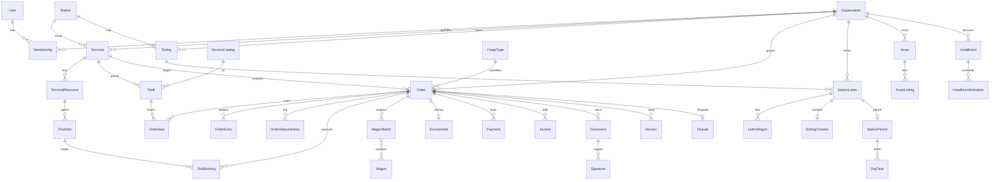

# YukSaroy — Ma'lumotlar modeli (Data Architect lens)

Manba-faktlar: VagonFlow `schema.prisma` (Station.ecpCode = 6 raqamli ESR, Siding 40+ maydon, Client.inn, AuditLog), `ЕСР с новыми станциями.xlsx` (varaq `V_STAN`: KOD/NAME/DOR/OTD, 22 419 qator — butun MDH), `Шахобча йўллар.xlsx` (varaq `Ветвевладелецы` 1 393 qator: №, РЖУ, Наименование, Станция «723600 - Тукимачи», Длина, Для выгрузок, Для погрузок; varaq `Лист1` 94 qator + ИНН), `yuklar.xlsx` (407 qator ETSNG guruh/kod/diapazon), `railmap-esr-import.json` (214 stansiya, UUID→esrCode). Tashqi faktlar: STIR 9 raqam (8 + nazorat raqami) — [taxid.pro](https://taxid.pro/docs/countries/uzbekistan); ETSNG 6 raqam (2 guruh + 1 pozitsiya + 2 tartib + 1 nazorat) — [maintransport.ru](https://maintransport.ru/transportnye-kompanii/info/etsng); ESR asosiy 4–5 raqam, O'TY reestrida 6 raqam ishlatiladi (VagonFlow `ecpCode`, dor=73 — `railmap-esr-README.md`); shaxsga doir ma'lumotlar qonuni ZRU-547, 2026-03 tuzatish: sezgir ma'lumot O'zbekiston serverida qoladi — [kun.uz](https://kun.uz/en/news/2026/03/27/uzbekistan-amends-personal-data-law-to-facilitate-global-payment-systems); soliq hujjatlari saqlash muddati 2024 dan 3 yil — [Forvis Mazars](https://www.forvismazars.com/uz/en/insights/our-publications/tax-alerts/issue-1-republic-of-uzbekistan).

Umumiy konvensiya (barcha modellarga tegishli, qayta yozilmaydi): `id String @id @default(cuid())` (VagonFlow Int id bilan to'qnashmasligi uchun; ESR/STIR kabi tashqi kalitlar alohida `@unique`), `createdAt DateTime @default(now()) @db.Timestamptz(3)`, `updatedAt @updatedAt`, pul maydonlari `BigInt` tiyin, `*Tiyin` suffiksi. Tenant-scoped jadvallarda `orgId` majburiy va indekslangan.

## 1. Entity ro'yxati (60 model, 9 modul)

### M0 · Identity & Tenant

```prisma
model Organization { id; kind OrgKind; name; nameShort?; stir String? @unique   // 9 raqam, checkdigit tekshiruv
  oked?; address?; bankAccount?; mfo?; director?; kycStatus KycStatus @default(NONE); kycCheckedAt?
  homeStationId? -> Station; vfClientId Int? @unique   // VagonFlow Client.id
  tier LoyaltyTier @default(BRONZE); installmentLimitTiyin BigInt @default(0); deletedAt?
  @@index([kind]) @@index([homeStationId]) }
model User { id; phoneEnc Bytes; phoneHash String @unique   // AES-GCM + SHA256(lookup)
  name; pinHash?; passwordHash?; locale @default("uz"); telegramId BigInt? @unique; vfUserId Int? @unique
  isActive @default(true); lastLoginAt?; deletedAt?  }
model Membership { id; userId -> User; orgId -> Organization; roles OrgRole[]   // ko'p rol
  isOwner @default(false); invitedById?; acceptedAt?  @@unique([userId, orgId]) @@index([orgId]) }
model OtpCode { id; phoneHash; codeHash; purpose OtpPurpose; expiresAt; usedAt?  @@index([phoneHash, expiresAt]) }
model Session { id; userId; deviceId?; refreshHash @unique; ip?; ua?; expiresAt; revokedAt?  @@index([userId]) }
model PlatformConfig { key String @id; value Json; updatedById?; updatedAt }   // komissiya %, slot HOLD TTL, rassrochka ustama
```

### M1 · Ma'lumotnoma (reference)

```prisma
model Station { id; esrCode String @unique   // 6 raqam, leading zero saqlanadi (String!)
  dor String; otd?; nameUz; nameOz?; nameRu; nameEn?; regionCode?; lat Float?; lng Float?
  isCargoOpen @default(true); vfStationId Int? @unique; railmapId String? @unique
  @@index([regionCode]) @@index([nameUz]) }
model CargoType { id; etsngCode String @unique   // 6 raqam, oxirgisi nazorat
  groupCode String; groupName; name; nameUz?; hazardClass Int?; isBulk @default(false); tariffClass Int? @@index([groupCode]) }
model WagonType { id; code @unique; name; axles Int; capacityT Float; vfCode?  }
model Siding { id; stationId -> Station; name; ownerOrgId? -> Organization; ownerNameRaw?
  lengthM Int?; capacityWagons Int?; loadFront?; unloadFront?; usageType SidingUsage; locoType LocoType?
  status SidingStatus; contractEnd DateTime? @db.Date; lat?; lng?; geomLine Json?   // xaritada chiziq
  vfSidingId Int? @unique; registryRef String? @unique; railmapId? @unique; syncedAt?
  @@index([stationId]) @@index([ownerOrgId]) }
model Port { id; code @unique; name; country; city; lat; lng; contacts Json; tariffsNote?; isActive }
model Scale { id; kind ScaleKind; stationId?; terminalId?; capacityT Int; lat; lng; ownerOrgId?; verifiedUntil DateTime? @db.Date }
model RoadService { id; kind RoadServiceKind; name; lat; lng; roadCode?; phone?; hours?; rating Float? @default(0) }
```

### M2 · Terminal & Tarif & Slot

```prisma
model Terminal { id; orgId -> Organization; stationId -> Station; slug @unique; name
  passport Json   // {tracks, usefulLengthM, warehouseM2, openAreaM2, hasSvx, cranes:[{t,count}], gates}
  hours Json; is247; lat; lng; status TerminalStatus @default(DRAFT); isPremiumUntil?
  ratingAvg Float @default(0); ratingCount Int @default(0); loadPct Int @default(0)   // denorm, cron
  saasPlan SaasPlan @default(FREE); saasPaidUntil?; deletedAt?
  @@index([stationId]) @@index([status, ratingAvg]) }
model TerminalResource { id; terminalId; kind ResourceKind   // CRANE / TRACK / GATE / WAREHOUSE / TEAM
  name; capacityUnits Int @default(1); specs Json?; isActive  @@index([terminalId]) }
model ServiceCatalog { id; code @unique   // LOAD, UNLOAD, WEIGH, STORE_DAY, SVX, CONTAINER_HANDLE, LAST_MILE
  name; unit PriceUnit; requiresResource ResourceKind?; isExtra @default(false) }
model TerminalService { id; terminalId; serviceId -> ServiceCatalog; isEnabled; leadTimeMin Int @default(0)
  @@unique([terminalId, serviceId]) }
model Tariff { id; terminalId; serviceId; version Int; validFrom @db.Timestamptz; validTo? @db.Timestamptz
  priceTiyin BigInt; unit PriceUnit; tiers Json?   // [{minT:0,maxT:60,priceTiyin},...]
  cargoGroupCode?   // ETSNG guruhga maxsus narx
  createdById; note?   // APPEND-ONLY, hech qachon UPDATE qilinmaydi
  @@unique([terminalId, serviceId, version]) @@index([terminalId, serviceId, validFrom]) }
model SlotTemplate { id; terminalId; resourceId; weekday Int; startLocal String   // "08:00"
  endLocal String; capacity Int; feeTiyin BigInt @default(0); isActive }
model TimeSlot { id; terminalId; resourceId; startsAt @db.Timestamptz; endsAt @db.Timestamptz
  localDate DateTime @db.Date   // Asia/Tashkent kuni — indeks/UI uchun
  capacity Int; booked Int @default(0); held Int @default(0); status SlotStatus @default(OPEN)
  @@unique([resourceId, startsAt]) @@index([terminalId, localDate, status]) }
  // DB: CHECK (booked + held <= capacity)
model SlotBooking { id; slotId; orderId; status BookingStatus; holdExpiresAt?; confirmedAt?; releasedAt?; reason?
  @@unique([orderId, slotId]) @@index([slotId, status]) @@index([holdExpiresAt]) }
```

### M3 · Buyurtma & Vagon

```prisma
model Order { id; no String @unique   // "YS-2026-000123", sequence
  kind OrderKind   // TERMINAL / DOC_SERVICE / SPECIALIST / RAIL_PAYMENT
  shipperOrgId -> Organization; createdById -> User; terminalId?; stationId?
  direction Direction; operation Operation; cargoTypeId?; weightKg Int?; wagonCount Int?; containerSize?
  subtotalTiyin BigInt; extrasTiyin BigInt @default(0); slotFeeTiyin BigInt @default(0)
  platformFeeTiyin BigInt; totalTiyin BigInt; commissionPct Int   // 300 = 3.00%
  status OrderStatus @default(DRAFT); slaConfirmUntil?; completedAt?; cancelledAt?
  vfRequestId Int?   // VagonFlow Request.id
  note?; deletedAt?
  @@index([shipperOrgId, status]) @@index([terminalId, status, createdAt]) @@index([vfRequestId]) }
model OrderItem { id; orderId; serviceId; tariffId -> Tariff   // muzlatilgan versiya
  qty Float; unitPriceTiyin BigInt; amountTiyin BigInt  @@index([orderId]) }
model OrderExtra { id; orderId; extraCode ExtraCode   // SVX / WEIGH / STORAGE / LAST_MILE / INSURANCE / SPECIALIST
  providerOrgId?; priceTiyin BigInt; status ExtraStatus; payload Json?  @@index([orderId]) }
model OrderStatusHistory { id; orderId; fromStatus OrderStatus?; toStatus OrderStatus; actorId?; actorRole?
  reason?; at @db.Timestamptz   // APPEND-ONLY
  @@index([orderId, at]) }
model Wagon { id; number String @unique   // 8 raqam, 8-si nazorat (mod-10 "2-1")
  typeId?; ownerOrgId?; ownership Ownership?; buildYear Int?; nextInspection DateTime? @db.Date; lastLocationEventId? }
model WagonBatch { id; orderId; kind BatchKind   // ARRIVING / LOADING / EMPTY_DISPATCH
  vfRequestId?; expectedAt?; arrivedAt?; status BatchStatus  @@index([orderId]) }
model WagonBatchWagon { batchId; wagonId; seq Int; netKg Int?; sealNo?  @@id([batchId, wagonId]) }
```

### M4 · Moliya

```prisma
model Payment { id; orgId; orderId?; invoiceId?; installmentScheduleId?
  provider PayProvider   // PAYME / CLICK / UZUM / BANK_TRANSFER / BALANCE
  providerTxnId? @unique; amountTiyin BigInt; currency @default("UZS"); status PaymentStatus
  idempotencyKey @unique; paidAt?; failReason?; ofdReceiptId?; raw Json?
  @@index([orgId, status]) @@index([orderId]) }
model EscrowHold { id; orderId @unique; payerOrgId; payeeOrgId; amountTiyin BigInt; feeTiyin BigInt
  status EscrowStatus; heldAt; releaseAfter @db.Timestamptz; releasedAt?; refundedAt?; disputeId?  @@index([status, releaseAfter]) }
model LedgerAccount { id; orgId?; code String @unique   // "ESCROW:orgId", "REVENUE:COMMISSION", "RAIL:ELS"
  kind LedgerKind; balanceTiyin BigInt @default(0) }
model LedgerEntry { id; txnId String; accountId; debitTiyin BigInt @default(0); creditTiyin BigInt @default(0)
  refType?; refId?; at @db.Timestamptz   // APPEND-ONLY, double-entry: SUM(debit)=SUM(credit) per txnId
  @@index([txnId]) @@index([accountId, at]) }
model Invoice { id; no @unique; orgId; orderId?; amountTiyin BigInt; vatTiyin BigInt; status InvoiceStatus
  issuedAt; dueAt @db.Date; pdfDocId?; didoxId?   // e-faktura operatori
  @@index([orgId, status]) }
model Installment { id; orgId; orderId?; railTransferId?; months Int   // 3/6/12
  principalTiyin BigInt; feePct Int   // 400/800/1400
  totalTiyin BigInt; status InstallmentStatus; approvedById?; @@index([orgId, status]) }
model InstallmentSchedule { id; installmentId; seq Int; dueDate @db.Date; amountTiyin BigInt; paidAt?; paymentId?
  overdueDays Int @default(0)  @@unique([installmentId, seq]) @@index([dueDate, paidAt]) }
model RailTransfer { id; orgId; tyCode String; purpose RailPurpose   // TARIFF / WAGON_RENT / DEMURRAGE / OTHER
  amountTiyin BigInt; agentFeeTiyin BigInt; status TransferStatus; elsRef?; paidToRailAt?  @@index([orgId, status]) }
model Payout { id; orgId; amountTiyin BigInt; bankAccount; status PayoutStatus; batchNo?; paidAt?; ledgerTxnId? }
```

### M5 · Hujjat & Imzo

```prisma
model DocumentTemplate { id; code; version Int; name; engine TemplateEngine   // HTML_PDF / DOCX
  body String; schema Json   // JSON Schema — payload validatsiyasi
  isActive  @@unique([code, version]) }
model Document { id; templateId; orgId; orderId?; letterId?; kind DocKind
  payload Json; pdfFileId?; sha256 String; qrToken @unique; status DocStatus; preparedById?; slaDueAt?
  @@index([orgId, kind]) @@index([orderId]) }
model Signature { id; documentId; signerUserId; onBehalfOrgId; method SignMethod   // EIMZO / SMS_OTP
  certSerial?; certSubject?; pkcs7 Bytes?; tsaToken?; signedAt @db.Timestamptz; ip?
  @@index([documentId]) }
model File { id; bucket; key @unique; mime; sizeBytes Int; sha256; ownerOrgId?; uploadedById; isPublic @default(false); deletedAt? }
```

### M6 · Stansiyaga xat (shahobcha yo'lga vagon kiritish)

```prisma
model StationLetter { id; no @unique   // "SL-2026-0007"
  shipperOrgId; sidingId -> Siding; stationId -> Station; cargoTypeId; operation Operation
  periodFrom @db.Date; periodTo @db.Date; wagonCountPlanned Int; contactPhoneEnc Bytes
  status LetterStatus @default(DRAFT); documentId?; sentAt?; decidedAt?; rejectReason?
  @@index([stationId, status]) @@index([sidingId]) @@index([shipperOrgId]) }
model LetterWagon { letterId; wagonNo String; wagonId?; expectedAt?; placedAt?; removedAt?  @@id([letterId, wagonNo]) }
model SidingConsent { id; letterId @unique; ownerOrgId; decidedByUserId; decision ConsentDecision
  conditions?; feeTiyin BigInt?; signatureId?; decidedAt }
model StationPermit { id; letterId @unique; permitNo @unique; issuedByUserId   // DS (stansiya boshlig'i)
  validFrom @db.Date; validTo @db.Date; conditions?; signatureId?; revokedAt?; revokeReason? }
model DspTask { id; permitId; shiftDate @db.Date; wagonNos String[]; status DspTaskStatus; assignedUserId?
  vfDispatchTaskId Int?; doneAt?; note?  @@index([permitId, shiftDate]) @@index([shiftDate, status]) }
```

### M7 · Marketpleys

```prisma
model Asset { id; ownerOrgId; kind AssetKind   // WAGON / LOCOMOTIVE / SIDING
  title; stationId?; sidingId? @unique; wagonId?; specs Json   // {model:"ТЭМ2", year, hasDriver} / {count:15, wagonType}
  photos String[]; verified @default(false); deletedAt?  @@index([ownerOrgId]) @@index([kind, stationId]) }
model AssetListing { id; assetId; mode ListingMode   // RENT / SALE / SERVICE
  priceTiyin BigInt?; priceUnit PriceUnit?; priceNote?; status ListingStatus; premiumUntil?; expiresAt; views Int @default(0)
  @@index([status, mode]) @@index([premiumUntil]) }
model Ad { id; orgId; category AdCategory   // LOCOMOTIVE / CRANE / TRUCK / OTHER
  title; body; stationId?; priceNote; phoneEnc Bytes; status ModerationStatus; premiumUntil?; expiresAt; deletedAt?
  @@index([status, category]) }
model Specialist { id; userId @unique; orgId?; kind SpecialistKind[]   // EXPEDITOR / DECLARANT / LOGIST
  regions String[]; hourlyTiyin BigInt?; certFileIds String[]; verified; verifiedAt?; ratingAvg; ratingCount; doneCount }
model SpecialistOrder { id; orderId?; specialistId; clientOrgId; task; feeTiyin BigInt; escrowId?
  status SpecialistOrderStatus; respondBy @db.Timestamptz   // SLA 2 soat
  @@index([specialistId, status]) }
model Vacancy { id; terminalId; title; profession Profession; salaryFromTiyin?; salaryToTiyin?; body; status ModerationStatus; expiresAt }
model Application { id; vacancyId; userId; cvFileId?; message?; status ApplicationStatus  @@unique([vacancyId, userId]) }
model TyCodeApplication { id; orgId; stationId; monthlyVolumeT Int; docs Json   // checklist {name, fileId, ok}
  status TyCodeStatus; submittedAt?; utyRef?; tyCode?; elsAccount?; decidedAt?; slaDueAt?  @@index([status]) }
model Referral { id; referrerOrgId; referredOrgId @unique; code; bonusTiyin BigInt; status ReferralStatus; paidAt? }
```

### M8 · Kuzatuv & Avto

```prisma
model TrackingEvent { id; subjectType TrackSubject   // ORDER / WAGON / VEHICLE / LETTER
  subjectId; code String   // "WAGON_ARRIVED", "SLOT_STARTED", "GATE_IN"
  stationId?; lat?; lng?; source TrackSource   // ASOUP / VAGONFLOW / MANUAL / GPS
  payload Json?; at @db.Timestamptz   // PARTITION BY RANGE (at), oylik
  @@index([subjectType, subjectId, at]) }
model Vehicle { id; carrierOrgId; plate @unique; kind VehicleKind; capacityT Float; bodyType?; driverUserId? }
model AutoTrip { id; orderExtraId @unique; vehicleId; driverUserId; fromTerminalId; toAddress; toLat; toLng
  status TripStatus; gateSlotId?; startedAt?; deliveredAt?; podFileId? }
model DriverLocation { vehicleId; at @db.Timestamptz; lat; lng; speed?  @@id([vehicleId, at]) }   // hypertable/partition, 90 kun
```

### M9 · Ishonch, xabar, audit

```prisma
model Review { id; orderId; fromOrgId; targetType ReviewTarget; targetId; stars Int   // CHECK 1..5
  text?; reply?; hiddenReason?  @@unique([orderId, fromOrgId, targetType]) @@index([targetType, targetId]) }
model Dispute { id; orderId; openedByOrgId; againstOrgId; reason DisputeReason; description; status DisputeStatus
  slaDueAt @db.Timestamptz   // 3 ish kuni
  arbiterUserId?; resolution?; refundTiyin BigInt?; evidenceFileIds String[]; resolvedAt?  @@index([status, slaDueAt]) }
model Notification { id; userId; channel NotifChannel   // PUSH / SMS / TELEGRAM / EMAIL / INAPP
  template; payload Json; status NotifStatus; sentAt?; readAt?; providerRef?
  @@index([userId, readAt]) @@index([status, createdAt]) }
model AuditLog { id BigInt @id @default(autoincrement()); at @db.Timestamptz; actorUserId?; actorOrgId?; actorRole?
  action; entity; entityId; before Json?; after Json?; ip?; prevHash String; hash String
  @@index([entity, entityId]) @@index([actorOrgId, at]) }   // APPEND-ONLY, hash-zanjir
model OutboxEvent { id; aggregate; aggregateId; type; payload Json; status OutboxStatus; attempts Int @default(0); nextAt?; @@index([status, nextAt]) }
model VfSyncLog { id; entity; vfId Int; ysId; direction SyncDirection; payloadHash; syncedAt; error?  @@unique([entity, vfId]) }
model ImportBatch { id; source ImportSource; fileId; totalRows Int; okRows Int; errRows Int; status ImportStatus; startedById; finishedAt? }
model ImportRow { id; batchId; rowNo Int; rowHash @unique; raw Json; targetEntity?; targetId?; error?  @@index([batchId, error]) }
model KycCheck { id; orgId; source KycSource   // SOLIQ_API / MANUAL
  request Json; response Json?; result KycStatus; checkedAt  @@index([orgId, checkedAt]) }
```

## 2. Enumlar va state machine'lar

```prisma
enum OrgKind { SHIPPER LOGISTICS FORWARDER DECLARANT TERMINAL CARRIER ASSET_OWNER RAILWAY_STATION PLATFORM }
enum OrgRole { OWNER MANAGER OPERATOR ACCOUNTANT DRIVER DS DSP VIEWER }
enum KycStatus { NONE PENDING VERIFIED REJECTED }
enum LoyaltyTier { BRONZE SILVER GOLD }
enum Operation { LOAD UNLOAD EMPTY_DISPATCH STORAGE }
enum Direction { LOCAL IMPORT EXPORT }              // VagonFlow: EXPORT/LOCAL + IMPORT qo'shildi
enum OrderKind { TERMINAL DOC_SERVICE SPECIALIST RAIL_PAYMENT }
enum OrderStatus { DRAFT PENDING CONFIRMED REJECTED WAGON_LINKED IN_PROGRESS DONE PAID CANCELLED DISPUTED }
enum SlotStatus { OPEN FULL CLOSED }
enum BookingStatus { HOLD CONFIRMED RELEASED NO_SHOW }
enum PayProvider { PAYME CLICK UZUM BANK_TRANSFER BALANCE }
enum PaymentStatus { CREATED PENDING PAID FAILED REFUNDED }
enum EscrowStatus { HELD RELEASED REFUNDED DISPUTED PARTIAL }
enum InstallmentStatus { REQUESTED APPROVED ACTIVE OVERDUE CLOSED DEFAULTED }
enum LetterStatus { DRAFT AWAITING_CONSENT CONSENTED SENT_TO_STATION PERMITTED REJECTED EXPIRED }
enum ConsentDecision { AGREE AGREE_WITH_CONDITIONS DECLINE }
enum DspTaskStatus { PLANNED IN_SHIFT DONE PARTIAL CANCELLED }
enum DisputeStatus { OPEN EVIDENCE ARBITRATION RESOLVED_REFUND RESOLVED_RELEASE CLOSED }
enum TyCodeStatus { DRAFT CHECKING SENT_TO_UTY NEED_INFO APPROVED REJECTED }
enum ModerationStatus { DRAFT PENDING ACTIVE REJECTED ARCHIVED }
enum SidingUsage { PUBLIC PRIVATE }  enum LocoType { RAILWAY PRIVATE }  enum SidingStatus { FAOL TAMIRDA YOPIQ }  // VagonFlow bilan bir xil
enum Ownership { CARGO MPS SPS }    // VagonFlow bilan bir xil
```

**Order state machine** (o'tishlar faqat `OrderService.transition()` orqali; har o'tish `OrderStatusHistory` + `OutboxEvent`):

| Dan | Ga | Kim | Shart / SLA |
|---|---|---|---|
| DRAFT | PENDING | mijoz | slot HOLD olindi, narx muzlatildi (tariffId) |
| PENDING | CONFIRMED | terminal | 30 daq ichida; muddat o'tsa → cron `REJECTED(reason=SLA)` + slot RELEASED + terminal rating −0.05 |
| PENDING | REJECTED | terminal | reason majburiy |
| CONFIRMED | WAGON_LINKED | tizim | VagonFlow `Request` yaratildi (`vfRequestId`) yoki AutoTrip ochildi |
| CONFIRMED / WAGON_LINKED | IN_PROGRESS | terminal | slot `startsAt` keldi, `TrackingEvent SLOT_STARTED` |
| IN_PROGRESS | DONE | terminal | akt Document `SIGNED`; escrow `releaseAfter = now()+72h` |
| DONE | PAID | tizim | EscrowHold RELEASED → LedgerEntry (komissiya ajratildi) |
| DONE | DISPUTED | mijoz | 72 soat ichida; escrow DISPUTED |
| DRAFT/PENDING/CONFIRMED | CANCELLED | mijoz | CONFIRMED dan keyin slot fee qaytarilmaydi |

**SlotBooking:** `HOLD(10 daq TTL) → CONFIRMED → (NO_SHOW | RELEASED)`; HOLD muddati o'tsa cron `held--`, CONFIRMED bo'lsa `held--, booked++` — bitta tranzaksiyada `SELECT ... FOR UPDATE` TimeSlot qatori.

**EscrowHold:** `HELD → RELEASED` (auto 72h yoki mijoz "qabul qildim") · `HELD → DISPUTED → PARTIAL | REFUNDED | RELEASED` (arbitr, 3 ish kuni).

**StationLetter (foydalanuvchining oxirgi talabi):** `DRAFT → AWAITING_CONSENT` (shahobcha egasiga push/TG) `→ CONSENTED` (SidingConsent AGREE + Signature EIMZO) `→ SENT_TO_STATION` (Document PDF, qrToken) `→ PERMITTED` (StationPermit.permitNo, DS imzosi) `→ DspTask[] PLANNED` (har smena kuniga bittadan, `periodFrom..periodTo`). `DECLINE`/`REJECTED` yakuniy; `periodTo < today` → `EXPIRED` (cron).

**Installment:** `REQUESTED → APPROVED` (limit ≤ `Organization.installmentLimitTiyin`) `→ ACTIVE` (RailTransfer to'landi) `→ OVERDUE` (dueDate+3 kun, limit muzlatiladi) `→ CLOSED | DEFAULTED` (90 kun).

**Dispute:** `OPEN → EVIDENCE (48h) → ARBITRATION → RESOLVED_REFUND | RESOLVED_RELEASE → CLOSED`.

## 3. ER diagramma (asosiy 25 entity)



## 4. Muhim dizayn qarorlari

| # | Qaror | Nima uchun | Alternativa (rad etildi) |
|---|---|---|---|
| 1 | **Pul = `BigInt` tiyin** (Postgres `bigint`) | Int32 maksimumi 2 147 483 647 tiyin = 21,4 mln so'm — demo'dagi tepplovoz sotuvi 3,2 mlrd so'm = 320 mlrd tiyin sig'maydi; suzuvchi nuqta banklarga to'g'ri kelmaydi. Komissiya foizi `Int` (300 = 3,00%), bo'lish faqat `bigint` bilan, yaxlitlash "banker's" emas, **yuqoriga** (tizim foydasiga emas, mijoz ko'radigan formula bilan). | `Decimal(18,2)` — Prisma `Decimal.js` obyektlari, JSON serializatsiyada qo'shimcha kod, tiyin bilan hech nima yutmaydi. |
| 2 | **Vaqt: hamma `@db.Timestamptz(3)`, TZ faqat render qatlamida `Asia/Tashkent`** (UTC+5, DST yo'q) | Prisma `DateTime` default `timestamp(3)` (tz'siz) — server TZ o'zgarsa slotlar 5 soat siljiydi. `TimeSlot.localDate` alohida `date` ustun: "bugungi slotlar" so'rovi indeksdan o'qiladi, `AT TIME ZONE` hisoblanmaydi. | Local vaqtni saqlash — Qozog'iston porti/Rossiya ASOUP hodisalari kelganda aralashadi. |
| 3 | **Soft-delete faqat katalog obyektlarida** (`deletedAt`: Organization, User, Terminal, Asset, Ad, Order-DRAFT) + Prisma `$extends` query-filtri | Moliya/audit/hujjat jadvallarida DELETE umuman yo'q (app-rol `REVOKE DELETE`). Buyurtma DONE'dan keyin o'chirilmaydi — bekor qilinadi (status). | `isDeleted Boolean` — qachon/kim o'chirgani yo'qoladi; global cascade — qonun talabini buzadi. |
| 4 | **Versiyalangan tarif = append-only qatorlar** `(terminalId, serviceId, version)` + Postgres `EXCLUDE USING gist (terminal_id WITH =, service_id WITH =, tstzrange(valid_from, valid_to) WITH &&)` (raw migration) | Bir xizmatga bir vaqtda ikki narx bo'lishi mumkin emas — DB kafolatlaydi, app kodi emas. `OrderItem.tariffId + unitPriceTiyin` muzlatiladi: terminal narx o'zgartirsa eski buyurtma o'zgarmaydi, nizoda "qaysi tarif bilan" savoli javobli. | `TariffHistory` jadvali + trigger — ikki jadval, sinxron bo'lmasligi mumkin. |
| 5 | **Slot sig'imi = resurs × vaqt oynasi** (`TerminalResource` → `SlotTemplate` → materiallashgan `TimeSlot`, 30 kun oldinga cron) | eModal modeli: "kran-32t 10:00–12:00, sig'im 2" — bitta terminalning krani va darvozasi alohida navbat. Bron `SELECT … FOR UPDATE` + `CHECK(booked+held<=capacity)`: ikki mijoz bir vaqtda bossa bittasi kutadi, ikkinchisi xato oladi. HOLD 10 daqiqa TTL — to'lov sahifasida turgan mijoz slotni bloklab qo'ymaydi. | Bronlarni `COUNT(*)` bilan hisoblash — lock qiladigan qator yo'q, poyga (race) bo'ladi; terminal darajasida bitta sig'im — kran band, darvoza bo'sh holatini ko'rsatolmaydi. |
| 6 | **Ko'p-tenant: bitta DB, har tenant-jadvalda `orgId`/`terminalId` + Postgres RLS** (`SET LOCAL app.org_id` har so'rovda, Prisma `$transaction` middleware) | Marketpleys so'rovlari tenant-kesuvchi (katalog, rating, analitika) — sxema-per-tenant bularni yo'q qiladi. RLS ikkinchi himoya qatlami: `where` unutilsa ham terminal boshqa terminal talabnomasini ko'rmaydi. | Sxema-per-tenant — 20–200 terminal uchun migratsiya og'ir; alohida DB — hech kim to'lamaydi. |
| 7 | **Audit/immutability: `AuditLog`, `LedgerEntry`, `OrderStatusHistory`, `Tariff` — INSERT-only** (app-rolga `REVOKE UPDATE, DELETE`), `AuditLog.hash = sha256(prevHash‖payload)` zanjir | Ish standarti: "kim, qachon, nima qildi — hamisha javobli". Hash-zanjir DBA ham o'zgartira olmasligini tekshiruvchi skript bilan isbotlaydi (`scripts/audit-verify.ts`, tunda). Ledger double-entry: `SUM(debit)=SUM(credit)` har `txnId` uchun — komissiya, eskrou, rassrochka bitta hisob tizimida. | pgaudit — DBA uchun log, mijozga ko'rsatib bo'lmaydi; VagonFlow AuditLog (`details Json`, hashsiz) — yetarli emas, moliya bor. |
| 8 | **PII shifrlash: `phoneEnc Bytes` (AES-256-GCM, kalit env/KMS) + `phoneHash` (HMAC-SHA256) lookup** | Telefon — login kaliti va aktivatsiya kanali, DB dump chiqsa ham o'qilmaydi. STIR, korxona nomi — ochiq reestr, shifrlanmaydi (qidiruv kerak). Pasport raqami (Specialist KYC) faqat `File`da, DB ustunida yo'q. Hosting O'zbekistonda (UzCloud/Uztelecom) — ZRU-547 sezgir ma'lumot uchun hali ham majburiy. | pgcrypto DB-ichida — kalit DB'da, dump bilan chiqadi. |
| 9 | **Saqlash muddati (cron `retention.ts`)**: `AuditLog`, `LedgerEntry`, `Invoice`, `Document/Signature` — 5 yil (soliq minimumi 3 yil, biz 5); `TrackingEvent` — 3 yil (oylik partitsiya, eski partitsiya `DETACH` → S3 parquet); `DriverLocation` — 90 kun (keyin `AutoTrip` uchun 1 daq agregat); `Notification` — 180 kun; `OtpCode` — 10 daqiqa; `Session` — 30 kun; `ImportRow` — batch yopilgach 30 kun. | "Hech narsani o'chirmaymiz" — DriverLocation yiliga ~1 mlrd qator (100 mashina × 1/5s), Postgres'ni cho'ktiradi. |
| 10 | **Integratsiya = Transactional Outbox** (`OutboxEvent`, worker poll 1 s) | Order CONFIRMED bo'lganda VagonFlow'ga Request yaratish, push, SMS — DB tranzaksiyasi commit bo'lmasa hech biri ketmaydi; ketmasa qayta uriniladi (`attempts`, backoff). | To'g'ridan-to'g'ri `fetch()` handler ichida — VagonFlow yotsa buyurtma yo'qoladi yoki ikki marta ketadi. |
| 11 | **ID: `cuid()` String, tashqi kalitlar alohida `@unique`** (`vfStationId`, `esrCode`, `stir`, `registryRef`) | VagonFlow `Int autoincrement` — ikki tizim ID'si aralashmaydi; URL'da buyurtma soni ko'rinmaydi; `Order.no` odam uchun alohida sequence. | UUID v4 — indeks kattaroq, cuid sortable. |

## 5. Migratsiya / seed strategiyasi

Papka: `prisma/seed/` — har manba alohida idempotent skript, `ImportBatch/ImportRow` orqali (`rowHash = sha256(normalized row)` → qayta ishga tushirsa yangilaydi, dublikat yaratmaydi). Tartib majburiy (FK):

```
prisma/seed/
  00-config.ts        PlatformConfig (commissionPct=300, slotHoldTtlMin=10, installmentFee={3:400,6:800,12:1400})
  01-esr-stations.ts  ЕСР с новыми станциями.xlsx → Station
  02-etsng.ts         yuklar.xlsx + 01-1_ETSNG_ПНЕТСНГ 2026-01-01.doc → CargoType
  03-wagon-types.ts   VagonFlow WagonType (API) → WagonType
  04-sidings.ts       Шахобча йўллар.xlsx → Siding (+ Organization by STIR)
  05-clients.ts       «Ягона дарча» reestri (18 428) → Organization (+ ImportRow)
  06-vf-link.ts       VagonFlow Station/Siding/Client → vf*Id backfill (VfSyncLog)
  07-service-catalog.ts  ServiceCatalog (LOAD, UNLOAD, WEIGH, STORE_DAY, SVX, CONTAINER_HANDLE, LAST_MILE)
  08-demo-terminals.ts   pilot 5 terminal pasporti (anketa xlsx) → Terminal/Resource/Tariff v1/SlotTemplate
```

**01 ESR.** Varaq `V_STAN`: `KOD` (6 belgi, `String` — "000015" nol yo'qolmasin), `NAME`, `DOR`, `OTD`; 22 419 qator (MDH). Filtr `DOR='73'` (railmap README: 73 = O'TY) → ~300 stansiya; 2–3-varaqlar ("yangi stansiyalar", DOR 74/75 ko'rsatilgan) — qo'lda tekshiruv ro'yxatiga (`ImportRow.error='REVIEW_DOR'`). `nameRu = NAME`; `nameUz` — VagonFlow `Station.nameUz` dan (`vfStationId` join) yoki transliteratsiya + qo'lda. `railmap-esr-import.json` (214 ta, `confidence:'exact'`) → `railmapId`, lat/lng RailMap API'dan. Qolgan ~90 stansiya koordinatasiz — xaritada ko'rinmaydi, katalog ishlaydi.

**02 ETSNG.** `yuklar.xlsx` (407 qator): ustunlar `[guruh nomi, guruh kodi 5 raqam, yuk nomi, kod, diapazon oxiri]` → `CargoType.etsngCode` (nazorat raqami bilan 6 raqam — rasmiy `.doc` dan olinadi, `libreoffice --convert-to txt` → regex `^\d{6}\s`), `groupCode`, `name`. Nazorat raqami tekshiruvi seed'da: mos kelmasa `error='CHECKDIGIT'`.

**04 Shahobcha yo'llar.** Varaq `Ветвевладелецы` 1 393 qator: `Станция` "723600 - Тукимачи" → `split(' - ')[0]` = esrCode → `Station` FK (topilmasa `error='STATION_NOT_FOUND'`); `Наименование` → `ownerNameRaw`; `Длина` → `lengthM`; `Для выгрузок/Для погрузок` → `unloadFront/loadFront`; `РЖУ` → MTU nomi (Station.mtu bilan solishtirish). Varaq `Лист1` (94 qator, `ИНН` bor) → `Organization.stir` upsert + `Siding.ownerOrgId`. VagonFlow'da shu reestr allaqachon `Siding.registryRef` bilan import qilingan — `registryRef` ni bir xil formulada hosil qilamiz (`esrCode:№`) va 06-skriptda `vfSidingId` bog'lanadi. **Nima uchun ikki nusxa:** YukSaroy'da Siding marketpleys obyekti (Asset/Listing, StationLetter), VagonFlow'da — operatsion; VF egasi — master, YukSaroy tunda `syncedAt` bo'yicha o'qiydi (VF API `/api/admin/sidings`, read-only). Alternativa — bitta DB'ga ulanish: VagonFlow ichki sxemasiga bog'lanib qolamiz, migratsiyasi bizni sindiradi.

**05 Mijozlar (18 428).** Tozalash: STIR normalizatsiya (9 raqam, nazorat raqami), 18 338 STIR'li → `Organization` upsert by `stir`; 90 STIR'siz → `kycStatus=NONE`, `ImportRow.error='NO_STIR'`, qo'lda. Dublikat STIR (bir korxona bir nechta stansiyada) → bitta Organization, `homeStationId` = eng katta hajmli stansiya (2–3-varaq yuklash/tushirish hajmi). Telefon 0 ta → `User` yaratilmaydi; aktivatsiya: "Yagona darcha" logini orqali xabar → mijoz telefon kiritadi → `User + Membership(OWNER)`. Segment: `Organization.tier` emas, alohida `PlatformConfig`siz — `mv_client_segment` (bo'lim 6). VagonFlow `Client.inn` bilan 06-skriptda `vfClientId` bog'lanadi (7 056 stansiyaga biriktirilgan mijoz avval).

Migratsiya intizomi: `prisma migrate` (VagonFlow'dagi `db push` emas — ishlab chiqarishda moliya jadvallari bor), har migratsiya `-- rollback:` izohi bilan; RLS/EXCLUDE/CHECK/partitsiya — `prisma/migrations/*/migration.sql` ichida qo'lda SQL (Prisma bularni bilmaydi).

## 6. Hisobot / analitika o'qish modeli

Qaror: **F1–F3 da ClickHouse kerak emas**, Postgres materialized view + partitsiya yetadi. Hisob: 20 terminal × 150 buyurtma/oy = 3 000 Order/oy, 5 yilda 180 000 qator — Postgres uchun kichik. Og'ir jadvallar `TrackingEvent` (~50 hodisa/buyurtma → 150 000/oy) va `DriverLocation` — partitsiya + retention bilan yopiladi. ClickHouse chegarasi: `TrackingEvent` > 100 mln qator yoki analitik so'rovlar p95 > 2 s (F4, avto-birja + GPS) — o'shanda Postgres logical replication → ClickHouse (`MaterializedPostgreSQL`), sxema o'zgarmaydi.

Materialized view'lar (`pg_cron`, `REFRESH MATERIALIZED VIEW CONCURRENTLY`, unique indeks bilan):

| View | Granulyarlik | Yangilanish | Kim ishlatadi |
|---|---|---|---|
| `mv_terminal_daily` (terminalId, localDate, orders, doneOrders, revenueTiyin, slotsTotal, slotsBooked, avgConfirmMin, noShow) | kun | 15 daq | terminal kabineti, admin "Analitika", `Terminal.loadPct` |
| `mv_terminal_rating` (terminalId, ratingAvg, ratingCount, slaBreach30d, rank) | kun | 1 soat | katalog saralash, "Terminallar reytingi" |
| `mv_station_flow` (stationId, month, direction, cargoGroupCode, tonnes, wagons) | oy | kecha | O'TY/investor hisoboti, API-oqim 6 |
| `mv_client_segment` (orgId, last6mOrders, last6mTonnes, segment ACTIVE/DORMANT/NEW, homeStationId) | kun | kecha | aktivatsiya to'lqinlari, mijoz oylik hisoboti |
| `mv_order_funnel` (localDate, terminalId, draft, pending, confirmed, rejected, done, paid) | kun | 15 daq | KPI "likvidlik", konversiya |
| `mv_finance_daily` (localDate, commissionTiyin, escrowHeldTiyin, installmentOutstandingTiyin, overdueTiyin) | kun | 15 daq | moliya, bank hamkorlar |

Real-vaqt kerak bo'lgan 3 ko'rsatkich (terminal bandligi %, bo'sh slotlar soni, demurraj taymeri) MV'dan emas — to'g'ridan-to'g'ri `TimeSlot`/`WagonBatch` dan indeks bilan o'qiladi (so'rov < 5 ms). Mijozga oylik PDF hisobot — `mv_client_segment + mv_terminal_daily` dan `Document(kind=CLIENT_REPORT)` sifatida cron'da yaratiladi. Reporting uchun alohida `readonly` Postgres roli + `pg_stat_statements` limiti; keyinchalik replica'ga ko'chirish uchun `DATABASE_URL_RO` env allaqachon kodda ajratiladi.
